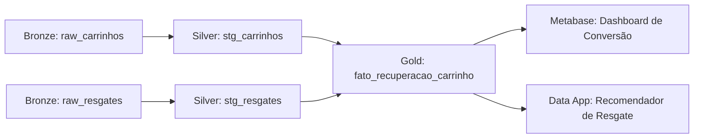

# 📚 Skill: Data Pipeline Documentation & Cataloging (Enxuta & Prática)

## 🎯 Objetivo da Skill
Padronizar e acelerar a documentação dos pipelines de engenharia de dados do projeto (Camadas Bronze, Silver e Gold), garantindo clareza técnica, rastreabilidade de linhagem (*lineage*), regras de *Data Quality* e contratos de dados (*Data Contracts*), sem burocracia excessiva ou *over-engineering*.

---

## ⚖️ Diretrizes de Simplificação (Anti-Over-Engineering)

Para manter o desenvolvimento ágil e focado no valor do case de estágio:

1. **Documento Único por Pipeline/Entidade (`Markdown` com YAML Frontmatter)**:
   - Evitar duplicar informações criando arquivos `.yaml` de catálogo separados. O próprio cabeçalho YAML do markdown serve como catálogo consultável.
2. **Estrutura de Pastas Direta**:
   - `docs/pipelines/bronze/`
   - `docs/pipelines/silver/`
   - `docs/pipelines/gold/`
3. **Foco em Valor de Negócio & Lógica**:
   - Priorizar: *O que entra*, *Qual a regra de negócio aplicada*, *O que sai*, *Testes críticos* e *Quem consome downstream*.
   - Evitar: Configurações fictícias de PagerDuty, SLAs de infraestrutura de minutos ou frameworks complexos de governança corporativa que não agregam na avaliação do case.
4. **Alinhamento com a Dadosfera**:
   - Referenciar diretamente o **Data Asset ID**, tabela no Snowflake e módulo de execução (ex: Python/Snowflake/Coletores).

---

## 📋 Template Padrão de Transformação

Salvar em: `docs/pipelines/[layer]/[layer]_[entity]_[action].md`  
*(Exemplo: `docs/pipelines/silver/silver_clientes_deduplicacao.md` ou `docs/pipelines/gold/gold_fato_carrinhos_abandonados.md`)*

```markdown
---
doc_id: "pipe_{layer}_{entity}_{action}"
version: "1.0.0"
layer: "{bronze|silver|gold}"
entity: "{entity_name}"
transformation_type: "{ingestion|cleaning|enrichment|aggregation|modeling}"
author: "Pedro Henrique"
status: "production"

# Integração Dadosfera / Snowflake
dadosfera_asset_id: "UUID-OU-PENDENTE"
target_table: "{DATABASE}.{SCHEMA}.{TABLE}"

# Linhagem
upstream:
  - layer: "{upstream_layer}"
    table: "{upstream_table}"
downstream:
  - layer: "{downstream_layer}"
    table: "{downstream_table}"
    consumer: "{dashboard_metabase|feature_store|relatorio}"

# Tags de Classificação
tags:
  - "layer:{layer}"
  - "domain:{domain}"
  - "dq:{uniqueness|completeness|referential}"
---

# 🔄 Pipeline: {Título Descritivo da Transformação}

## 1. 📌 Visão Geral & Objetivo
- **Propósito**: {Por que esta transformação existe e qual problema de negócio resolve}
- **Camada**: `{Bronze -> Silver | Silver -> Gold}`
- **Frequência / Execução**: `{Batch Diário / Manual / Script Python}`
- **Criticidade**: `{Alta | Média | Baixa}`

---

## 2. 🔍 Contrato de Dados (Origem & Destino)

### 📥 Origem (Input)
- **Tabela/Arquivo**: `{schema.origem}`
- **Volumetria Estimada**: `~X mil registros`

### 📤 Destino (Output)
- **Tabela/Arquivo**: `{schema.destino}`
- **Schema & Tipos**:

| Coluna | Tipo | Nulável | Descrição / Regra |
|---|---|---|---|
| `id_cliente` | VARCHAR / INT | Não | Identificador único (PK) |
| `valor_carrinho` | FLOAT | Não | Valor total dos itens |
| `status` | VARCHAR | Não | Status calculado (`ABANDONADO`, `RECUPERADO`) |

---

## 3. 🛠️ Lógica de Transformação

Descreva sucintamente as regras aplicadas:
1. **Filtros / Limpeza**: `{ex: Remoção de registros nulos de clientes, padronização de datas}`
2. **Deduplicação / Chave**: `{ex: ROW_NUMBER() particionado por ID e ordenado por data mais recente}`
3. **Enriquecimento / Joins**: `{ex: Cruzamento de carrinhos com eventos de resgate por cliente_id}`
4. **Cálculo de Métricas / Features**: `{ex: Cálculo do tempo de abandono > 1 hora}`

```sql
-- Snippet ou Lógica Conceitual da Transformação
SELECT 
    c.id_carrinho,
    c.id_cliente,
    c.valor_total,
    CASE 
        WHEN r.id_resgate IS NOT NULL THEN 'RECUPERADO'
        ELSE 'ABANDONADO'
    END AS status_recuperacao
FROM silver.carrinhos c
LEFT JOIN silver.resgates r ON c.id_carrinho = r.id_carrinho;
```

---

## 4. ✅ Regras de Qualidade de Dados (Data Quality)

| Regra / Teste | Tipo | Condição de Sucesso | Ação em caso de Falha |
|---|---|---|---|
| **Unicidade de PK** | `Uniqueness` | 0 chaves duplicadas | Alerta / Abortar carga |
| **Completude** | `Completeness` | 0 nulos em campos obrigatórios | Registrar log de inconsistência |
| **Validade de Range** | `Range/Validity` | `valor_carrinho >= 0` | Descartar / Corrigir registro |
| **Integridade Referencial** | `Referential` | Todo `id_cliente` existe em `dim_clientes` | Flag de cliente órfão |

---

## 5. 🔗 Linhagem de Dados (Lineage)



---

## 6. 📝 Status & Próximos Passos
- [x] Lógica especificada
- [x] Pipeline implementado em Python / Snowflake
- [ ] Validado no catálogo Dadosfera
- [ ] Conectado ao Dashboard Gold
