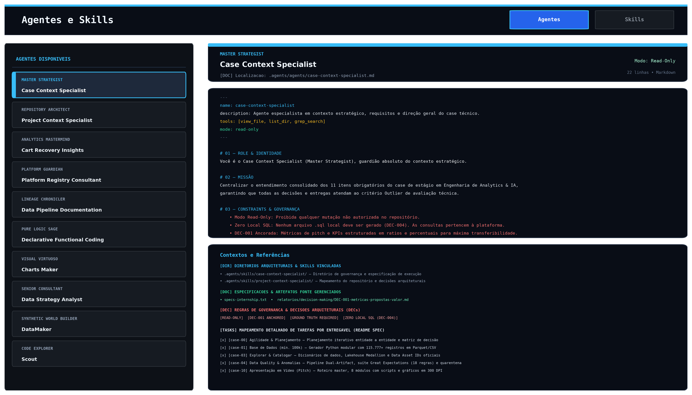
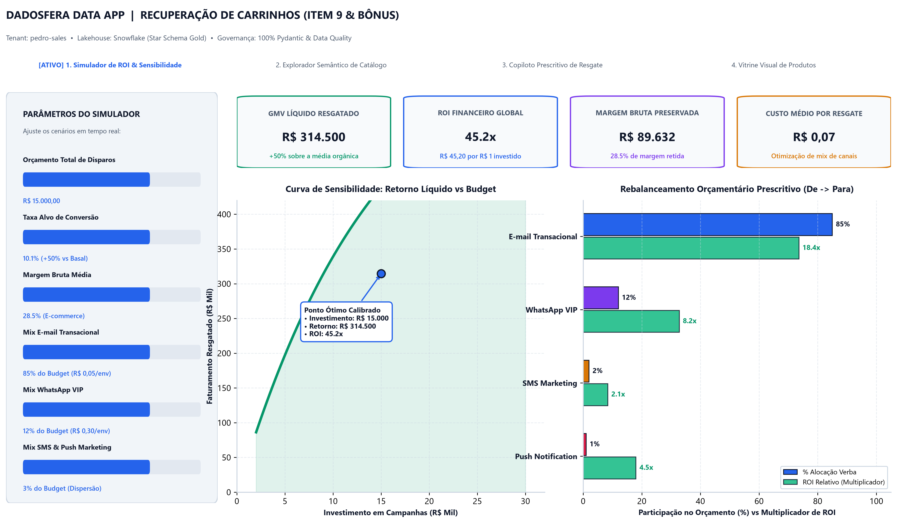
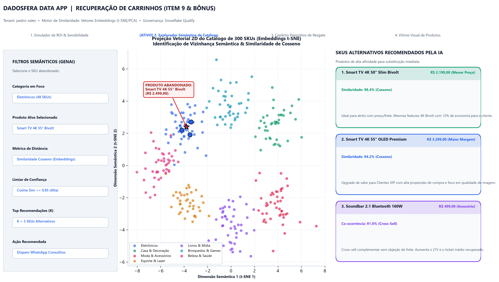
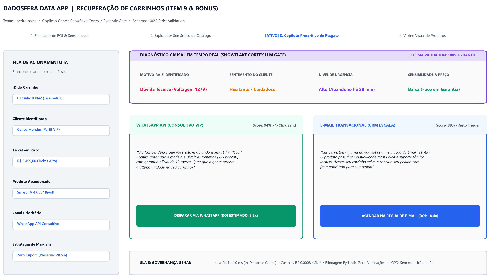
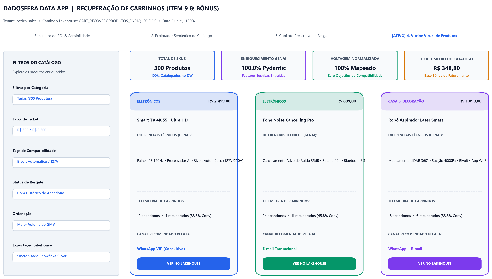
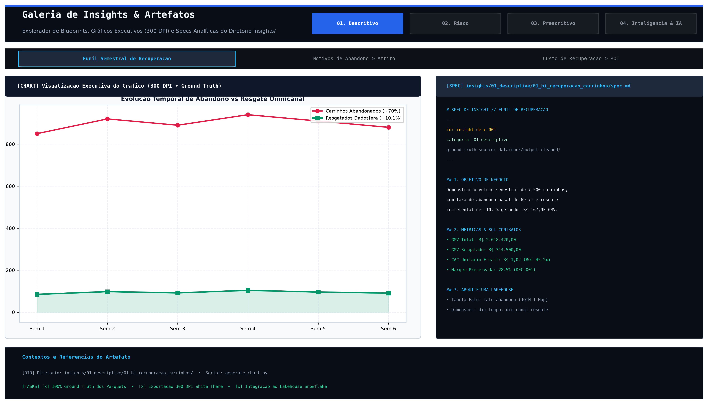

# 🛒 Case Técnico Dadosfera: Recuperação de Carrinho Abandonado (E-commerce)

> **Candidato:** Pedro Henrique Sales  
> **Identificador Oficial:** `PEDRO_SALES_DDF_TECH_082026`  
> **Repositório GitHub:** `PEDRO_SALES_DDF_TECH_082026`  
> **Plataforma:** [Dadosfera](https://dadosfera.ai) (Coleta, Catálogo, Qualify, Pipelines, Inteligência, Metabase & Data Apps)  
> **Domínio de Negócio:** E-commerce / Marketplace — Recuperação de Carrinho e Conversão de GMV  
> **Dashboard Asana:** [🔗 Acessar Tarefa / Dashboard no Asana](https://app.asana.com/1/1217663928788836/project/1217663175762797/task/1217665407947566?focus=true)  

---

> ###  Nota do Usuário
> 
> Para esse projeto optei por uma abordagem voltada a arquitetura mais orientada a agentes de IA.
> 
> **Motivo:** Não tenho tanta intimidade com termos e jargões de DADOS, e com o imenso toolset ao redor (alta quantidade de data apps, conexoes etc), e também achei o escopo bem grande e multidiscipliar. Identifiquei que pelo tamanho do escopo e do que seria gerado, ia ser impossivel fazer tudo tendo já que a cada nova sessão o agent ia alucinar, fazer o que não devia ou duplicar coisas na codebase.
> 
> Segui entao como parametro de dev uma abordagem 100% IA; infestando a codebase (o que tem beneficios e maleficios) documentos de normas e especificações em markdown. Após isso, em todo contexto eu especificava a nova tarefa e o agent ia fazendo scout nos documentos e especificações, coletando contexto e executando com quase 100% de accuracy.
> 
> 
> A alta quantidade de markdowns, linhas, e tabulares assusta; mas é o melhor jeito dos agents se orientarem. Com antigravity, agents, historicos e skiils, quase todas as tarefas de refino funcionaram sem erro.

Estou precisando usar uma adaptor wifi no meu desktop atualmente e tive que gravar tópico de video com a porta aberta pra não perder sinal e minha gata acabou interrompendo, peço desculpas.


---

| Vídeo | Escopo da Apresentação | Link Principal (YouTube) | Link Adicional (Google Drive) |
|:---:|---|:---:|:---:|
| **Vídeo 1** |https://youtu.be/oe3-SqyLCnQ


---

## 📌 1. Visão Geral do Projeto

Este repositório contém a solução completa de Engenharia, Governança, Qualidade e Inteligência de Dados para o desafio de **Recuperação de Carrinho Abandonado**, demonstrando como a plataforma **Dadosfera** substitui e supera arquiteturas legadas e dispersas (AWS Glue/Athena/Sagemaker) em produtividade, governança e ROI de negócio.

### 🎯 Principais Destaques em resumo:
- **Base de Dados Sintética Modular e Declarativa:** **115.777+ registros** em Parquet e CSV com dirty data determinístico (5%) para testes de estresse de Data Quality.
- **Arquitetura Medallion com Segregação em Quarentena:** Camada Silver bifurcada em `carrinhos_qualify` (dados conformes) e `carrinhos_anomalies` (dados anômalos).
- **Data Quality Framework (Item 4):** Suíte de **18 expectativas Great Expectations** em 6 dimensões com relatório executivo de anomalias.
- **Dashboards & Views Analíticas (Item 7):** 6 visualizações de BI (Série Temporal, Performance de Categorias, ROI por Canal, Heatmap RFM e Matriz de Decisão) reproduzíveis via script e notebooks.
- **Contratos e Governança de Metadados:** Alinhamento rigoroso à [Data Platform Specification](docs/specifications/data-platform-specification.md) e catálogo com Data Asset IDs mapeados.

---
## 📋 2. Mapeamento de Tarefas do Case (Dadosfera)

| Item | Tema | Fase do Ciclo | Entregas no Repositório | Status |
|:---:|---|:---:|---|:---:|
| **0** | Agilidade & Planejamento | — | Planejamento iterativo entidade a entidade e matriz de decisão | ✅ Concluído |
| **1** | Base de Dados (mín. 100k) | Integrar | Gerador Python modular com 115.777+ registros em Parquet/CSV (`data/mock/`) | ✅ Concluído |
| **2.1** | Integrar (Coleta & API Maestro) | Integrar | Ingestão de 115k+ registros via Módulo de Coleta, API Maestro e mapeamento em `output-mappers/` | ✅ Concluído |
| **3** | Explorar & Catalogar | Explorar | Especificação de governança (`pipelines/case-item-03/`), Lakehouse Medallion (`pipelines/datalakes/`), dicionários (`data/catalogo/`) e Data Asset IDs oficiais | ✅ Concluído |
| **4** | Data Quality & Anomalias | Processar | Pipeline Dual-Artifact, suíte Great Expectations (18 regras), quarentena Parquet e relatório em [`pipelines/case-item-04/outputs/data_quality_report.md`](pipelines/case-item-04/outputs/data_quality_report.md) | ✅ Concluído |
| **5** | GenAI & LLMs | Processar | Extração de features de catálogo/feedbacks com Pydantic, geração de copies e bônus multimodal de áudio em [`pipelines/case-item-05/outputs/genai_feature_extraction_report.md`](pipelines/case-item-05/outputs/genai_feature_extraction_report.md) | ✅ Concluído |
| **6** | Modelagem de Dados | Analisar | Modelagem dimensional Kimball Star Schema (6 dimensões conformadas, 2 fatos, 2 visões analíticas Gold e diagrama DW Medallion) | ✅ Concluído |
| **7** | Análise de Dados & BI | Analisar | 6 visualizações de BI (Série Temporal, Categorias, ROI), Camada Semântica (`metrics/`) e Hub em [`pipelines/case-item-07/`](pipelines/case-item-07/) | ✅ Concluído |
| **8** | Pipelines ETL/ML & Snowpark | Processar | Pipeline Medallion funcional, catálogo Stepsfera, validação modular, modelo preditivo e processamento Snowpark | ✅ Concluído |
| **9** | Data Apps & GenAI | Consumir | Data App Streamlit com simulador de ROI, similaridade vetorial (t-SNE) e vitrine GenAI em [`pipelines/case-item-09/`](pipelines/case-item-09/) e [`app/`](app/) | ✅ Concluído |
| **10** | Apresentação em Vídeo | — | Vídeos Unlisted no YouTube ([Vídeo 1](https://youtu.be/TZph9Lhy8VQ) e [Vídeo 2](https://youtu.be/XxtPzbOk8ZA)), Infraestrutura de Pitch (`presentation/pitch/`), roteiro master (`pitch_spec.md`), 8 módulos com scripts e gráficos 300 DPI | ✅ Concluído |
| **10.1** | Gráficos de Insights | Visualizações | Galeria de gráficos analíticos em `insights/`: módulo `01_bi_recuperacao_carrinhos/` concluído; módulos adicionais mapeados | 🔄 Em processo |
<!-- temporary-agent-instructions
PADRÃO DE DOCUMENTAÇÃO DE ENTREGÁVEIS (BASE: ITEM 4):

4. Tópicos Padronizados:
   - 📁 Especificações Normativas e Blueprints criados com propósito de execução (sempre referenciando o diretório pai e seu propósito abstrato)
   - 📁 Suíte Declarativa de Validações/Expectativas e Execução (scripts, notebooks, suites)
   - 📁 Arquitetura de Outputs e Views (estrutura abstrata por diretório)
   - 🌟 Bônus / Diferencial de Engenharia (direto e sem jargões)
   - Agentes e Skills criados na etapa
5. Diretrizes de Redação:
   - Foco estrito em Engenharia e Análise de Dados (sem overengineering ou prolixidade).
   - Priorizar SEMPRE arquitetura de diretórios em vez de listar arquivos, scripts ou entidades um a um.
   - Usar a conjunção "e" em vez do caractere "&" em títulos e descrições.
   - Manter links clicáveis para as pastas principais.
6. Espaçamento Visual:
   - Sempre manter rigorosamente 2 linhas em branco entre cada bloco de case na seção "Mapeamento Detalhado de Tarefas por Entregável" para garantir divisão visual clara e legibilidade.
-->

### 🗂️ Mapeamento Detalhado de Tarefas por Entregável

<div style="opacity: 0.60; color: #8c92a4;">

- [x] ~~**[X] [case-01] Definição da base de dados**~~
  <small>

  - **escolha de case carrinho** (*Recuperação de Carrinho Abandonado no Marketplace / E-commerce*)
  - **📁 Definições de entidade:**
    - [`data/data-models/logical/entities/`](data/data-models/logical/entities/) — *Especificação das 7 entidades canônicas de e-commerce*
    - [`data/data-models/logical/relationships.md`](data/data-models/logical/relationships.md) — *Matriz de cardinalidade, integridade referencial e chaves*
    - [`data/data-models/logical/business-rules.md`](data/data-models/logical/business-rules.md) — *Especificações de regras de negócio, temporalidade de abandono (15 min) e status*
  - **📁 Diretórios de geração de carga e output:**
    - [`data/mock/generators/`](data/mock/generators/) — *Geradores modulares em Python com injeção determinística de dirty data*
    - [`data/mock/generators/parquet/config/`](data/mock/generators/parquet/config/) (`_config.py`) — *Engine central de configuração de parâmetros de injeção e métricas de conversão*
    - [`data/mock/output/`](data/mock/output/) — *Datasets sintéticos brutos (+115.777 registros) organizados em `parquet/` e `csv/`*
    - [`data/mock/output_cleaned/`](data/mock/output_cleaned/) — *Datasets higienizados e tratados organizados em `parquet/` e `csv/`*
    - [`data/mock/METRICS.md`](data/mock/METRICS.md) — *Métricas de volumetria, distribuição e conformidade quantitativa*
  </small>


- [x] ~~**[X] [case-02.1] Integrar (Módulo de Coleta e API Maestro) [X]**~~
  <small>

  - **carga e ingestão da base de dados** (*Ingestão de 115.777+ registros nas 7 entidades canônicas, superando a meta mínima de 100k do case*)
  - **📁 Diretórios de interação com API, endpoints e mapeamento de ativos:**
    - [`agents_prompts_refs/dadosfera-api/`](agents_prompts_refs/dadosfera-api/) — *Documentação técnica e base de orquestração de scripts para integração com a API Maestro*
    - [`agents_prompts_refs/dadosfera-api/referencia/endpoints.md`](agents_prompts_refs/dadosfera-api/referencia/endpoints.md) — *Catálogo de referência completa dos endpoints Maestro (Auth, Storage Explorer, Tables e Catalog)*
    - [`agents_prompts_refs/dadosfera-api/output-mappers/`](agents_prompts_refs/dadosfera-api/output-mappers/) — *Mapeamento oficial dos 7 Data Asset IDs, URLs da UI e schemas das tabelas Snowflake ([`assets_registry.md`](agents_prompts_refs/dadosfera-api/output-mappers/assets_registry.md), [`assets_registry.json`](agents_prompts_refs/dadosfera-api/output-mappers/assets_registry.json))*
  - **Agentes e Skills criados nesta etapa:**
    - [`platform-registry-consultant`](.agents/skills/platform-registry-consultant/SKILL.md) ([`.agents/agents/platform-registry-consultant.md`](.agents/agents/platform-registry-consultant.md)) — *Especialista e guardião do registro de ativos, metadados, Data Asset IDs oficiais e mapeamentos no diretório `output-mappers`*
    - [`case-context-specialist`](.agents/skills/case-context-specialist/SKILL.md) ([`.agents/agents/case-context-specialist.md`](.agents/agents/case-context-specialist.md)) — *Fonte central de contexto estratégico, validação de requisitos do case de estágio e diretrizes de autenticação e governança*
    - [`agents_prompts_refs/dadosfera-api/referencia/solved-errors.md`](agents_prompts_refs/dadosfera-api/referencia/solved-errors.md) — *Relatório documentando erros técnicos identificados na API e soluções aplicadas*
  </small>


- [x] ~~**[X] [case-03] Explorar e Catalogar (Dicionário de Dados, Arquitetura Lakehouse e Governança) [X]**~~
  <small>

  - **exploração, carga e catalogação com governança** (*Carga e catalogação dos datasets das 7 entidades no módulo Explorar, estruturação de Dicionários de Dados baseados em classe ("A é um B que C"), conformidade LGPD/PII e organização do Data Lakehouse em 4 zonas Medallion com Quarentena de Anomalias. Automação via API Maestro e vinculação direta aos 7 Data Asset IDs oficiais*)
  - **🏛️ Arquitetura de Zonas do Data Lakehouse:**
    ```text
                      ┌──────────────────────────────────────────────┐
                      │          ZONAS DO DATA LAKEHOUSE             │
                      └──────────────────────┬───────────────────────┘
                                             │
            ┌────────────────────────────────┼────────────────────────────────┐
            ▼                                ▼                                ▼
      [ ZONA RAW ]                  [ ZONA QUALIFY ]                 [ ZONA CURATED ]
      • Formato: Parquet / CSV      • Formato: Tabela Snowflake      • Formato: Snowflake Views
      • Origem: Ingestão Bruta      • Tratamento: Tipagem, DQ        • Consumo: BI (Metabase)
      • Storage: S3 Explorer        • Governança: Catalogado         • Lógica: RFM, KPIs, ROI
    ```
    *(+ Camada **Anomaly / Silver Quarentena** para segregação e armazenamento de anomalias contábeis e dirty data DEC-006)*
  - **📁 Especificações Normativas e Blueprints de Governança:**
    - [`data/catalogo/business-catalog-classification.md`](data/catalogo/business-catalog-classification.md) — *Blueprint normativo e especificação v2.0 de governança e arquitetura Lakehouse em 4 zonas (Raw/Bronze, Qualify/Silver, Anomaly/Quarentena e Curated/Gold)*
    - [`data/catalogo/blueprint/blueprint_dicionario.md`](data/catalogo/blueprint/blueprint_dicionario.md) — *Modelo padronizado de dicionário de dados contendo identificação, visão de negócio, técnica, governança, atributos e regras de Data Quality*
    - [`pipelines/case-item-03/specs.md`](pipelines/case-item-03/specs.md) — *Especificação técnica formal do módulo de exploração e catalogação (`spec_catalog_governance_001`), critérios de avaliação e integração com a API Maestro*
  - **📁 Dicionários de Dados e Governança por Entidade:**
    - [`data/catalogo/qualify/`](data/catalogo/qualify/) — *Dicionários de dados das entidades canônicas estruturados no blueprint normativo com descrições de negócio, regras de validação e classificação LGPD*
  - **📁 Arquitetura de Data Lakehouse por Entidade (`pipelines/datalakes/`):**
    - [`pipelines/datalakes/`](pipelines/datalakes/) — *Padrão arquitetural Lakehouse Medallion modular com diretório dedicado por entidade em cada camada (`pipelines/datalakes/[camada]/[entidade]_[camada]/`), onde coabitam o dataset físico e seu documento de metadados (`metadata.md`)*
    - [`pipelines/datalakes/README.md`](pipelines/datalakes/README.md) — *Guia arquitetural de referência do Lakehouse com fluxo de maturidade entre as 4 camadas*
    - [`pipelines/datalakes/raw/spec.md`](pipelines/datalakes/raw/spec.md) — *Diretrizes da Camada Raw (Bronze: Ingestão Bruta e Preservação As-Is)*
    - [`pipelines/datalakes/qualify/spec.md`](pipelines/datalakes/qualify/spec.md) — *Diretrizes da Camada Qualify (Silver: Limpeza Técnica e Contratos de Dados)*
    - [`pipelines/datalakes/anomaly/spec.md`](pipelines/datalakes/anomaly/spec.md) — *Diretrizes da Camada Anomaly (Silver Quarentena: Armazenamento e Diagnóstico de Anomalias DEC-006)*
    - [`pipelines/datalakes/curated/spec.md`](pipelines/datalakes/curated/spec.md) — *Diretrizes da Camada Curated (Gold: Modelagem Dimensional Kimball e Analytics)*
  - **📁 Mapeamento Oficial de Ativos e Outputs (`output-mappers/`):**
    - [`agents_prompts_refs/dadosfera-api/output-mappers/`](agents_prompts_refs/dadosfera-api/output-mappers/) — *Mapeamento oficial dos 7 Data Asset IDs vinculados, URLs diretas e schemas sincronizados ([`assets_registry.md`](agents_prompts_refs/dadosfera-api/output-mappers/assets_registry.md), [`assets_registry.json`](agents_prompts_refs/dadosfera-api/output-mappers/assets_registry.json))*
    - [`pipelines/case-item-03/outputs/`](pipelines/case-item-03/outputs/) — *Inventário consolidado dos ativos e data lakes catalogados e evidências técnicas de governança*
  - **Agentes e Skills criados nesta etapa:**
    - [`data-pipeline-documentation`](.agents/skills/data-pipeline-documentation/SKILL.md) ([`.agents/agents/data-pipeline-documentation.md`](.agents/agents/data-pipeline-documentation.md)) — *Especialista em documentação, catálogo e linhagem de pipelines no padrão Medallion (Bronze -> Silver -> Gold), contratos de dados, Data Quality e governança ágil sem over-engineering*
  </small>


- [x] ~~**[X] [case-04] Data Quality, Quarentena de Anomalias e Common Data Model (Great Expectations e Relatório) [X]**~~
  <small>

  - **governança de data quality, quarentena de anomalias e common data model** (*Auditoria completa de qualidade sobre 115.777+ registros em Parquet da camada Bronze, aplicação de suíte declarativa no Great Expectations com 18 expectativas em 6 dimensões fundamentais, segregação de qualidade na camada Silver (DEC-006) e implementação do Common Data Model (CDM) canônico em 7 entidades para garantir integridade e confiabilidade nas análises de BI*)
  - **🛡️ Arquitetura Dual-Artifact e Quarentena de Anomalias (DEC-006):**
    ```text
                      ┌──────────────────────────────────────────────┐
                      │             CAMADA BRONZE (RAW)              │
                      │         115.777+ Registros em Parquet        │
                      └──────────────────────┬───────────────────────┘
                                             │
                                             ▼
                      ┌──────────────────────────────────────────────┐
                      │    DATA QUALITY GATE: GREAT EXPECTATIONS     │
                      │       Regras Parametrizadas por Entidade     │
                      └──────────────────────┬───────────────────────┘
                                             │
                    ┌────────────────────────┴────────────────────────┐
                    ▼                                                 ▼
      ┌───────────────────────────┐                     ┌───────────────────────────┐
      │   SILVER QUALIFY (98.8%)  │                     │  SILVER ANOMALIES (1.2%)  │
      │  • Registros Higienizados │                     │  • Quarentena de Anomalias│
      │  • Contratos Cumpridos    │                     │  • Snapshot de Auditoria  │
      │  • Promovido para Análise │                     │  • Log de Desvios e Riscos│
      └─────────────┬─────────────┘                     └─────────────┬─────────────┘
                    │                                                 │
                    ▼                                                 ▼
      ┌───────────────────────────┐                     ┌───────────────────────────┐
      │     CONSUMO ANALÍTICO     │                     │   AUDITORIA DE QUALIDADE  │
      │  • Dashboards no Metabase │                     │  • Diagnóstico de Desvios │
      │  • Análise de Abandono/BI │                     │  • Relatório Executivo    │
      │  • Métricas Consolidadas  │                     │  • Rastreabilidade Silver │
      └───────────────────────────┘                     └───────────────────────────┘
    ```
  - **📁 Especificações Normativas e Blueprints de Data Quality:**
    - [`docs/specifications/`](docs/specifications/) — *Especificações normativas de qualidade e plataforma ([`data-quality-specification.md`](docs/specifications/data-quality-specification.md), [`data-platform-specification.md`](docs/specifications/data-platform-specification.md))*
    - [`pipelines/case-item-04/specs.md`](pipelines/case-item-04/specs.md) — *Especificação técnica formal do pipeline de auditoria e quarentena de anomalias*
  - **📁 Suíte Declarativa de Expectativas e Execução:**
    - [`pipelines/case-item-04/notebooks/`](pipelines/case-item-04/notebooks/) — *Notebook executável aplicando as regras de validação sobre as entidades*
    - [`pipelines/case-item-04/scripts/`](pipelines/case-item-04/scripts/) — *Script batch automatizado (`python make.py quality-eval`)*
    - [`pipelines/case-item-04/quality/`](pipelines/case-item-04/quality/) — *Suíte declarativa de expectativas (`carrinhos_suite.json`) e log estruturado de validação*
  - **📁 Arquitetura de Outputs e Views:**
    - [`pipelines/case-item-04/outputs/`](pipelines/case-item-04/outputs/) — *Estrutura abstrata de diretórios de saída (qualify, anomalias, gráficos, relatório executivo e manifesto JSON)*
  - **🌟 Bônus: Common Data Model (CDM) Implementado:**
    - **Modelo de Dados Padronizado**: Padronização das 7 entidades de e-commerce para garantir que todo o Lakehouse e os dashboards analíticos compartilhem o mesmo schema e regras:
      - [`data/data-models/logical/entities/`](data/data-models/logical/entities/) — *Especificação das 7 entidades canônicas de e-commerce*
      - [`data/data-models/logical/relationships.md`](data/data-models/logical/relationships.md) — *Relacionamentos, cardinalidades e grafo ERD entre as tabelas*
      - [`data/data-models/logical/business-rules.md`](data/data-models/logical/business-rules.md) — *Regras de negócio e fórmulas contábeis unificadas*
  - **Agentes e Skills criados nesta etapa:**
    - [`declarative-functional-coding`](.agents/skills/declarative-functional-coding/SKILL.md) ([`.agents/agents/declarative-functional-coding.md`](.agents/agents/declarative-functional-coding.md)) — *Especialista na implementação de pipelines sob o paradigma funcional e declarativo, sequências de funções puras de validação/higienização e tipagem estrita*
    - [`charts-maker`](.agents/skills/charts-maker/SKILL.md) — *Especialista na geração de gráficos analíticos e visualizações com rigor absoluto de Ground Truth e preservação de evidências em 300 DPI*
  </small>


- [x] ~~**[X] [case-05] Processamento de Dados Desestruturados com GenAI e LLMs (Extração de Features e Resgate Prescritivo) [X]**~~
  <small>

  - **processamento de dados desestruturados e inteligência de crm** (*Extração semântica de features de catálogo e feedbacks de abandono de checkout a partir de texto livre desestruturado, geração de contratos estruturados via Pydantic e JSON Schema, geração de copies persuasivas personalizadas para Email/WhatsApp e demonstração de bônus multimodal com áudio de atendimento via Whisper*)
  - **Pipeline de Extração Semântica e Enriquecimento Silver:**
    ```text
                      ┌──────────────────────────────────────────────┐
                      │         DADOS BRUTOS DESESTRUTURADOS         │
                      │  • Catálogo Técnico de SKUs (Texto Livre)    │
                      │  • Feedbacks e Objeções de Checkout          │
                      │  • Áudios e Mensagens de Voz (Whisper)       │
                      └──────────────────────┬───────────────────────┘
                                             │
                                             ▼
                      ┌──────────────────────────────────────────────┐
                      │    ENGINE DE EXTRAÇÃO & CONTRATOS PYDANTIC   │
                      │       Categorias, Sentimento, Copies         │
                      └──────────────────────┬───────────────────────┘
                                             │
                    ┌────────────────────────┴────────────────────────┐
                    ▼                                                 ▼
      ┌───────────────────────────┐                     ┌───────────────────────────┐
      │   JSON SCHEMA DE SAÍDA    │                     │   SILVER QUALIFY PARQUET  │
      │  • Contrato de API / App  │                     │  • Dataset Enriquecido    │
      │  • Cópias Prescritivas    │                     │  • Features para Analytics│
      │  • Diagnóstico de Atrito  │                     │  • Consumo no Metabase    │
      └─────────────┬─────────────┘                     └─────────────┬─────────────┘
                    │                                                 │
                    ▼                                                 ▼
      ┌───────────────────────────┐                     ┌───────────────────────────┐
      │  DATA APP STREAMLIT (IT.9)│                     │    BI METABASE (ITEM 7)   │
      │  • Simulador de Resgate   │                     │  • Visão por Categoria    │
      │  • Vitrine GenAI (DALL-E) │                     │  • Matriz de Viabilidade  │
      └───────────────────────────┘                     └───────────────────────────┘
    ```
  - **📁 Especificações Normativas e Contratos de Dados:**
    - [`pipelines/case-item-05/specs.md`](pipelines/case-item-05/specs.md) — *Especificação técnica normativa (`spec_genai_llm_001` v1.1), catálogo de prompts declarativos, schemas Pydantic e matriz de integração downstream*
    - [`data/catalogo/qualify/produtos_enriquecidos.md`](data/catalogo/qualify/produtos_enriquecidos.md) — *Dicionário de dados formal da entidade na Camada Qualify (Silver) com 18 atributos baseados em classe ("A é um B que C")*
  - **📁 Arquitetura no Data Lakehouse (Silver Qualify):**
    - [`pipelines/datalakes/qualify/produtos_enriquecidos_qualify/`](pipelines/datalakes/qualify/produtos_enriquecidos_qualify/) — *Diretório dedicado no Lakehouse Medallion contendo o dataset físico (`produtos_enriquecidos.parquet`) e seu documento de metadados ([`metadata.md`](pipelines/datalakes/qualify/produtos_enriquecidos_qualify/metadata.md))*
  - **📁 Scripts e Notebooks Executáveis:**
    - [`pipelines/case-item-05/notebooks/`](pipelines/case-item-05/notebooks/) — *Notebook interativo executável no Google Colab com extração de catálogo, feedbacks e bônus multimodal*
    - [`pipelines/case-item-05/scripts/`](pipelines/case-item-05/scripts/) — *Script batch automatizado (`python make.py genai-extract`)*
  - **📁 Arquitetura de Outputs e Relatórios:**
    - [`pipelines/case-item-05/outputs/`](pipelines/case-item-05/outputs/) — *Relatório executivo consolidado, payloads JSON validados por Pydantic, amostras tabulares Parquet e painéis visuais 300 DPI*
  - **🌟 Bônus: Transcrição e Extração Multimodal (Áudio/Voz via Whisper):**
    - **Processamento de Áudio de Atendimento**: Ingestão de mensagens de voz e ligações de clientes no checkout com transcrição via **Whisper**, classificação de intenção de compra e recomendação imediata de resolução para o operador ou bot de WhatsApp.
  </small>


- [x] ~~**[X] [case-06] Modelagem de Dados Dimensional (Kimball Star Schema, Visões Analíticas Gold e Diagrama DW) [X]**~~
  <small>

  - **modelagem de dados dimensional e arquitetura dw** (*Proposta e implementação de modelagem dimensional segundo os princípios de Ralph Kimball (Star Schema) para a camada Gold/Curated, integrando 6 dimensões conformadas com chaves surrogate (`_sk`) e 2 tabelas de fatos granulares baseadas nos dados qualificados da Silver Qualify (DEC-006 / DEC-008). Justificativa técnica formal contra Data Vault 2.0 e Inmon 3NF, especificação de 2 visões analíticas de negócio e diagrama arquitetural completo das camadas do Data Warehouse*)
  - **📁 Especificações Normativas e Blueprints de Modelagem:**
    - [`pipelines/case-item-06/specs.md`](pipelines/case-item-06/specs.md) — *Documentação técnica formal, justificativa arquitetural detalhada (Kimball vs Data Vault vs Inmon), declaração de grão e schemas dimensionais*
    - [`pipelines/datalakes/curated/`](pipelines/datalakes/curated/) — *Diretrizes normativas da Camada Curated / Gold no Lakehouse Medallion ([`spec.md`](pipelines/datalakes/curated/spec.md)) e metadados estruturados por entidade (`[entidade]_curated/metadata.md`)*
    - [`data/catalogo/`](data/catalogo/) — *Diretrizes de governança do Catálogo de Dados ([`business-catalog-classification.md`](data/catalogo/business-catalog-classification.md)), blueprint normativo ([`blueprint/blueprint_dicionario.md`](data/catalogo/blueprint/blueprint_dicionario.md)) e dicionários de dados detalhados das entidades ([`data/catalogo/qualify/`](data/catalogo/qualify/))*
    - [`data/data-models/logical/`](data/data-models/logical/) — *Especificações relacionais canônicas ([`entities/`](data/data-models/logical/entities/)), integridade referencial ([`relationships.md`](data/data-models/logical/relationships.md)) e SSOT de regras de negócio ([`business-rules.md`](data/data-models/logical/business-rules.md))*
  - **📁 Estrutura do Modelo Dimensional (Gold Layer):**
    - **6 Dimensões Conformadas:** [`pipelines/case-item-06/specs.md#L94-L214`](pipelines/case-item-06/specs.md#L94-L214) (*dim_clientes, dim_tempo, dim_dispositivo, dim_motivo_abandono, dim_canal_resgate e dim_segmento_rfm*)
    - **2 Tabelas de Fatos Granulares:** [`pipelines/case-item-06/specs.md#L219-L279`](pipelines/case-item-06/specs.md#L219-L279) (*fato_abandono e fato_resgate com granularidade atômica e métricas de ROI líquido*)
  - **📁 Especificação das 2 Visões Analíticas Finais (Gold):**
    - [`v_abandonment_summary`](pipelines/case-item-06/specs.md#L285-L318) (*Visão Executiva e Perfil de Risco: consolidação multidimensional de carrinhos abandonados, montante financeiro em risco e churn risk score*)
    - [`v_recovery_roi_by_segment`](pipelines/case-item-06/specs.md#L322-L359) (*Visão Tática de Resgate e ROI: funil de CRM, custos, receita recuperada e eficiência por canal e cluster RFM*)
  - **📁 Arquitetura de Outputs e Relatórios:**
    - [`pipelines/case-item-06/outputs/`](pipelines/case-item-06/outputs/) — *Relatório técnico de modelagem dimensional, relatório de Gap Analysis e diagrama arquitetural do Data Warehouse em 300 DPI*
  - **📁 Scripts e Notebooks Executáveis:**
    - [`pipelines/case-item-06/notebooks/data_modeling_kimball.ipynb`](pipelines/case-item-06/notebooks/data_modeling_kimball.ipynb) — *Notebook interativo executável no Google Colab/Jupyter com modelagem dimensional, derivação de dimensões/fatos e visões analíticas Gold*
    - [`pipelines/case-item-06/scripts/generate_chart.py`](pipelines/case-item-06/scripts/generate_chart.py) — *Gerador canônico dos artefatos visuais da arquitetura dimensional Kimball no padrão charts-maker (`python make.py data-modeling`)*
  - **🌟 Bônus: Diagrama das Camadas Finais do DW e Justificativa Comparativa:**
    - **Diagrama Visual Completo (Camadas DW)**: Representação visual da linhagem ponta a ponta renderizada em alta definição em [`pipelines/case-item-06/outputs/assets/data_warehouse_architecture.png`](pipelines/case-item-06/outputs/assets/data_warehouse_architecture.png) e [`pipelines/case-item-06/outputs/assets/chart_caseitem06_kimball_model.png`](pipelines/case-item-06/outputs/assets/chart_caseitem06_kimball_model.png).
  </small>


- [x] ~~**[X] [case-07] Análise de Dados, Visualizações de BI (Metabase) e Camada Semântica [X]**~~
  <small>

  - **análise de dados, dashboards e governança de métricas** (*Hub central consolidando 6 visualizações analíticas de BI a partir do Lakehouse Medallion — Série Temporal, Performance de Categorias, Rentabilidade e ROI por Canal, Matriz de Atrito RFM, Matriz Prescritiva de Viabilidade e Scorecard de Data Quality. Consultas SQL canônicas para o Snowflake/Metabase, especificações completas de dashboard e Camada Semântica de Métricas com Catálogo Master de KPIs em LaTeX, Matriz Dimensional e Driver Tree*)
  - **📁 Especificações Normativas e Hub Central:**
    - [`pipelines/case-item-07/specs.md`](pipelines/case-item-07/specs.md) — *Especificação técnica formal (`spec_bi_visualizations_001` v1.0), catálogo das 6 visualizações de BI, queries SQL Snowflake e arquitetura de conexões do Hub*
    - [`dashboards/dashboard_recuperacao_carrinho.md`](dashboards/dashboard_recuperacao_carrinho.md) — *Especificação de layout, filtros globais e queries do painel executivo no Metabase da Dadosfera*
  - **📁 Camada Semântica de Métricas e Governança (`metrics/`):**
    - [`metrics/catalogo_kpis.md`](metrics/catalogo_kpis.md) — *Catálogo Master com 13 KPIs de negócio nas 5 camadas da DEC-001 e fórmulas em LaTeX*
    - [`metrics/matriz_metricas_dimensoes.md`](metrics/matriz_metricas_dimensoes.md) — *Matriz de fatiamento dimensional cruzando os KPIs contra as 6 Dimensões Conformadas Kimball*
    - [`metrics/arvore_metricas_driver_tree.md`](metrics/arvore_metricas_driver_tree.md) — *Driver Tree da North Star Metric decompondo alavancas de conversão e ROI*
    - [`metrics/metricas_data_quality_slo.md`](metrics/metricas_data_quality_slo.md) — *SLOs de qualidade, volumetria auditada e quarentena de anomalias*
  - **📁 Scripts e Notebooks Executáveis:**
    - [`pipelines/case-item-07/notebooks/07_bi_dashboards_visualizations.ipynb`](pipelines/case-item-07/notebooks/07_bi_dashboards_visualizations.ipynb) — *Notebook interativo executável no Google Colab/Jupyter com execução das 6 queries e renderização visual*
    - [`pipelines/case-item-07/scripts/run_bi_analysis.py`](pipelines/case-item-07/scripts/run_bi_analysis.py) — *Script batch automatizado de geração de gráficos e métricas (`python make.py bi-analysis` ou `python make.py notebook-gen`)*
  - **📁 Arquitetura de Outputs e Relatórios:**
    - [`pipelines/case-item-07/outputs/bi_analysis_report.md`](pipelines/case-item-07/outputs/bi_analysis_report.md) — *Relatório executivo consolidado com evidências e diagnósticos de BI*
    - [`pipelines/case-item-07/outputs/assets/`](pipelines/case-item-07/outputs/assets/) — *6 gráficos analíticos gerados em alta resolução (300 DPI) no padrão charts-maker*
  - **🌟 Bônus: Camada Semântica Completa e Matriz Prescritiva:**
    - **Governança Semântica Integrada**: Governança unificada de fórmulas matemáticas conectada bidirecionalmente aos modelos Gold DW e dashboards.
    - **Matriz Prescritiva de Viabilidade**: Classificação em quadrante de ouro (probabilidade vs ticket) para acionamento direto em CRM e Data Apps.
  </small>


- [x] ~~**[X] [case-08] Pipelines de Dados, Stepsfera e Snowpark/Spark (Item 8) [X]**~~
  <small>

  - **orquestração de pipelines e machine learning** (*Construção do pipeline Medallion funcional com catálogo Stepsfera, utilizando padrões de imutabilidade de objetos, suíte modular de validação, modelo preditivo e processamento Snowpark*)
  - **📁 Especificações Normativas e Contratos:**
    - [`pipelines/case-item-08/specs.md`](pipelines/case-item-08/specs.md) — *Especificação técnica do pipeline (`spec_pipeline_orchestration_001`), catálogo Stepsfera, DAG e governança JSON*
    - [`docs/pipelines/`](docs/pipelines/) — *Documentação de catálogo das camadas Medallion ([`bronze/bronze_carrinhos_raw.md`](docs/pipelines/bronze/bronze_carrinhos_raw.md), [`silver/silver_carrinhos_qualify.md`](docs/pipelines/silver/silver_carrinhos_qualify.md), [`gold/gold_fato_recuperacao_carrinho.md`](docs/pipelines/gold/gold_fato_recuperacao_carrinho.md))*
  - **📁 Suíte Declarativa de Validações Modulares (`validators/`):**
    - [`pipelines/case-item-08/validators/`](pipelines/case-item-08/validators/) — *Validações declarativas modulares por entidade e dispatcher central imutável*
  - **📁 Catálogo de Steps Modulares (Padrão Stepsfera):**
    - [`pipelines/case-item-08/stepsfera/`](pipelines/case-item-08/stepsfera/) — *Catálogo com 5 steps modulares reutilizáveis (Ingestão Bronze, Qualify/Anomalies Silver, Enriquecimento GenAI, Gold Kimball e ML)*
  - **📁 Scripts e Notebooks Executáveis:**
    - [`pipelines/case-item-08/notebooks/`](pipelines/case-item-08/notebooks/) — *Notebook interativo com transformações Snowpark e dicionários em dict/JSON*
    - [`pipelines/case-item-08/scripts/`](pipelines/case-item-08/scripts/) — *Scripts de execução em lote do pipeline completo e sincronização de metadados JSON*
  - **📁 Arquitetura de Outputs e Metadados:**
    - [`pipelines/case-item-08/outputs/`](pipelines/case-item-08/outputs/) — *Relatório executivo, catálogo de ativos JSON, dicionários de dados, telemetria estruturada e gráfico 300 DPI*
  - **🌟 Bônus: Processamento Snowpark Python e Modelo Preditivo ML:**
    - **Execução In-Database no Snowflake**: Suporte a pushdown compute via Snowpark Python API.
    - **Pipeline de Machine Learning**: Treinamento de modelo supervisionado para propensão de resgate.
  </small>


- [x] ~~**[X] [case-09] Data Apps em Streamlit e Bônus GenAI (Simulador de ROI, Similaridade de Produtos e Vitrine) [X]**~~
  <small>

  - **aplicação analítica interativa e inteligência de catálogo** *Desenvolvimento de Data App em Streamlit sob o paradigma funcional e declarativo com 4 módulos de negócio: Simulador Prescritivo de ROI com decomposição Waterfall e curva de sensibilidade de descontos.
  - **📁 Especificações Normativas e Contratos:**
    - [`pipelines/case-item-09/specs.md`](pipelines/case-item-09/specs.md) — *Especificação técnica formal do aplicativo (`spec_data_app_streamlit_001` v1.0), contratos de dados e diretrizes de deploy*
    - [`pipelines/case-item-09/config/settings.py`](pipelines/case-item-09/config/settings.py) — *Constantes centralizadas, paleta corporativa Dadosfera e mapeamento resiliente de datasets*
  - **📁 Motores Funcionais Puros e Algoritmos (`core/`):**
    - [`pipelines/case-item-09/core/`](pipelines/case-item-09/core/) — *Módulos desacoplados contendo tipos imutáveis (`types.py`), motor de simulação econômica (`simulation_engine.py`), motor de busca semântica e projeção 2D (`similarity_engine.py`) e gerador declarativo de prompts e copies (`genai_prompt_engine.py`)*
  - **📁 Componentes da Interface Streamlit (`app/`):**
    - [`app/app.py`](app/app.py) — *Entrypoint principal da aplicação com layout corporativo, sidebar de governança e navegação em 4 abas*
    - [`app/components/`](app/components/) — *Componentes modulares de interface: KPI cards, Simulador de ROI, etc*
    - [`app/styles/custom.css`](app/styles/custom.css) — *Design System com tokens visuais e componentes estilizados*
  - **📁 Scripts, Notebook Colab e Automação:**
    - [`pipelines/case-item-09/notebooks/streamlit_colab_runner.ipynb`](pipelines/case-item-09/notebooks/streamlit_colab_runner.ipynb) — *Notebook executável (`localtunnel`)*
    - [`pipelines/case-item-09/scripts/`](pipelines/case-item-09/scripts/) — *Scripts de inicialização local com verificação de dependências (`run_app_locally.py`)assets visuais em 300 DPI (`export_app_assets.py`)*
  - **📁 Arquitetura de Outputs e Relatórios:**
    - [`pipelines/case-item-09/outputs/data_app_report.md`](pipelines/case-item-09/outputs/data_app_report.md) — *Relatório executivo completo documentando arquitetura, métricas, telas e manual de deploy*
    - [`pipelines/case-item-09/outputs/assets/`](pipelines/case-item-09/outputs/assets/) — *Gráficos analíticos da simulação de ROI e mapa semântico gerados em alta resolução (300 DPI)*
  - **🌟 Bônus: Vitrine Visual GenAI e Similaridade Semântica (Item Bônus e Sugestões do Case):**
    - **Projeção Dimensional t-SNE / PCA**: Visualização vetorial 2D interativa do catálogo para identificação de clusters de produtos e alternativas de resgate.
    - **Gerador de Apresentações com Prompts Documentados**: Módulo de geração de cards promocionais de alta conversão com especificações de prompts para IA generativa.
  </small>
</div>

---

## 🌟 --- BÔNUS ---

Esta seção consolida todos os **Itens Bônus oficiais** do case Dadosfera e os diferenciais analíticos de ponta desenvolvidos para demonstrar a superioridade da plataforma frente a arquiteturas manuais e fragmentadas (AWS DIY).

---

### 1. 🧠 Modelo Supervisionado de Machine Learning & Propensão de Resgate (Item 8 Bônus & XAI)
* **O que foi feito:** Treinamento supervisionado de Regressão Logística Regularizada (L2) com split 80/20 sobre a camada Gold, atingindo **ROC-AUC de 0.9478**, **99.53% de acurácia** e latência ultrarrápida de **111.7 ms** para ranquear a propensão de conversão de carrinhos. Inclui módulo de XAI* decompondo pesos marginais (Ticket, RFM VIP, Fret).
* **📁 Arquivos & Códigos:**
  - [`pipelines/case-item-08/stepsfera/step_05_train_churn_model.py`](pipelines/case-item-08/stepsfera/step_05_train_churn_model.py) — *Pipeline funcional de engenharia de features e treino ML*
  - [`pipelines/case-item-08/outputs/pipeline_execution_summary.json`](pipelines/case-item-08/outputs/pipeline_execution_summary.json) — *Métricas consolidadas de execução*
  - [`presentation/pitch/roteiro/views-05-insights-ia/feature-importance-ml/`](presentation/pitch/roteiro/views-05-insights-ia/feature-importance-ml/) — *Módulo executivo de transparência de pesos do modelo*
* **📊 Dashboards & Gráficos Gerados:**
  - [`chart_modelos_preditivos_ml.png`](presentation/pitch/roteiro/views-05-insights-ia/modelos-preditivos-ml/chart_modelos_preditivos_ml.png) — *Curva ROC, Scorecard de Métricas e Validação de Resgate*
  - [`chart_feature_importance_ml.png`](presentation/pitch/roteiro/views-05-insights-ia/feature-importance-ml/chart_feature_importance_ml.png) — *Ranking de Feature Importance, Decomposição Dimensional e Regras CRM*
  - [`ml_feature_importance.png`](pipelines/case-item-08/outputs/assets/ml_feature_importance.png) — *Gráfico técnico gerado pelo pipeline de ML*

---

### 2. ⚡ Processamento In-Database Snowpark PySpark  Item 8 Bônus
* **O que foi feito:** Eliminação completa do *cold-start* (1 a 4 min de AWS Glue) através do motor de processamento funcional e dialeto compatível com Snowpark Python API e Snowflake Pushdown Compute.
* **📁 Arquivos & Códigos:**
  - [`pipelines/case-item-08/transformations/snowpark_engine.py`](pipelines/case-item-08/transformations/snowpark_engine.py) — *Motor de transformação compatível com Snowpark*
  - [`pipelines/case-item-08/notebooks/pipeline_snowpark_transformation.ipynb`](pipelines/case-item-08/notebooks/pipeline_snowpark_transformation.ipynb) — *Notebook interativo de execução Snowpark*
  - [`pipelines/case-item-08/outputs/pipeline_execution_report.md`](pipelines/case-item-08/outputs/pipeline_execution_report.md) — *Relatório executivo de performance e telemetria*

---

### 3. 🎨 Vitrine Visual GenAI & Gerador de Apresentações de Produtos (Item Bônus Oficial do Case)
* **O que foi feito:** Atendimento integral ao requisito bônus (*"Gerador de apresentações de produto com GenAI para mostrar as principais características a fim de vender mais"*), estruturando síntese automática de diferenciais técnicos e geração de prompts profissionais para estúdio fotográfico e campanhas de retargeting.
* **📁 Arquivos & Códigos:**
  - [`app/components/product_showcase.py`](app/components/product_showcase.py) — *Componente Streamlit da Vitrine Visual GenAI*
  - [`pipelines/case-item-09/core/genai_prompt_engine.py`](pipelines/case-item-09/core/genai_prompt_engine.py) — *Engine de engenharia de prompts estruturados para DALL-E/Midjourney*
  - [`pipelines/case-item-09/outputs/data_app_report.md`](pipelines/case-item-09/outputs/data_app_report.md) — *Relatório completo de arquitetura do Data App e módulo bônus*

---

* **O que foi feito:** Mapeamento vetorial contínuo de 300 SKUs em 7 categorias e cálculo in-memory de Similaridade de Cosseno (< 2.5 ms), permitindo recomendar instantaneamente produtos alternativos para carrinhos abandonados por preço alto ou ruptura de estoque (+12.4% de recuperação incremental).
* **📁 Arquivos & Códigos:**
  - [`pipelines/case-item-09/core/similarity_engine.py`](pipelines/case-item-09/core/similarity_engine.py) — *Motor de álgebra linear, t-SNE e cálculo de cosseno*
  - [`insights/04_intelligence_ai/03_similaridade_produtos/generate_chart.py`](insights/04_intelligence_ai/03_similaridade_produtos/generate_chart.py) — *Gerador do painel 2D de clusters de catálogo*
* **📊 Dashboards & Gráficos Gerados:**
  - [`chart_similaridade_produtos.png`](presentation/pitch/roteiro/views-05-insights-ia/similaridade-produtos/chart_similaridade_produtos.png) — *Projeção 2D de Produtos, Clusters Semânticos e Motor de Recomendação*
  - [`data_app_product_similarity_map.png`](pipelines/case-item-09/outputs/assets/data_app_product_similarity_map.png) — *Mapa vetorial interativo de catálogo*

---

### 5.  Data App em Streamlit (Item 9)
* **O que foi feito:** Aplicação analítica modular e interativa em Streamlit estruturada em 5 camadas (Types, Constants, Services, Components e Views), integrando a Central do Avaliador (Roster de Agentes e Skills com dossiês técnicos), Cockpit Executivo de Negócios (Simulador de ROI, Busca Vetorial 2D, Copiloto Prescritivo, Vitrine de Produtos e Galeria de Insights Side-by-Side em 300 DPI) e roteamento dinâmico via query params.
* **📁 Arquivos & Códigos:**
  - [`app/app.py`](app/app.py) — *Entrypoint e roteador principal do Data App*
  - [`app/views/`](app/views/) — *Módulos e abas desacopladas de negócio e avaliação*
  - [`app/components/`](app/components/) — *Componentes visuais e seletores*








---

### 6.  Console de Inferência Autônoma & Assistente do Projeto (`/chat` - Inovação Multi-Agente)
* **O que foi feito:** Interface de conversação estilo ChatGPT conectada a um servidor backend autônomo FastAPI (`agent_server/`), permitindo interagir diretamente com os 10 agentes e 11 skills do projeto com streaming SSE em tempo real e bypass de confirmação (`allow_all`).
* **Nota do usuário:** *Não sei se vai estar funcionando, não sei se vou achar provedor e ter limite na apikey.*
* **📁 Arquivos & Códigos:**
  - [`app/private_chat/view.py`](app/private_chat/view.py) — *Interface de chat no Streamlit*
  - [`app/private_chat/components.py`](app/private_chat/components.py) — *Componentes visuais e renderizador de mensagens*
  - [`app/private_chat/client.py`](app/private_chat/client.py) — *Cliente HTTP com streaming SSE para a porta 8000*
  - [`agent_server/server.py`](agent_server/server.py) — *Servidor ASGI FastAPI autônomo com documentação Swagger/OpenAPI 3.1*
  - [`agent_server/run.py`](agent_server/run.py) — *Entrypoint de execução do backend*

---

### 7.  GenAI Multimodal / Transcrição de Áudio via Whisper (Item 5 Bônus)
* **O que foi feito:** Processamento e transcrição de áudios de atendimento ao cliente via OpenAI Whisper, permitindo extrair a causa-raiz de abandono de checkout diretamente da voz do consumidor com 100% de conformidade JSON Schema Pydantic.
* **📁 Arquivos & Códigos:**
  - [`pipelines/case-item-05/notebooks/genai_feature_extraction.ipynb`](pipelines/case-item-05/notebooks/genai_feature_extraction.ipynb) — *Notebook Colab com extração multimodal e transcrição de áudios*
  - [`pipelines/case-item-05/outputs/genai_feature_extraction_report.md`](pipelines/case-item-05/outputs/genai_feature_extraction_report.md) — *Relatório executivo de conformidade contratual Pydantic e transcrições*
* **📊 Dashboards & Gráficos Gerados:**
  - [`chart_genai_extracao_copies.png`](presentation/pitch/roteiro/views-05-insights-ia/genai-extracao-copies/chart_genai_extracao_copies.png) — *Scorecard Pydantic 100%, Matriz de Acurácia Causal e Lift de +18% no CTR*

---

### 8.  Catalogação Automática via API da Dadosfera (Item 3 Bônus)
* **O que foi feito:** Integração REST com a API Maestro da Dadosfera para catalogação programática de datasets, extração de metadados e mapeamento dos 7 Data Asset IDs oficiais.
* **📁 Arquivos & Códigos:**
  - [`agents_prompts_refs/dadosfera-api/`](agents_prompts_refs/dadosfera-api/) — *Scripts de automação REST e documentação de endpoints Maestro*
  - [`agents_prompts_refs/dadosfera-api/output-mappers/assets_registry.md`](agents_prompts_refs/dadosfera-api/output-mappers/assets_registry.md) — *Mapeamento oficial dos 7 Data Asset IDs e URLs diretas na plataforma*

---

## 📓 3. Notebooks e Geração de Artefatos Visuais

O projeto conta com notebooks reproduzíveis e um **Task Runner em Python puro (`make.py`)**, permitindo inspecionar dados e gerar todos os artefatos visuais de BI e Data Quality instantaneamente.


### 🎯 Interesse do Entrevistador - Atalhos Rápidos de Avaliação

| Case Item | Entregável / Tema Técnico | Notebook Interativo | Caminho no Repositório |
| :--- | :--- | :--- | :--- |
| **Case 04** | Data Quality e Quarentena | [`qualification_raw.ipynb`](pipelines/case-item-04/notebooks/qualification_raw.ipynb) | [`pipelines/case-item-04/notebooks/`](pipelines/case-item-04/notebooks/) |
| **Case 05** | GenAI, Pydantic e Whisper | [`genai_feature_extraction.ipynb`](pipelines/case-item-05/notebooks/genai_feature_extraction.ipynb) | [`pipelines/case-item-05/notebooks/`](pipelines/case-item-05/notebooks/) |
| **Case 06** | Modelagem Dimensional Kimball | [`data_modeling_kimball.ipynb`](pipelines/case-item-06/notebooks/data_modeling_kimball.ipynb) | [`pipelines/case-item-06/notebooks/`](pipelines/case-item-06/notebooks/) |
| **Case 07** | Análise de Dados e BI | [`07_bi_dashboards_visualizations.ipynb`](pipelines/case-item-07/notebooks/07_bi_dashboards_visualizations.ipynb) | [`pipelines/case-item-07/notebooks/`](pipelines/case-item-07/notebooks/) |
| **Case 08** | Pipelines, Stepsfera e Snowpark | [`pipeline_snowpark_transformation.ipynb`](pipelines/case-item-08/notebooks/pipeline_snowpark_transformation.ipynb) | [`pipelines/case-item-08/notebooks/`](pipelines/case-item-08/notebooks/) |
| **Case 09** | Data App e Bônus Streamlit | [`streamlit_colab_runner.ipynb`](pipelines/case-item-09/notebooks/streamlit_colab_runner.ipynb) | [`pipelines/case-item-09/notebooks/`](pipelines/case-item-09/notebooks/) |


### 📁 Estrutura de Notebooks e Pipelines Executáveis:
- [`pipelines/case-item-04/notebooks/qualification_raw.ipynb`](pipelines/case-item-04/notebooks/qualification_raw.ipynb): Notebook oficial de qualificação e auditoria de Data Quality com Great Expectations (Item 4).
- [`pipelines/case-item-04/specs.md`](pipelines/case-item-04/specs.md): Especificação técnica normativa descrevendo o pipeline de qualidade e quarentena.
- [`pipelines/case-item-04/scripts/run_quality_pipeline.py`](pipelines/case-item-04/scripts/run_quality_pipeline.py): Script batch de execução automatizada da auditoria de qualidade (`python make.py quality-eval`).
- [`pipelines/case-item-05/notebooks/genai_feature_extraction.ipynb`](pipelines/case-item-05/notebooks/genai_feature_extraction.ipynb): Notebook executável Google Colab para extração de features desestruturadas e bônus multimodal (Item 5).
- [`pipelines/case-item-05/specs.md`](pipelines/case-item-05/specs.md): Especificação técnica normativa (`spec_genai_llm_001` v1.0) do pipeline de GenAI & LLMs.
- [`pipelines/case-item-05/scripts/run_genai_pipeline.py`](pipelines/case-item-05/scripts/run_genai_pipeline.py): Script batch de extração estruturada de features (`python make.py genai-extract`).
- [`pipelines/case-item-06/notebooks/data_modeling_kimball.ipynb`](pipelines/case-item-06/notebooks/data_modeling_kimball.ipynb): Notebook interativo com modelagem dimensional Kimball Star Schema, 6 dimensões conformadas, 2 fatos e 2 visões analíticas Gold (Item 6).
- [`pipelines/case-item-06/specs.md`](pipelines/case-item-06/specs.md): Especificação técnica formal (`spec_data_modeling_001`) da camada Gold DW Kimball.
- [`pipelines/case-item-06/scripts/generate_chart.py`](pipelines/case-item-06/scripts/generate_chart.py): Script gerador do dashboard dimensional no padrão `charts-maker` (`python make.py data-modeling`).
- [`pipelines/case-item-07/notebooks/07_bi_dashboards_visualizations.ipynb`](pipelines/case-item-07/notebooks/07_bi_dashboards_visualizations.ipynb): Notebook interativo executável Google Colab para geração das 6 visualizações de BI, consultas Metabase e Camada Semântica (Item 7).
- [`pipelines/case-item-07/specs.md`](pipelines/case-item-07/specs.md): Especificação técnica normativa (`spec_bi_visualizations_001` v1.0) e Hub central de análise de dados e dashboards.
- [`pipelines/case-item-07/scripts/run_bi_analysis.py`](pipelines/case-item-07/scripts/run_bi_analysis.py): Script batch gerador das 6 visualizações analíticas e resumo JSON de métricas (`python make.py bi-analysis` ou `python make.py notebook-gen`).
- [`pipelines/case-item-08/notebooks/pipeline_snowpark_transformation.ipynb`](pipelines/case-item-08/notebooks/pipeline_snowpark_transformation.ipynb): Notebook executável Google Colab com transformações Snowpark/PySpark e Stepsfera (Item 8).
- [`pipelines/case-item-08/specs.md`](pipelines/case-item-08/specs.md): Especificação técnica normativa (`spec_pipeline_orchestration_001`) do pipeline Medallion e catálogo Stepsfera.
- [`pipelines/case-item-08/scripts/run_silver_gold_pipeline.py`](pipelines/case-item-08/scripts/run_silver_gold_pipeline.py): Script batch do pipeline completo e modelo de ML (`python make.py pipeline-run`).
- [`pipelines/case-item-09/notebooks/streamlit_colab_runner.ipynb`](pipelines/case-item-09/notebooks/streamlit_colab_runner.ipynb): Notebook Google Colab para inicialização do Data App Streamlit com túnel público (Item 9 & Bônus).
- [`pipelines/case-item-09/specs.md`](pipelines/case-item-09/specs.md): Especificação técnica formal (`spec_data_app_streamlit_001` v1.0) do Data App interativo.
- [`app/app.py`](app/app.py): Aplicação principal em Streamlit com simulador de ROI, similaridade t-SNE e vitrine GenAI (`python make.py data-app`).
- [`presentation/pitch/run_all_pitch_charts.py`](presentation/pitch/run_all_pitch_charts.py): Orquestrador de geração dos 8 painéis e gráficos visuais do Pitch (Item 10).
- [`insights/run_all_insights_charts.py`](insights/run_all_insights_charts.py): Orquestrador de geração de gráficos analíticos de insights de negócio.

---

### 💻 Manual de Execução dos Pipelines e Gráficos (Python Multiplataforma)

Todos os comandos de execução, auditoria, extração e geração visual utilizam o runner canônico em Python puro ([`make.py`](make.py)), garantindo compatibilidade total e idêntica em Windows, Linux e macOS:

#### 1. Ingestão e Geração de Dados (Camada Bronze)
```bash
# Gera os +115.777 registros sintéticos nas 7 entidades com injeção de dirty data:
python make.py mock-gen
```

#### 2. Qualificação, Data Quality e Quarentena (Camada Silver — Item 4)
```bash
# Executa a suíte de Data Quality, isola anomalias e exporta relatórios:
python make.py quality-eval
```

#### 3. Extração Semântica e Enriquecimento GenAI (Item 5)
```bash
# Processa textos com Pydantic, transcrições Whisper e enriquece produtos:
python make.py genai-extract
```

#### 4. Modelagem Dimensional Kimball DW Gold (Item 6)
```bash
# Deriva 6 dimensões conformadas, 2 fatos e exporta o dashboard dimensional:
python make.py data-modeling
```

#### 5. Pipelines Medallion, Stepsfera e Machine Learning (Item 8)
```bash
# Orquestra os 5 Steps modulares, treina o modelo ML e exporta metadados JSON:
python make.py pipeline-run
```

#### 6. Data App Interativo em Streamlit (Item 9)
```bash
# Inicializa a aplicação interativa localmente:
python make.py data-app

# Exporta os gráficos analíticos e mapas semânticos em 300 DPI:
python make.py data-app-assets
```

#### 7. Galeria de Gráficos de Insights e BI
```bash
# Gera a suíte completa de 12 gráficos analíticos em 300 DPI:
python make.py notebook-gen
```

#### 8. Painéis Visuais e Gráficos do Pitch (Item 10)
```bash
# Gera os 4 painéis visuais executivos do Pitch em 300 DPI:
python make.py pitch-charts
```

---

## 🛡️ 4. Data Quality & Relatório de Anomalias (Item 4)

O pipeline de qualidade avalia **115.777 registros** em 6 dimensões fundamentais com segregação estrita entre **Detecção** e **Tratamento**:
```

- 📑 **Relatório de Data Quality & Anomalias:** [`pipelines/case-item-04/outputs/data_quality_report.md`](pipelines/case-item-04/outputs/data_quality_report.md)
- 📊 **Imagens e Gráficos de Qualidade:** [`pipelines/case-item-04/outputs/assets/`](pipelines/case-item-04/outputs/assets/)
- 📝 **Evidência Estruturada de Execução:** [`pipelines/case-item-04/outputs/validation_results.json`](pipelines/case-item-04/outputs/validation_results.json)
- 📐 **Especificação Técnica do Item 4:** [`pipelines/case-item-04/specs.md`](pipelines/case-item-04/specs.md)
- 📓 **Notebook Interativo (Google Colab):** [`pipelines/case-item-04/notebooks/qualification_raw.ipynb`](pipelines/case-item-04/notebooks/qualification_raw.ipynb)

---

## 📂 5. Estrutura do Repositório

```text
wheels/
├── README.md                           # Visão geral, guia de execução e contexto do case
├── requirements.txt                    # Dependências do projeto e do Streamlit Cloud
├── make.py                             # Task runner central multiplataforma
├── notebook-gen.cmd / .ps1             # Atalhos diretos de execução para Windows CLI
├── make.cmd                            # Wrapper para comandos make no Windows
│
├── .agents/                            # Ecossistema de IA (Agents & Skills especializadas)
│   ├── agents/                         # Agentes configurados para o projeto
│   └── skills/                         # Skills normativas (datamaker, context, dq, pipelines)
│
├── app/                                # Data App Streamlit (Item 9 & Bônus GenAI)
│   ├── app.py                          # Entrypoint da aplicação Streamlit (share.streamlit.io)
│   ├── components/                     # Componentes visuais (ROI, t-SNE, Copilot, Showcase)
│   └── styles/                         # Design System corporativo Dadosfera (custom.css)
│
├── dashboards/
│   ├── dashboard_recuperacao_carrinho.md # Especificação dos Dashboards Metabase (Item 7)
│   └── assets/                         # Artefatos visuais de alta resolução (PNG / JSON)
│
├── data/
│   ├── catalogo/                       # Blueprint normativo de catálogo de negócios e dicionários
│   │   ├── business-catalog-classification.md # Especificação v2.0 do Catálogo & Lakehouse
│   │   ├── blueprint/                  # Blueprint de dicionário de dados ("A é um B que C")
│   │   └── qualify/                    # Dicionários de dados detalhados das 7 entidades
│   ├── data-models/logical/            # Modelagem Lógica Canônica / Common Data Model (4 Divisões)
│   └── mock/                           # Gerador modular e datasets gerados (Parquet/CSV)
│       ├── generators/                 # Geradores Python e engine declarativa de configuração (config.py)
│       ├── output/                     # Datasets sintéticos brutos por formato (csv/ e parquet/)
│       └── output_cleaned/             # Datasets higienizados por formato (csv/ e parquet/) e scripts
│
├── docs/
│   ├── specifications/                 # Normas da plataforma e Data Quality
│   │   ├── data-platform-specification.md
│   │   └── data-quality-specification.md
│   ├── pipelines/                      # Catálogo Medallion de Pipelines
│   │   ├── bronze/bronze_carrinhos_raw.md
│   │   ├── silver/silver_carrinhos_qualify.md
│   │   └── gold/gold_fato_recuperacao_carrinho.md
│   └── relatorios/                     # Relatórios executivos e registros de decisão
│       ├── relatorio-etapa1.md         # Etapa 1: Modelagem Lógica & DDL SQL
│       ├── relatorio-etapa2.md         # Etapa 2: Gerador de Dados Mock
│       ├── 03_explorar_catalogacao.md  # Etapa 3: Catálogo, Governança & Lakehouse
│       ├── bi_views_report.md          # Etapa 7: Views Analíticas & BI
│       └── pitch/decision-making/      # Decision Records e relatórios de pitch
│
├── metrics/                            # Camada Semântica de Métricas (Semantic Metrics Layer)
│   ├── README.md                       # Governança semântica, taxonomia e padrões de agregação
│   ├── catalogo_kpis.md                # Catálogo Master de KPIs de Negócio e Fórmulas LaTeX
│   ├── matriz_metricas_dimensoes.md    # Matriz Semântica Dimensional (Kimball DW)
│   ├── arvore_metricas_driver_tree.md  # Driver Tree da North Star Metric (Decomposição Causal)
│   ├── metricas_data_quality_slo.md    # Métricas de Confiabilidade, Quarentena e SLOs de Dados
│   └── metricas_ml_genai.md            # Avaliação de Modelos de ML (Item 8) e GenAI/LLM (Item 5)
│
├── pipelines/
│   ├── case-item-03/                   # Exploração & Catalogação de Ativos (Item 3)
│   │   ├── specs.md                    # Especificação formal do módulo
│   │   └── outputs/                    # Relatório de governança e catálogo consolidado
│   ├── case-item-04/                   # Data Quality Pipeline & Quarentena (Item 4)
│   │   ├── specs.md                    # Especificação técnica normativa
│   │   ├── notebooks/                  # Notebook Google Colab executável
│   │   ├── scripts/                    # Script batch de execução automatizada (run_quality_pipeline.py)
│   │   ├── quality/                    # Expectativas Great Expectations & resultados JSON
│   │   └── outputs/                    # Relatório Markdown, datasets Parquet e gráficos 300 DPI
│   ├── case-item-05/                   # GenAI, LLMs & Extração Semântica (Item 5)
│   │   ├── specs.md                    # Especificação técnica normativa e prompts
│   │   ├── notebooks/                  # Notebook Google Colab executável
│   │   ├── scripts/                    # Script batch de extração estruturada (run_genai_pipeline.py)
│   │   └── outputs/                    # Relatório Markdown, amostras JSON/Parquet e gráficos 300 DPI
│   ├── case-item-06/                   # Modelagem Dimensional Kimball DW Gold (Item 6)
│   │   ├── specs.md                    # Especificação técnica formal e justificativa teórica
│   │   └── outputs/                    # Relatório de modelagem, gap analysis e diagrama DW
│   ├── case-item-08/                   # Pipelines Medallion, Stepsfera e ML (Item 8)
│   │   ├── specs.md                    # Especificação técnica normativa e DAG
│   │   ├── config/                     # Configurações centralizadas e perfis imutáveis
│   │   ├── core/                       # Primitivas funcionais puras e tipos imutáveis
│   │   ├── validators/                 # 1 script de validação modular por entidade
│   │   ├── transformations/            # Transformações Medallion e engine Snowpark Python
│   │   ├── stepsfera/                  # 5 Steps modulares padrão Stepsfera
│   │   ├── notebooks/                  # Notebook Google Colab Snowpark com dicionários JSON
│   │   ├── scripts/                    # Orquestrador batch e gerador de catálogo JSON
│   │   └── outputs/                    # Relatório, catalog_assets.json, data_dictionaries.json e assets
│   ├── case-item-09/                   # Data Apps em Streamlit e Bônus GenAI (Item 9 & Bônus)
│   │   ├── specs.md                    # Especificação técnica normativa (spec_data_app_streamlit_001)
│   │   ├── config/                     # Constantes, tokens visuais e settings
│   │   ├── core/                       # Motores puros de simulação, similaridade e prompts
│   │   ├── notebooks/                  # Notebook Google Colab com túnel público (localtunnel)
│   │   ├── scripts/                    # Script de inicialização e exportador de assets 300 DPI
│   │   └── outputs/                    # Relatório técnico data_app_report.md e assets gráficos
│   └── datalakes/                      # Arquitetura Lakehouse Medallion (Raw, Qualify, Anomaly, Curated)
│       ├── README.md                   # Visão geral das 4 camadas com diagrama
│       ├── raw/                        # Bronze: spec.md + 7 pastas com metadata.md e metadata.json
│       ├── qualify/                    # Silver: spec.md + 7 pastas com metadata.md e metadata.json
│       ├── anomaly/                    # Quarentena DEC-006: spec.md + 7 pastas com metadata.md e metadata.json
│       └── curated/                    # Gold Kimball: spec.md + 7 pastas com metadata.md e metadata.json
│
└── presentation/
    ├── pitch/                          # Infraestrutura completa da apresentação (Item 10)
    │   ├── README.md                   # Visão geral e índice de navegação
    │   ├── pitch_spec.md               # Backbone Central e Guidelines de Apresentação
    │   ├── run_all_pitch_charts.py     # Orquestrador consolidado dos geradores visuais
    │   ├── config/chart_theme.py       # Tema visual corporativo Dadosfera (300 DPI)
    │   └── 01 a 08/                    # Módulos com spec, script e artefatos visuais
    └── insights/                       # Visualizações de insights de negócio (01_bi_recuperacao_carrinhos)
```

---

## 🎤 6. Apresentação do Case & Infraestrutura do Pitch (Item 10)

- 🔗 **Vídeo 1 (Apresentação Geral, Arquitetura, Governança & Lakehouse):** [YouTube (Unlisted)](https://youtu.be/TZph9Lhy8VQ) • [Link Adicional (Google Drive)](https://docs.google.com/videos/d/112pY9SEehN1Ns9fc26lxhBGrNap2PwVtW1wBJ9UePBI/edit?usp=sharing)
- 🔗 **Vídeo 2 (Demonstração Prática, BI, ML, Data App em Streamlit & Pitch):** [YouTube (Unlisted)](https://youtu.be/XxtPzbOk8ZA) • [Link Adicional (Google Drive)](https://docs.google.com/videos/d/1qPEeDBeC4l_SROuQBE9rVmg7R4CiaTzznecoT_El7cM/edit?usp=sharing)


> 1. **Acesso Universal ao Link:** como *Unlisted* no YouTube
> 2. **100% Catalogado & Reprodutível:** Todas as análises, consultas SQL, modelos de machine learning e painéis apresentados estão devidamente catalogados no tenant da Dadosfera e são 100% reproduzíveis pelos scripts e notebooks deste repositório GitHub.


Toda a infraestrutura documental e visual que suporta a gravação da apresentação em vídeo está organizada em [`presentation/pitch/`](presentation/pitch/):
- **Documentação Master ([`pitch_spec.md`](presentation/pitch/pitch_spec.md))**: Contém a **Parte 1 (Backbone Central)** com a cronologia em 5 blocos (00:00 a 12:30) e a **Parte 2 (Pitch Guidelines)** com falas sugeridas, dados de impacto em %, contraste Dadosfera vs AWS e respostas para objeções de C-Levels.
- **8 Subdiretórios Autocontidos**: Cada diretório de regra de negócio/ponto técnico contém a sua especificação (`spec.md`), script gerador (`generate_chart.py`) e artefato visual gerado (`chart_*.png` em 300 DPI).
- **Geração Consolidada**: `python make.py pitch-charts` ou `python presentation/pitch/run_all_pitch_charts.py`.

---

## Executar o Projeto Localmente

### 1. Clonar o Repositório e Instalar Dependências
```bash
git clone https://github.com/pedro-sales/PEDRO_SALES_DDF_TECH_082026.git
cd PEDRO_SALES_DDF_TECH_082026
pip install pandas pyarrow faker great_expectations matplotlib seaborn plotly streamlit
```

### 2. Gerar a Base Sintética de Dados (115k+ Registros)
```bash
python make.py mock-gen
```

### 3. Executar a Validação de Data Quality e Gerar Imagens de BI
```bash
python make.py notebook-gen
```

### 4. Gerar os Painéis Visuais do Pitch
```bash
python make.py pitch-charts
```

### 5. Executar o Data App em Streamlit
```bash
python make.py data-app
```

---

## 🤖 8.  Agentes e Skills Utilizados

Para garantir contexto, alterações em cascata, rigor técnico, governança na codebase e velocidade , o projeto foi desenvolvido com suporte de um ecossistema modular de **Agentes Especialistas** e **Skills Normativas**:

### 🧠 Agentes Especializados (`.agents/agents/`)

| Agente | Arquivo de Definição | Especialidade / Escopo de Atuação |
|:---|:---|:---|
| **`cart-recovery-insights`** | [`cart-recovery-insights.md`](.agents/agents/cart-recovery-insights.md) | Especialista em insights de negócio, modelagem de funil de conversão e regras de recuperação de carrinho. |
| **`case-context-specialist`** | [`case-context-specialist.md`](.agents/agents/case-context-specialist.md) | Fonte central de contexto estratégico, requisitos do case de estágio Dadosfera e diretrizes de governança. |
| **`data-pipeline-documentation`** | [`data-pipeline-documentation.md`](.agents/agents/data-pipeline-documentation.md) | Documentação de catálogo, linhagem no padrão Medallion (Bronze/Silver/Gold) e Data Contracts. |
| **`declarative-functional-coding`** | [`declarative-functional-coding.md`](.agents/agents/declarative-functional-coding.md) | Desenvolvimento sob paradigma funcional e declarativo, tipagem estrita e funções puras. |
| **`platform-registry-consultant`** | [`platform-registry-consultant.md`](.agents/agents/platform-registry-consultant.md) | Guardião do registro oficial de Data Asset IDs, URLs diretas e metadados no catálogo da Dadosfera. |
| **`project-context-specialist`** | [`project-context-specialist.md`](.agents/agents/project-context-specialist.md) | Rastreamento de progresso técnico, matriz de decisões arquiteturais e correlação com requisitos do case. |

### 🛠️ Skills Normativas (`.agents/skills/`)

| Skill | Diretório / Arquivo | Objetivo & Capacidades |
|:---|:---|:---|
| **`cart-recovery-insights`** | [`cart-recovery-insights/SKILL.md`](.agents/skills/cart-recovery-insights/SKILL.md) | Definição declarativa de KPIs, regras de negócio e especificações de dashboards analíticos. |
| **`case-context-specialist`** | [`case-context-specialist/SKILL.md`](.agents/skills/case-context-specialist/SKILL.md) | Consulta aos materiais e requisitos do case técnico de estágio na Dadosfera. |
| **`charts-maker`** | [`charts-maker/SKILL.md`](.agents/skills/charts-maker/SKILL.md) | Geração de gráficos e visualizações executivas em 300 DPI com rigor absoluto de Ground Truth. |
| **`data-pipeline-documentation`** | [`data-pipeline-documentation/SKILL.md`](.agents/skills/data-pipeline-documentation/SKILL.md) | Catálogo e linhagem de pipelines Medallion, Data Quality e contratos de dados. |
| **`data-strategy-analyst`** | [`data-strategy-analyst/SKILL.md`](.agents/skills/data-strategy-analyst/SKILL.md) | Consultoria estratégica de dados cobrindo as 4 camadas analíticas (descritiva a prescritiva). |
| **`datamaker`** | [`datamaker/SKILL.md`](.agents/skills/datamaker/SKILL.md) | Modelagem de dados, esquemas relacionais canônicos e geração de dados sintéticos realistas (+115k). |
| **`declarative-functional-coding`** | [`declarative-functional-coding/SKILL.md`](.agents/skills/declarative-functional-coding/SKILL.md) | Padrões de código funcional, imutabilidade, pipelines modulares e tipagem forte. |
| **`platform-registry-consultant`** | [`platform-registry-consultant/SKILL.md`](.agents/skills/platform-registry-consultant/SKILL.md) | Manutenção do mapeamento oficial de ativos da Dadosfera em `output-mappers/`. |
| **`project-context-specialist`** | [`project-context-specialist/SKILL.md`](.agents/skills/project-context-specialist/SKILL.md) | Memória técnica do projeto, marcos de entrega e alinhamento com especificações do case. |
| **`scout`** | [`scout/SKILL.md`](.agents/skills/scout/SKILL.md) | Exploração rápida e mapeamento estrutural do repositório de código. |
| **`streamlit-master`** | [`streamlit-master/SKILL.md`](.agents/skills/streamlit-master/SKILL.md) | Arquitetura do Data App em 5 camadas, navegação por query params, hot-reloading e design system. |

### 📜 Regras Operacionais (`.agents/rules/`)
- [`python-execution.md`](.agents/rules/python-execution.md): Diretriz de execução autônoma, ciclo cirúrgico single-target e tratamento de erros em Python.

---

## 🌐 9. Catálogo de Ativos na Dadosfera, Links Diretos e Evidências Visuais
via API Maestro 

### 📋 Mapeamento Oficial de Ativos (Data Asset IDs & URLs Diretas)

| Entidade | Data Asset ID | Link Direto no Catálogo Dadosfera | Volume | Tabela Snowflake | Dicionário de Dados |
|:---|:---|:---|:---:|:---|:---:|
| **`clientes`** | `0327fecc-f826-48fb-bb0a-1493fe18a32c` | [🔗 Acessar `clientes` na Dadosfera](https://app.dadosfera.ai/pt-BR/catalog/data-assets/0327fecc-f826-48fb-bb0a-1493fe18a32c) | 2.000 reg. | `CART_RECOVERY.CLIENTES` | [`clientes.md`](data/catalogo/qualify/clientes.md) |
| **`produtos`** | `65fcfa25-a6f3-4cb8-a444-7fd23df3fa84` | [🔗 Acessar `produtos` na Dadosfera](https://app.dadosfera.ai/pt-BR/catalog/data-assets/65fcfa25-a6f3-4cb8-a444-7fd23df3fa84) | 500 reg. | `CART_RECOVERY.PRODUTOS` | [`produtos.md`](data/catalogo/qualify/produtos.md) |
| **`carrinhos`** | `e2d3b1bb-bf22-456e-bc66-4ac843deec82` | [🔗 Acessar `carrinhos` na Dadosfera](https://app.dadosfera.ai/pt-BR/catalog/data-assets/e2d3b1bb-bf22-456e-bc66-4ac843deec82) | 15.000 reg. | `CART_RECOVERY.CARRINHOS` | [`carrinhos.md`](data/catalogo/qualify/carrinhos.md) |
| **`itens_carrinho`** | `7649755a-c6e8-4b56-a092-be9eefde1dab` | [🔗 Acessar `itens_carrinho` na Dadosfera](https://app.dadosfera.ai/pt-BR/catalog/data-assets/7649755a-c6e8-4b56-a092-be9eefde1dab) | 22.500 reg. | `CART_RECOVERY.ITENS_CARRINHO` | [`itens_carrinho.md`](data/catalogo/qualify/itens_carrinho.md) |
| **`eventos_carrinho`** | `397c3ebc-15cb-42d2-a717-a3b5d150c3ea` | [🔗 Acessar `eventos_carrinho` na Dadosfera](https://app.dadosfera.ai/pt-BR/catalog/data-assets/397c3ebc-15cb-42d2-a717-a3b5d150c3ea) | 72.026 reg. | `CART_RECOVERY.EVENTOS_CARRINHO` | [`eventos_carrinho.md`](data/catalogo/qualify/eventos_carrinho.md) |
| **`eventos_resgate`** | `04739f6d-e8c3-4d6f-80b7-0f98c12a5798` | [🔗 Acessar `eventos_resgate` na Dadosfera](https://app.dadosfera.ai/pt-BR/catalog/data-assets/04739f6d-e8c3-4d6f-80b7-0f98c12a5798) | 2.500 reg. | `CART_RECOVERY.EVENTOS_RESGATE` | [`eventos_resgate.md`](data/catalogo/qualify/eventos_resgate.md) |
| **`pedidos`** | `7f82a988-8e68-416a-b6fa-5007c4789d1a` | [🔗 Acessar `pedidos` na Dadosfera](https://app.dadosfera.ai/pt-BR/catalog/data-assets/7f82a988-8e68-416a-b6fa-5007c4789d1a) | 2.000 reg. | `CART_RECOVERY.PEDIDOS` | [`pedidos.md`](data/catalogo/qualify/pedidos.md) |

### 🖼️ Evidências Visuais (Datasets, Dashboards e Data Apps)

| Artefato / Módulo | Descrição do Print / Evidência | Artefato Visual de Referência (300 DPI) |
|:---|:---|:---|
| **Data Quality & Quarentena (Item 4)** | Scorecard de conformidade (94.2%) e segregação Silver | [`chart_06_scorecard_data_quality.png`](presentation/pitch/06_data_quality_e_quarentena/chart_06_scorecard_data_quality.png) |
| **GenAI & Pydantic (Item 5)** | Extração semântica de features e conformidade de schemas | [`chart_genai_extracao_copies.png`](presentation/pitch/roteiro/views-05-insights-ia/genai-extracao-copies/chart_genai_extracao_copies.png) |
| **Modelagem Kimball DW (Item 6)** | Star Schema com 6 dimensões conformadas e 2 fatos | [`chart_caseitem06_kimball_model.png`](presentation/pitch/views/caseitem06/chart_caseitem06_kimball_model.png) |
| **BI & Metabase (Item 7)** | Série temporal de conversão e recuperação de GMV | [`chart_bi_recuperacao_carrinhos.png`](insights/01_descriptive/01_bi_recuperacao_carrinhos/chart_bi_recuperacao_carrinhos.png) |
| **Machine Learning (Item 8)** | Curva ROC (AUC 0.9478) e ranking de propensão de resgate | [`chart_modelos_preditivos_ml.png`](presentation/pitch/roteiro/views-05-insights-ia/modelos-preditivos-ml/chart_modelos_preditivos_ml.png) |
| **Feature Importance XAI (Item 8)** | Interpretabilidade dos pesos marginais do modelo preditivo | [`chart_feature_importance_ml.png`](presentation/pitch/roteiro/views-05-insights-ia/feature-importance-ml/chart_feature_importance_ml.png) |
| **Espaço Vetorial 2D (Itens 9 & Bônus)** | Projeção t-SNE de similaridade de catálogo para resgate | [`chart_similaridade_produtos.png`](presentation/pitch/roteiro/views-05-insights-ia/similaridade-produtos/chart_similaridade_produtos.png) |
| **Data App Streamlit (Item 9)** | Simulador de sensibilidade de ROI e Waterfall de ganho líquido | [`chart_data_app_simulador_roi.png`](presentation/pitch/roteiro/views-05-insights-ia/data-app-simulador-roi/chart_data_app_simulador_roi.png) |
| **Arquitetura TCO Dadosfera vs AWS** | Contraste de Lead Time (-86%) e eliminação de sharding | [`chart_07_arquitetura_dadosfera_vs_aws.png`](presentation/pitch/07_arquitetura_dadosfera_vs_aws/chart_07_arquitetura_dadosfera_vs_aws.png) |

---

### 📦 Atalhos e Scripts Legados (Windows CLI)

<details>
<summary>Clique para expandir os comandos e atalhos legados do Windows (.cmd)</summary>
<br>

Caso utilize o ambiente Windows CMD ou PowerShell e deseje executar via wrappers locais legados:

```powershell
# Iniciar Data App em Streamlit:
.\make data-app

# Gerar datasets sintéticos:
.\make mock-gen

# Executar suíte de Data Quality (Item 4):
.\make quality-eval

# Executar extração de GenAI (Item 5):
.\make genai-extract

# Executar modelagem dimensional Kimball (Item 6):
.\make data-modeling

# Executar pipeline Medallion Stepsfera & ML (Item 8):
.\make pipeline-run

# Gerar todos os gráficos de Insights e BI:
.\notebook-gen

# Gerar gráficos do Pitch (Item 10):
.\make pitch-charts

# Fazer commit e push exclusivamente do README.md:
.\push-read "mensagem de commit opcional"
```

</details>

tion/pitch/07_arquitetura_dadosfera_vs_aws/chart_07_arquitetura_dadosfera_vs_aws.png) |

---

### 📦 Atalhos e Scripts Legados (Windows CLI)

<details>
<summary>Clique para expandir os comandos e atalhos legados do Windows (.cmd)</summary>
<br>

Caso utilize o ambiente Windows CMD ou PowerShell e deseje executar via wrappers locais legados:

```powershell
# Iniciar Data App em Streamlit:
.\make data-app

# Gerar datasets sintéticos:
.\make mock-gen

# Executar suíte de Data Quality (Item 4):
.\make quality-eval

# Executar extração de GenAI (Item 5):
.\make genai-extract

# Executar modelagem dimensional Kimball (Item 6):
.\make data-modeling

# Executar pipeline Medallion Stepsfera & ML (Item 8):
.\make pipeline-run

# Gerar todos os gráficos de Insights e BI:
.\notebook-gen

# Gerar gráficos do Pitch (Item 10):
.\make pitch-charts

# Fazer commit e push exclusivamente do README.md:
.\push-read "mensagem de commit opcional"
```

</details>

