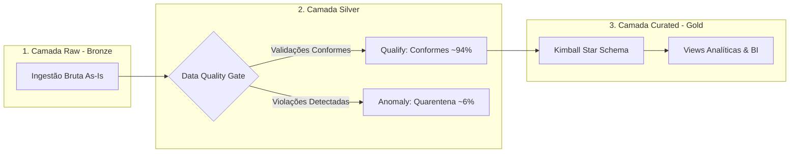

# Data Classification & Lakehouse Architecture Specification

**Projeto:** Cart Recovery  
**Domínio:** Recuperação de Carrinho Abandonado (Marketplace)  
**Versão:** 2.0  
**Status:** ✅ Homologado & Ativo  
**Fontes Normativas:** `data_model_specs.md`, DEC-001 (Métricas em Execução), DEC-004 (Sem SQL Local), DEC-006 (Dual-Artifact Qualify/Anomaly)

---

# 1. Objetivo e Visão Geral

Este documento estabelece as diretrizes normativas de arquitetura, classificação de maturidade e governança de metadados para a plataforma Data Lakehouse do projeto Cart Recovery. O ecossistema organiza o ciclo de vida dos dados em quatro zonas arquiteturais bem delineadas:

1. **Raw (Bronze):** Zona de aterrissagem bruta onde os dados operacionais são preservados em seu estado de origem, assegurando replayability, auditoria e rastreabilidade temporal sem transformações destrutivas.
2. **Qualify (Silver):** Zona de conformidade técnica e padronização tipológica, responsável por executar contratos de dados rígidos, deduplicação e limpeza de domínios.
3. **Anomaly (Silver Quarentena de Anomalias):** Zona de isolamento de registros corrompidos ou que violam regras de integridade contábil e de negócio, permitindo auditoria, diagnóstico de causas-raiz e governança contínua sem interrupção do pipeline principal.
4. **Curated (Gold):** Zona dimensional analítica estruturada no paradigma Kimball Star Schema, combinando entidades conformadas, métricas aditivas e visões de negócio prontas para consumo executivo no Metabase e em Data Apps.

---

# 2. Padrão Arquitetural: Diretório por Entidade & Dual-Metadata (MD + JSON)

Para garantir máxima modularidade, desacoplamento e aderência às melhores práticas de engenharia de dados e governança de catálogo, cada camada do Data Lakehouse adota a convenção de **um diretório dedicado por entidade**.

Em cada pasta de entidade (`pipelines/datalakes/[camada]/[entidade]_[camada]/`), coabitam o dataset físico da camada e o seu respectivo arquivo de especificação e catálogo nos formatos **Dual-Metadata**:
1. **`metadata.md` (Human-Readable):** Visão executiva em Markdown com cabeçalho YAML Frontmatter, links clicáveis na Dadosfera e linhagem.
2. **`metadata.json` (Machine-Readable):** Formato estruturado nativo consumido pela API Maestro da Dadosfera (`https://maestro.dadosfera.ai`), contendo schema de colunas, tipagem, granularidade, upstream e downstream.

```text
pipelines/datalakes/
├── raw/                                # Zona Bronze (Landing & Preservação)
│   ├── spec.md                         # Diretrizes gerais da camada Raw
│   ├── carrinhos_raw/                  # carrinhos_raw.parquet + metadata.md + metadata.json
│   ├── pedidos_raw/                    # pedidos_raw.parquet + metadata.md + metadata.json
│   ├── clientes_raw/                   # clientes_raw.parquet + metadata.md + metadata.json
│   ├── produtos_raw/                   # produtos_raw.parquet + metadata.md + metadata.json
│   ├── itens_carrinho_raw/             # itens_carrinho_raw.parquet + metadata.md + metadata.json
│   ├── eventos_carrinho_raw/           # eventos_carrinho_raw.parquet + metadata.md + metadata.json
│   └── eventos_resgate_raw/            # eventos_resgate_raw.parquet + metadata.md + metadata.json
├── qualify/                            # Zona Silver (Validação & Conformidade)
│   ├── spec.md                         # Diretrizes gerais da camada Qualify
│   ├── carrinhos_qualify/              # carrinhos_qualify.parquet + metadata.md + metadata.json
│   ├── pedidos_qualify/                # pedidos_qualify.parquet + metadata.md + metadata.json
│   ├── clientes_qualify/               # clientes_qualify.parquet + metadata.md + metadata.json
│   ├── produtos_qualify/               # produtos_qualify.parquet + metadata.md + metadata.json
│   ├── itens_carrinho_qualify/         # itens_carrinho_qualify.parquet + metadata.md + metadata.json
│   ├── eventos_carrinho_qualify/       # eventos_carrinho_qualify.parquet + metadata.md + metadata.json
│   └── eventos_resgate_qualify/        # eventos_resgate_qualify.parquet + metadata.md + metadata.json
├── anomaly/                            # Zona Silver Quarentena (Anomalias DEC-006)
│   ├── spec.md                         # Diretrizes gerais da camada Anomaly
│   ├── carrinhos_anomalies/            # carrinhos_anomalies.parquet + metadata.md + metadata.json
│   ├── pedidos_anomalies/              # pedidos_anomalies.parquet + metadata.md + metadata.json
│   ├── clientes_anomalies/             # clientes_anomalies.parquet + metadata.md + metadata.json
│   ├── produtos_anomalies/             # produtos_anomalies.parquet + metadata.md + metadata.json
│   ├── itens_carrinho_anomalies/       # itens_carrinho_anomalies.parquet + metadata.md + metadata.json
│   ├── eventos_carrinho_anomalies/     # eventos_carrinho_anomalies.parquet + metadata.md + metadata.json
│   └── eventos_resgate_anomalies/      # eventos_resgate_anomalies.parquet + metadata.md + metadata.json
└── curated/                            # Zona Gold (Kimball Dimensional & Analytics)
    ├── spec.md                         # Diretrizes gerais da camada Curated
    ├── dim_clientes/                   # dim_clientes.parquet + metadata.md + metadata.json
    ├── dim_tempo/                      # dim_tempo.parquet + metadata.md + metadata.json
    ├── dim_dispositivo/                # dim_dispositivo.parquet + metadata.md + metadata.json
    ├── dim_canal_resgate/              # dim_canal_resgate.parquet + metadata.md + metadata.json
    ├── fato_abandono/                  # fato_abandono.parquet + metadata.md + metadata.json
    ├── fato_resgate/                   # fato_resgate.parquet + metadata.md + metadata.json
    ├── v_abandonment_summary/          # v_abandonment_summary.parquet + metadata.md + metadata.json
    └── v_recovery_roi_by_channel/      # v_recovery_roi_by_channel.parquet + metadata.md + metadata.json
```

---

# 3. Princípios de Classificação e Fluxo de Maturidade

A promoção de dados ao longo do Lakehouse opera como uma esteira determinística e auditável:



1. **Ingestão Raw:** Os dados são capturados diretamente dos sistemas operacionais (webstore, CRM, ERP, checkout) e armazenados no formato Parquet com carimbo de ingestão.
2. **Avaliação no Quality Gate:** O motor de transformação submete cada tupla às **validações declaradas no corpo da entidade** correspondente. Registros que cumprem integralmente os critérios são promovidos para a camada **Qualify** (`CART_RECOVERY.*`), enquanto registros que apresentam desvios contábeis, chaves nulas ou inconsistências cronológicas são isolados na camada **Anomaly** com payload original e diagnóstico da falha (DEC-006).
3. **Modelagem Curated:** Apenas os dados qualificados da Silver alimentam o modelo dimensional da camada **Curated** (`CART_RECOVERY_GOLD.*`), garantindo que visões analíticas, modelos preditivos e relatórios executivos no Metabase operem sobre bases 100% confiáveis e matematicamente consistentes (DEC-001).

---

# 4. Especificações das Quatro Camadas

### 4.1 Camada Raw (Bronze)
A camada Raw é o repositório imutável de entrada. Sua função primordial é a custódia fidedigna do dado original, permitindo reprocessamentos históricos integrais. As validações nesta camada concentram-se estritamente na sanidade física do arquivo, completude de transporte e codificação UTF-8, abstendo-se de descartar ou mutar registros que contenham dirty data.

### 4.2 Camada Qualify (Silver)
A camada Qualify consolida os dados tecnicamente limpos e tipados. É nela que são aplicadas as padronizações de datas para formato canônico, conversões numéricas, higienização sintática de strings e a execução estrita das **validações declaradas no corpo da entidade**. A granularidade atômica original é rigorosamente mantida, não sendo permitidas agregações prematuras que ocultem o grão da fonte.

### 4.3 Camada Anomaly (Quarentena de Anomalias de Dados)
A camada Anomaly atua como salvaguarda da integridade do Data Lakehouse. Em conformidade com o DEC-006, registros que não superam os testes de sanidade contábil (como equações financeiras incoerentes ou fretes negativos) ou regras de integridade referencial são direcionados para a quarentena. Cada registro anômalo é preservado com seu payload íntegro acompanhado de identificador único de auditoria, código do erro, severidade e timestamp de detecção.

### 4.4 Camada Curated (Gold)
A camada Curated entrega o valor analítico final do negócio. Adotando a metodologia Kimball Star Schema, estrutura os dados em dimensões conformadas e tabelas de fatos granulares com chaves surrogate (`_sk`). As medidas armazenadas nos fatos são puramente aditivas, delegando o cômputo de ratios, taxas de abandono e ROI de recuperação para o momento de consulta (DEC-001), eliminando distorções de cálculo em filtros analíticos.

---

# 5. Padrão do Documento de Metadados (`metadata.md`)

O documento de especificação presente em cada pasta de entidade unifica os metadados técnicos de catálogo com o contexto de negócio. Ele adota formato híbrido estruturado:

- **Cabeçalho YAML Frontmatter:** Contém identificadores canônicos para automação e integração (`doc_id`, `layer`, `entity_name`, `dadosfera_asset_id`, `snowflake_table`, `upstream`, `downstream`, `classification`, `governance_tags`).
- **Narrativa em Texto Corrido:** Apresenta a visão de negócio da entidade, o papel daquela tabela na camada, seu nível de granularidade e o direcionamento explícito para as **validações declaradas no corpo da entidade** em sua especificação de origem, preservando a coerência conceitual do repositório.