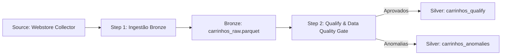

# 🔄 Pipeline: Ingestão de Dados Brutos de Carrinhos (Source -> Bronze)

## 1. 📌 Visão Geral & Objetivo
- **Propósito**: Realizar a aterrissagem (*landing zone*) bruta e imutável de todas as sessões de carrinho iniciadas na webstore e mobile app, preservando o estado *as-is* da fonte para replayability e auditoria.
- **Camada**: `Source -> Bronze (Raw)`
- **Frequência / Execução**: `Batch Automatizado (make.py pipeline-run / Stepsfera Step 1)`
- **Criticidade**: `Crítica (Base de entrada para todo o funil de recuperação e conciliação contábil)`

---

## 2. 🔍 Contrato de Dados (Origem & Destino)

### 📥 Origem (Input)
- **Fonte**: Webstore E-commerce / Event Collector
- **Formato de Carga**: JSON / Streamline Batch
- **Volumetria Estimada**: `~7.500 sessões de carrinho`

### 📤 Destino (Output)
- **Tabela/Arquivo**: `BRONZE_RAW.CARRINHOS` (`data/mock/output/parquet/carrinhos.parquet`)
- **Schema & Tipos**:

| Coluna | Tipo | Nulável | Descrição / Papel |
|---|---|---|---|
| `carrinho_id` | VARCHAR / UUID | Não | Identificador único bruto da sessão |
| `cliente_id` | VARCHAR / UUID | Não | Identificador do cliente proprietário do carrinho |
| `data_criacao` | TIMESTAMP | Não | Data e hora de abertura do carrinho |
| `data_ultima_atividade` | TIMESTAMP | Não | Timestamp do último evento na sessão |
| `status` | VARCHAR | Não | Status bruto emitido pela fonte |
| `valor_subtotal` | FLOAT / NUMERIC | Não | Somatório bruto dos itens |
| `valor_frete` | FLOAT / NUMERIC | Não | Valor de frete atribuído |
| `valor_desconto` | FLOAT / NUMERIC | Sim | Desconto ou cupom aplicado na sessão |
| `valor_total` | FLOAT / NUMERIC | Não | Valor total computado no checkout |
| `cupom_aplicado` | VARCHAR | Sim | Código promocional utilizado |
| `origem` | VARCHAR | Sim | Canal de navegação (`mobile_app`, `desktop_web`, etc.) |

---

## 3. 🛠️ Lógica de Ingestão & Preservação

1. **Preservação As-Is**: Nenhuma coerção destrutiva ou remoção de dados incorretos é realizada nesta camada. Registros com anomalias propositais (ex: frete negativo ou incoerência contábil) são preservados integralmente.
2. **Compressão & Formato**: Persistência em arquivo binário colunar `Parquet` sob compressão Snappy para eficiência de I/O.
3. **Imutabilidade**: O pipeline opera em modo idempotente garantindo rastreabilidade sem permitir mutações arbitrárias nos dados brutos.

---

## 4. ✅ Validações de Transporte e Sanidade de Entrada

| Regra / Verificação | Tipo | Condição de Sucesso | Ação em caso de Falha |
|---|---|---|---|
| `ING_CAR_001` | `File Integrity` | Arquivo Parquet válido e legível | Abortar lote de ingestão |
| `ING_CAR_002` | `Schema Check` | Presença de colunas obrigatórias | Notificar engenharia |
| `ING_CAR_003` | `Batch Volume` | Registros > 0 | Alertar ausência de dados |

---

## 5. 🔗 Linhagem de Dados (Lineage)

