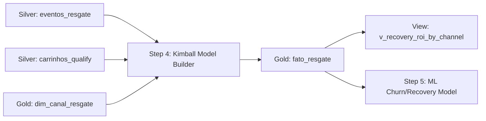

# 🔄 Pipeline: Modelagem Dimensional de Resgates (Silver -> Gold)

## 1. 📌 Visão Geral & Objetivo
- **Propósito**: Consolidar a tabela de fatos analítica de disparos de CRM, calculando receita recuperada atribuída, custos de comunicação e ROI líquido individual por evento de resgate.
- **Camada**: `Silver -> Gold (Kimball Star Schema)`
- **Frequência / Execução**: `Batch Automatizado (make.py pipeline-run / Stepsfera Step 4)`
- **Criticidade**: `Alta (Métrica primária de negócio para o Pitch de Vendas e BI)`

---

## 2. 🔍 Contrato de Dados (Origem & Destino)

### 📥 Origem (Input)
- **Tabelas**: `SILVER_QUALIFY.EVENTOS_RESGATE` e `SILVER_QUALIFY.CARRINHOS`
- **Volumetria Estimada**: `~6.400 disparos de CRM`

### 📤 Destino (Output)
- **Tabela/Arquivo**: `GOLD_KIMBALL.FATO_RESGATE` (`pipelines/case-item-08/outputs/curated/fato_resgate.parquet`)
- **Schema & Tipos**:

| Coluna | Tipo | Nulável | Descrição / Regra |
|---|---|---|---|
| `fato_resgate_sk` | BIGINT | Não | Surrogate Key da linha de fato |
| `resgate_id` | VARCHAR / UUID | Não | Chave natural do disparo |
| `carrinho_id` | VARCHAR / UUID | Não | FK do carrinho recuperado |
| `canal_sk` | INTEGER | Não | FK para `dim_canal_resgate` |
| `flag_aberto` | INTEGER | Não | 1 se houve abertura, 0 se não |
| `flag_clicado` | INTEGER | Não | 1 se houve clique, 0 se não |
| `flag_convertido` | INTEGER | Não | 1 se resultou em conversão de pedido |
| `custo_envio` | FLOAT | Não | Custo financeiro unitário do disparo |
| `receita_recuperada` | FLOAT | Não | Receita bruta/líquida resgatada |
| `roi_liquido_disparo` | FLOAT | Não | `receita_recuperada - custo_envio` |

---

## 3. 🛠️ Lógica de Transformação

1. **Atribuição Financeira**: Mapeamento do valor total do carrinho abandonado para cada disparo de resgate.
2. **Cálculo de Funil**: Criação de flags binárias puras para `flag_aberto`, `flag_clicado` e `flag_convertido`.
3. **Cálculo de ROI Líquido (DEC-001)**: `receita_recuperada = valor_carrinho * (1 - desconto_rate)` para conversões; `roi_liquido = receita_recuperada - custo_envio`.

---

## 4. 🔗 Linhagem de Dados (Lineage)

