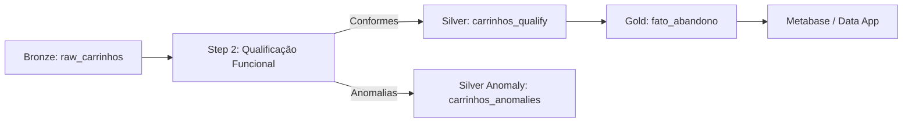

# 🔄 Pipeline: Qualificação e Sanitização de Carrinhos (Bronze -> Silver)

## 1. 📌 Visão Geral & Objetivo
- **Propósito**: Higienizar os dados brutos de sessões de carrinho da camada Bronze, aplicando validações declarativas puras e segregando registros inconsistentes para quarentena de anomalias (DEC-006).
- **Camada**: `Bronze -> Silver (Qualify / Anomalies)`
- **Frequência / Execução**: `Batch Automatizado (make.py pipeline-run / Stepsfera Step 2)`
- **Criticidade**: `Alta (Garante integridade contábil para dashboards e modelos preditivos)`

---

## 2. 🔍 Contrato de Dados (Origem & Destino)

### 📥 Origem (Input)
- **Tabela/Arquivo**: `BRONZE_RAW.CARRINHOS` (`data/mock/output/parquet/carrinhos.parquet`)
- **Volumetria Estimada**: `~7.500 registros`

### 📤 Destino (Output)
- **Tabela/Arquivo**: `SILVER_QUALIFY.CARRINHOS` (`pipelines/case-item-08/outputs/qualify/carrinhos.parquet`)
- **Schema & Tipos**:

| Coluna | Tipo | Nulável | Descrição / Regra |
|---|---|---|---|
| `carrinho_id` | VARCHAR / UUID | Não | Identificador único da sessão (PK) |
| `cliente_id` | VARCHAR / UUID | Não | FK do cliente associado |
| `valor_subtotal` | FLOAT / NUMERIC | Não | Somatório dos itens no carrinho |
| `valor_frete` | FLOAT / NUMERIC | Não | Valor de frete sanitizado ($\ge 0$) |
| `valor_desconto` | FLOAT / NUMERIC | Sim | Valor total do desconto aplicado |
| `valor_total` | FLOAT / NUMERIC | Não | Total contábil: `subtotal + frete - desconto` |
| `status` | VARCHAR | Não | Status canônico (`comprado`, `abandonado`, `expirado`, `ativo`, `recuperado`) |

---

## 3. 🛠️ Lógica de Transformação

1. **Normalização e Sanitização**: Padronização de nomes de colunas em snake_case e remoção de espaços em branco em strings.
2. **Avaliação Declarativa**: Execução do array puro de funções de validação (`VALIDATION_CARRINHOS`).
3. **Bifurcação em Quarentena (DEC-006)**: Registros com frete negativo, subtotal zerado ou quebra de equação contábil são roteados para `SILVER_ANOMALIES.CARRINHOS_ANOMALIES`.

---

## 4. ✅ Regras de Qualidade de Dados (Data Quality)

| Regra / Código | Tipo | Condição de Sucesso | Ação em caso de Falha |
|---|---|---|---|
| `ERR_CAR_001` | `Uniqueness / Not Null` | `carrinho_id IS NOT NULL` | Roteamento para Quarentena |
| `ERR_CAR_002` | `Integrity / Not Null` | `cliente_id IS NOT NULL` | Roteamento para Quarentena |
| `ANOM_CAR_001` | `Validity` | `valor_frete >= 0.0` | Quarentena (ANOM-01) |
| `ANOM_CAR_003` | `Business Rule` | `valor_desconto <= valor_subtotal` | Quarentena (ANOM-03) |
| `ANOM_CAR_004` | `Accounting Equation` | `abs(total - (subtotal + frete - desc)) <= 0.01` | Quarentena (ANOM-04) |

---

## 5. 🔗 Linhagem de Dados (Lineage)

