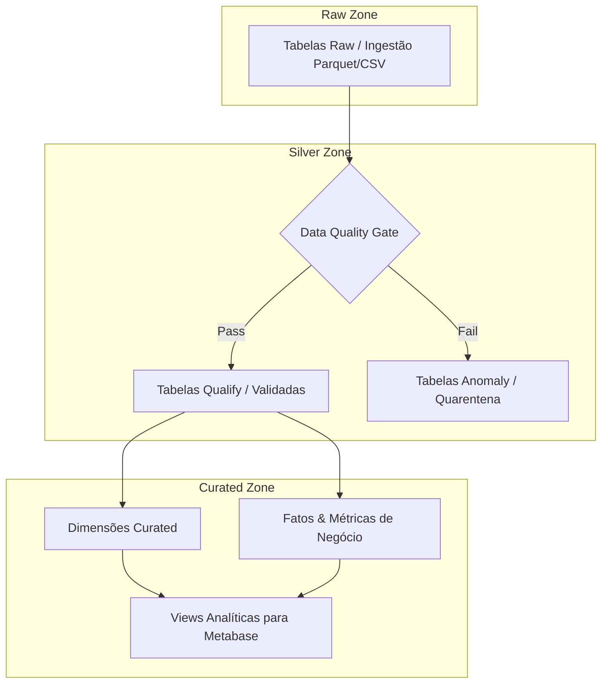

# Data Platform Specification

> **Versão:** 1.0  
> **Status:** Active  
> **Escopo:** Data Engineering / Data Quality / Data Transformation / Metadata Governance  
> **Última atualização:** 2026-08-23  

---

# 1. Purpose

Define o vocabulário, os padrões arquiteturais, as regras de transformação, validação, linhagem (*lineage*) e governança utilizados na especificação da plataforma de dados do projeto **Cart Recovery (Recuperação de Carrinho Abandonado)**.

Este documento funciona como a fonte normativa para:

- Especificação e modelagem de entidades;
- Especificação e catalogação de pipelines (Bronze $\rightarrow$ Silver $\rightarrow$ Gold);
- Definição de transformações e enriquecimentos;
- Definição de regras de *Data Quality* (contratos e validações);
- Classificação e roteamento de anomalias (*dead-letter / quarantine*);
- Definição de linhagem e rastreabilidade (*Lineage*);
- Geração padronizada de artefatos por agentes de IA e engenheiros.

---

# 2. Normative Language

As seguintes palavras possuem significado normativo baseado na [RFC 2119](https://www.ietf.org/rfc/rfc2119.txt):

| Termo | Significado |
|---|---|
| **MUST** | Requisito absoluto e obrigatório. |
| **MUST NOT** | Proibição absoluta. |
| **SHOULD** | Recomendação forte; exceções válidas devem ser justificadas. |
| **SHOULD NOT** | Prática não recomendada; deve ser evitada salvo exceções documentadas. |
| **MAY** | Item estritamente opcional. |

Agentes e desenvolvedores **MUST** respeitar estas regras ao gerar, auditar ou interpretar artefatos da plataforma.

---

# 3. Core Concepts

## 3.1 Entity (Entidade)

Uma entidade representa um conceito de negócio no domínio de e-commerce com:
- Significado de negócio claro e granularidade definida;
- Atributos tipados e regras de nulabilidade;
- Chaves primárias (PK) e relacionamentos (FK);
- Regras de negócio e validações de qualidade;
- Linhagem (*lineage*) upstream e downstream;
- Consumidores identificados (Dashboards, APIs, Modelos de ML/GenAI).

Cada entidade **MUST** possuir especificação própria no modelo canônico de 4 divisões (`data/data-models/logical/entities/[entidade].md`).

---

## 3.2 Dataset & Camadas Arquiteturais

Dataset é a representação física ou lógica de uma entidade em determinada camada da arquitetura Medallion:

```text
carrinhos_raw       (Bronze: dado preservado na granularidade da fonte)
carrinhos_qualify   (Silver: dado tecnicamente tratado, validado e conforme)
carrinhos_anomalies (Silver/Anomaly: registros inconsistentes isolados em quarentena)
dim_carrinhos       (Gold: modelo dimensional pronto para consumo analítico e BI)
fct_abandono        (Gold: fato de sessões de abandono e métricas de conversão)
```

### Estrutura de Catálogo e Documentação:

```text
docs/
├── specifications/
│   └── data-platform-specification.md  # (Este documento)
├── pipelines/
│   ├── bronze/                         # Especificações de Ingestão Raw
│   ├── silver/                         # Especificações de Limpeza & Qualify
│   └── gold/                           # Especificações de Modelagem Curated & Fatos
└── data-dictionary/                    # Dicionários de atributos e regras

data/
├── catalogo/
│   ├── raw/                            # Metadados de entrada da fonte
│   ├── qualify/                        # Dicionários da camada tratada (Silver)
│   ├── anomaly/                        # Catálogo de anomalias e quarentena
│   └── curated/                        # Modelos analíticos (Gold / Star Schema)
```

---

# 4. Camadas da Arquitetura Medallion



### 4.1 Camada Bronze (Raw)
- **Objetivo:** Preservar os dados brutos recebidos da fonte sem alterações destrutivas.
- **Regras:**
  - Registros **MUST** manter a granularidade e tipos originais.
  - Dados **MAY** conter duplicatas, nulos e valores sintéticos de dirty data.
  - Ingestão **MUST** incluir metadados de carga (`_ingestion_at`, `_source_file`).

### 4.2 Camada Silver (Qualify + Anomaly)
- **Objetivo:** Garantir conformidade técnica, tipos padronizados e isolamento de anomalias.
- **Regras:**
  - Registros conformes **MUST** ser promovidos para `[entidade]_qualify`.
  - Registros que falharem em regras críticas de qualidade **MUST NOT** ser descartados silenciosamente; **MUST** ser roteados para `[entidade]_anomalies` com a respectiva `anomaly_reason`.
  - A camada Qualify **MUST NOT** aplicar agregações que destruam a granularidade original da entidade.

### 4.3 Camada Gold (Curated / Analytics)
- **Objetivo:** Entregar dados estruturados para BI (Metabase), Data Apps (Streamlit) e modelos preditivos/GenAI.
- **Regras:**
  - Dados **MUST** ser estruturados em esquemas estrela (*Star Schema* / Dimensões e Fatos) ou views analíticas otimizadas.
  - Regras de negócio como segmentação RFM, identificação de abandono (>1h) e cálculo de ROI de resgate **MUST** ser materializadas nesta camada.

---

# 5. Data Quality Framework

Toda transformação entre Bronze e Silver **MUST** avaliar as 4 dimensões essenciais de qualidade:

| Dimensão | Descrição | Exemplo de Regra | Severidade |
|---|---|---|:---:|
| **Uniqueness (Unicidade)** | Não existência de chaves duplicadas. | `COUNT(id) = COUNT(DISTINCT id)` | Crítica |
| **Completeness (Completude)** | Campos obrigatórios preenchidos sem nulos. | `email IS NOT NULL` | Crítica / Alta |
| **Validity / Range (Validade)** | Valores dentro de domínios ou limites permitidos. | `valor_total >= 0`, `desconto <= subtotal` | Alta |
| **Referential Integrity (Integridade)** | Chaves estrangeiras com correspondência válida. | `carrinhos.id_cliente IN (SELECT id_cliente FROM clientes)` | Crítica |

---

# 6. Governança e Regras de Execução

1. **Proibição de `.sql` Locais (DEC-004):**
   - Agentes e pipelines **MUST NOT** criar arquivos `.sql` soltos no repositório. As queries de transformação e views pertencem exclusivamente à plataforma Dadosfera / Snowflake e especificações em Markdown.
2. **Integração com Catálogo Dadosfera:**
   - Todo dataset em produção **SHOULD** possuir seu `dadosfera_asset_id` registrado no `assets_registry.md` / `assets_registry.json`.
3. **Reproduzibilidade Determinística:**
   - Todas as transformações e pipelines **MUST** ser determinísticos e idempotentes.
