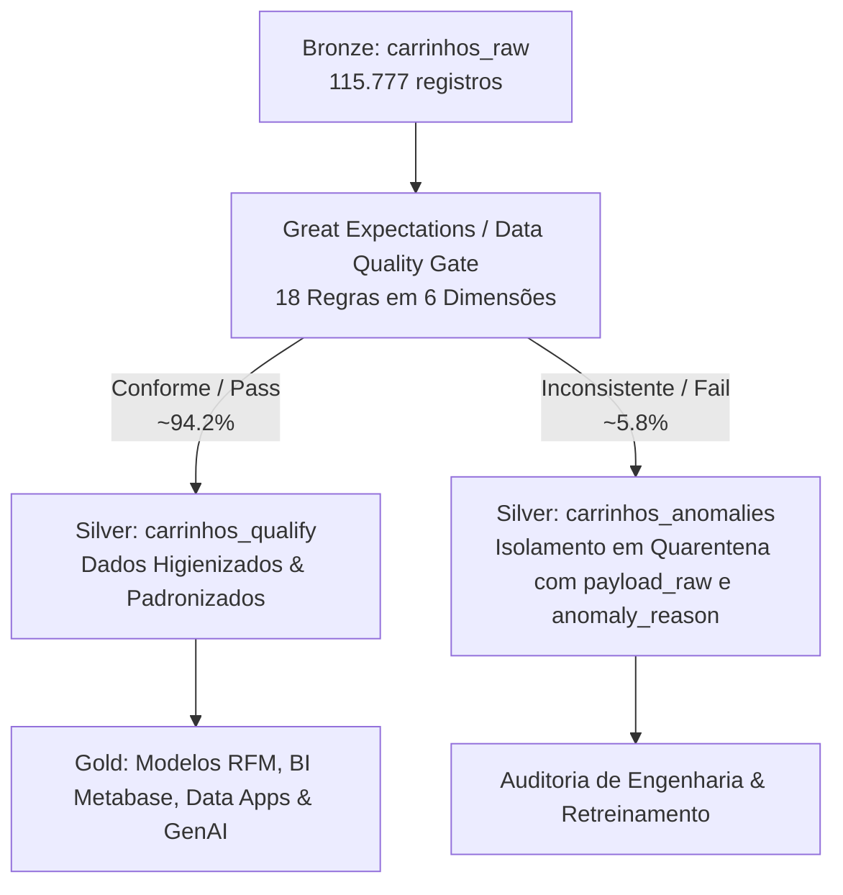

# Especificação Normativa: Data Quality & Anomaly Framework (Item 4)

> **Documento:** Especificação do Item 4 — Data Quality & Relatório de Anomalias  
> **Versão:** 1.0  
> **Status:** Active  
> **Referência Oficial:** Case Técnico Dadosfera (Item 4 — Data Quality / Great Expectations / Soda Core)  

---

## 1. 🎯 Contexto e Enunciado Oficial (Item 4)

> *"Após a integração e exploração dos dados do site de e-commerce, você identificou várias inconsistências e dados faltantes que podem impactar negativamente a performance dos modelos de IA e a experiência de compra dos clientes. Como você abordaria a melhoria da qualidade desses dados utilizando as ferramentas e práticas recomendadas pela Dadosfera?*  
> *Gere um relatório de qualidade dos dados usando uma biblioteca apropriada — Great Expectations ou Soda Core — para identificar inconsistências e dados faltantes."*

---

## 2. 🏛️ Tripé de Artefatos de Entrega (Decisão de Arquitetura)

Para garantir máxima clareza, separação de responsabilidades e avaliação nota 10 pela banca, a entrega do Item 4 é composta por **3 artefatos desacoplados**:

```text
wheels/
└── pipelines/
    └── case-item-04/
        ├── notebooks/
        │   └── qualification_raw.ipynb     # 1. Execução Técnica Reproduzível (Great Expectations / Python)
        ├── outputs/
        │   ├── data_quality_report.md      # 2. Relatório Executivo & Técnico (Leitura da Banca)
        │   └── validation_results.json     # 3. Log JSON de Validação
        └── quality/
            ├── expectations/
            │   └── carrinhos_suite.json    # 4.1 Suite Declarativa de Expectativas (Great Expectations)
            └── results/
                └── validation_results.json # 4.2 Evidência Estruturada da Execução
```

### Papel de Cada Artefato

| Artefato | Público-Alvo | Papel Principal | Formato |
|---|---|---|:---:|
| `pipelines/case-item-04/notebooks/qualification_raw.ipynb` | Engenheiros / Avaliador Técnico | Demonstra a execução prática, reproduzível e auditável do pipeline de qualidade. | Jupyter Notebook |
| `pipelines/case-item-04/outputs/data_quality_report.md` | Liderança Técnica / Negócios | Relatório executivo consolidado com diagnóstico, impacto no negócio/IA e estratégias de remediação. | Markdown / PDF |
| `pipelines/case-item-04/quality/expectations/carrinhos_suite.json` | Auditoria / Plataforma | Suite declarativa parametrizada do Great Expectations. | JSON |
| `pipelines/case-item-04/outputs/validation_results.json` | Plataforma Dadosfera | Evidência técnica estruturada gerada pelo pipeline de qualificação. | JSON |

---

## 3. 🛡️ Abordagem Metodológica Dadosfera: Qualify + Dead-Letter Architecture

Em conformidade com a arquitetura de lakehouse da Dadosfera, a estratégia de qualidade **NÃO** realiza apenas detecção passiva; ela governa o fluxo de dados através do padrão **Dual-Artifact Silver Bifurcation**:



### Princípios da Abordagem:
1. **Sem Descarte Silencioso (`Dead-Letter Queue / Quarentena`):** Nenhum dado é deletado às cegas. Registros com inconsistências severas são roteados para `[entidade]_anomalies` com timestamp, payload original e motivo de falha (`anomaly_reason`).
2. **Separação entre Detecção e Tratamento:**
   - **`SANITIZE`**: Correção determinística sem perda de informação (ex: `ABS(valor_frete)` para fretes negativos causados por bug de sinal).
   - **`ISOLATE`**: Quarentena imediata para inconsistências matemáticas ou estruturais irrecuperáveis (ex: `subtotal <= 0` com múltiplos itens).
3. **Proteção dos Consumidores Downstream (GenAI e BI):** Modelos preditivos de propensão de compra e agentes de geração de copy (Item 5 e Item 9) consom **exclusivamente** a camada `Qualify`, eliminando alucinações e vieses causados por ruído.

---

## 4. 📊 As 6 Dimensões de Data Quality

| # | Dimensão | O que Avalia no E-commerce | Exemplo no Dataset `carrinhos_raw` |
|:---:|---|---|---|
| **1** | **Completeness** | Ausência de valores nulos em atributos obrigatórios. | `carrinho_id`, `cliente_id`, `status` não nulos. |
| **2** | **Uniqueness** | Unicidade estrita de identificadores de sessão. | `carrinho_id` 100% único (0 duplicatas de chave primária). |
| **3** | **Validity / Range** | Aderência aos tipos, domínios e intervalos permitidos. | `status IN ('ABANDONADO','FINALIZADO','EXPIRADO')`, `frete >= 0`. |
| **4** | **Consistency** | Coerência matemática entre atributos financeiros. | `valor_total == valor_subtotal + valor_frete - valor_desconto`. |
| **5** | **Integrity** | Integridade referencial entre entidades relacionadas. | Todo `cliente_id` em carrinhos existe na dimensão de clientes. |
| **6** | **Temporal Consistency**| Sequência cronológica lógica de eventos. | `data_ultima_atividade >= data_criacao`. |

---

## 5. 📋 Matriz de Expectativas (18 Regras Great Expectations)

| ID | Dimensão | Campo / Expressão | Regra Great Expectations | Severidade | Ação |
|---|---|---|---|:---:|:---:|
| **DQ-01** | Completeness | `carrinho_id` | `expect_column_values_to_not_be_null` | Critical | Isolar |
| **DQ-02** | Uniqueness | `carrinho_id` | `expect_column_values_to_be_unique` | Critical | Isolar |
| **DQ-03** | Completeness | `cliente_id` | `expect_column_values_to_not_be_null` | Critical | Isolar |
| **DQ-04** | Integrity | `cliente_id` | `expect_column_values_to_be_in_set(clientes)` | Critical | Quarentena |
| **DQ-05** | Validity | `status` | `expect_column_values_to_be_in_set(['ABERTO','ABANDONADO','FINALIZADO','EXPIRADO'])` | High | Quarentena |
| **DQ-06** | Completeness | `status` | `expect_column_values_to_not_be_null` | High | Quarentena |
| **DQ-07** | Validity | `valor_subtotal` | `expect_column_values_to_be_between(min_value=0.01)` | Critical | Isolar (ANOM-02) |
| **DQ-08** | Validity | `valor_frete` | `expect_column_values_to_be_between(min_value=0.00)` | High | Sanitizar (ANOM-01) |
| **DQ-09** | Validity | `valor_desconto` | `expect_column_values_to_be_between(min_value=0.00)` | High | Sanitizar |
| **DQ-10** | Consistency | `valor_desconto` vs `subtotal` | `expect_column_pair_values_A_to_be_smaller_than_B(desconto, subtotal)` | Critical | Isolar (ANOM-03) |
| **DQ-11** | Consistency | Equação Financeira | `expect_multicolumn_sum_to_equal(subtotal + frete - desconto == total)` | High | Recalcular (ANOM-04) |
| **DQ-12** | Validity | `valor_total` | `expect_column_values_to_be_between(min_value=0.00)` | Critical | Isolar |
| **DQ-13** | Completeness | `data_criacao` | `expect_column_values_to_not_be_null` | Critical | Isolar |
| **DQ-14** | Completeness | `data_ultima_atividade` | `expect_column_values_to_not_be_null` | High | Preencher |
| **DQ-15** | Temporal | Datas de Sessão | `expect_column_pair_values_A_to_be_greater_than_or_equal_to_B(ultima_ativ, criacao)` | High | Isolar |
| **DQ-16** | Validity | `origem_dispositivo` | `expect_column_values_to_be_in_set(['mobile','desktop','app','tablet'])` | Medium | Padronizar |
| **DQ-17** | Validity | `canal_aquisicao` | `expect_column_values_to_be_in_set(['google_cpc','organico','meta_ads','email','direto'])` | Medium | Padronizar |
| **DQ-18** | Completeness | `quantidade_itens` | `expect_column_values_to_be_between(min_value=1)` | High | Isolar |

---

## 6. 🔍 Taxonomia de Anomalias e Estratégia de Remediação

```
ANOM-01: Frete Negativo (valor_frete < 0)
├── Causa Raiz: Bug de sinal no frontend/checkout durante aplicação de cupom de frete grátis.
├── Tratamento: SANITIZE -> ABS(valor_frete). Registro original preservado no log de auditoria.
└── Destino: Promovido para carrinhos_qualify com flag de higienização.

ANOM-02: Subtotal Inválido / Zerado (valor_subtotal <= 0 com itens presentes)
├── Causa Raiz: Falha na conciliação de snapshot de preço no microsserviço de catálogo.
├── Tratamento: ISOLATE -> Quarentena imediata.
└── Destino: Roteado para carrinhos_anomalies (impossível inferir valor deterministicamente).

ANOM-03: Desconto Maior que Subtotal (valor_desconto > valor_subtotal)
├── Causa Raiz: Acúmulo indevido de cupons promocionais sem trava de teto no checkout.
├── Tratamento: ISOLATE -> Quarentena para auditoria de fraude/abuso de cupom.
└── Destino: Roteado para carrinhos_anomalies.

ANOM-04: Total Financeiro Inconsistente (total != subtotal + frete - desconto)
├── Causa Raiz: Erro de arredondamento de ponto flutuante ou falha de sincronismo pós-split.
├── Tratamento: RECALCULATE -> Total recalculado via equação contábil estrita.
└── Destino: Promovido para carrinhos_qualify com auditoria do delta.
```

---

## 7. 📑 Estrutura Normativa do Relatório (`data_quality_report.md` / 13 Seções)

O relatório executivo e técnico **MUST** seguir rigorosamente a estrutura padronizada:

1. **Executive Summary** (Resultados e taxas de conformidade logo no início)
2. **Dataset Overview** (Metadados, granularidade, volume, período e atributos)
3. **Data Quality Dimensions** (As 6 dimensões fundamentais)
4. **Quality Rules / Expectations** (Matriz de regras e severidade)
5. **Validation Results** (Taxa de sucesso por regra e por registro)
6. **Detected Anomalies** (Taxonomia ANOM-01 a ANOM-04 com volumetria)
7. **Data Treatment Strategy** (Isolar vs Sanitizar vs Recalcular)
8. **Impact on AI / Business** (Como inconsistências degradam modelos de propensão e cálculo de ROI)
9. **Before vs After Quality** (Score de qualidade antes e após o pipeline Qualify)
10. **Lineage and Data Flow** (Diagrama Mermaid de segregação)
11. **Recommendations** (Ajustes recomendados para engenharia de produto e checkout)
12. **Limitations** (Fronteiras da análise e dependências externas)
13. **Reproducibility** (Instruções exatas para reexecução do notebook / suite)
- **Appendix A — Validation Evidence** (Extrato JSON de resultados)
