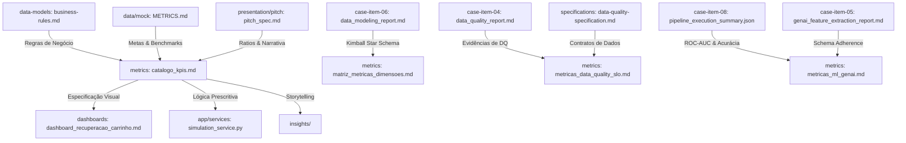

# 📐 Camada Semântica de Métricas & Governança de KPIs (Semantic Metrics Layer)

> **Módulo:** `metrics/`  
> **Papel Arquitetural:** Single Source of Truth (SSOT) de Fórmulas Matemáticas, Indicadores de Negócio, Matriz Dimensional, Confiabilidade de Dados (DQ/SLO) e Avaliação de IA/ML.  
> **Framework Normativo:** [`DEC-001`](../docs/relatorios/decision-making/pitch/pitch.txt) (Foco em % e Ratios) • [`DEC-004`](../docs/specifications/data-platform-specification.md) (Sem SQL Local) • [`DEC-006`](../docs/specifications/data-quality-specification.md) (Dual-Artifact Silver) • [`DEC-008`](../docs/relatorios/decision-making/dec-008-kimball-star-schema-simplicity.md) (Kimball Star Schema).

---

## 📌 1. Visão Geral e Propósito

Na arquitetura moderna da **Plataforma Dadosfera**, o módulo `metrics/` atua como a **Camada Semântica Desacoplada (Semantic Metrics Layer)**. Ele garante que qualquer consumidor analítico — seja um painel no **Metabase (Item 7)**, uma aplicação interativa no **Streamlit (Item 9)**, um script de simulação em Python ou a narrativa de vendas do **Pitch (Item 10)** — consuma exatamente as mesmas fórmulas, grãos, dimensões e convenções contábeis.

```text
┌─────────────────────────────────────────────────────────────────────────────┐
│                   FONTES DE DADOS E LAKEHOUSE MEDALLION                     │
│    Bronze (RAW) ──→ Silver Qualify & Anomalies (DEC-006) ──→ Gold (DW)      │
└──────────────────────────────────────┬──────────────────────────────────────┘
                                       │
                                       ▼
┌─────────────────────────────────────────────────────────────────────────────┐
│               CAMADA SEMÂNTICA DE MÉTRICAS (metrics/) [SSOT]                │
│  • Fórmulas Canônicas (LaTeX)       • Matriz Dimensional (Kimball)          │
│  • Driver Tree (North Star)         • Confiabilidade & SLOs de Dados        │
│  • Avaliação de Modelos de ML/GenAI • Governança & Padrões de Agregação     │
└──────────────────┬──────────────────────────────────────┬───────────────────┘
                   │                                      │
                   ▼                                      ▼
┌──────────────────────────────────────┐  ┌───────────────────────────────────┐
│     METABASE & BI NATIVO (Item 7)    │  │   DATA APP STREAMLIT (Item 9)     │
│  • Dashboards de Série Temporal      │  │  • Simulador de Viabilidade (ROI) │
│  • Visão de Categorias e Canais      │  │  • Prescrição em Tempo Real       │
└──────────────────────────────────────┘  └───────────────────────────────────┘
```

---

## 🗂️ 2. Estrutura do Módulo & Mapa de Navegação

O diretório é organizado em 5 pilares complementares e rastreáveis:

| Arquivo | Pilar de Governança | Descrição e Escopo |
|---|---|---|
| 📘 **[`catalogo_kpis.md`](catalogo_kpis.md)** | **Catálogo Master de KPIs de Negócio** | Dicionário canônico dos 12 KPIs analíticos estruturados nas 5 camadas hierárquicas da `DEC-001` + Score Prescritivo com formulação rigorosa em $\LaTeX$, grão atômico, benchmarks de mercado e mapeamento para as tabelas Gold. |
| 🧭 **[`matriz_metricas_dimensoes.md`](matriz_metricas_dimensoes.md)** | **Matriz Semântica Dimensional** | Mapeamento de fatiamento (*Slice & Dice*) que cruza os 12 KPIs contra as 6 Dimensões Conformadas do Data Warehouse (`dim_clientes`, `dim_tempo`, `dim_dispositivo`, `dim_motivo_abandono`, `dim_canal_resgate`, `dim_segmento_rfm`), com tipagem de aditividade. |
| 🌳 **[`arvore_metricas_driver_tree.md`](arvore_metricas_driver_tree.md)** | **Árvore de Causa e Efeito (Driver Tree)** | Decomposição causal da *North Star Metric* (Taxa Líquida de Recuperação & ROI de 45x) em drivers de Nível 1 (Volume, Engajamento, Conversão), Nível 2 (Canais, Timing, Descontos) e alavancas de negócio. |
| 🛡️ **[`metricas_data_quality_slo.md`](metricas_data_quality_slo.md)** | **Confiabilidade & Data SLOs** | Métricas de integridade da plataforma: Taxa de Conformidade Global (98.76%), volumetria auditada (115.775 registros), Quarentena Silver Anomalies (1.439 registros via `DEC-006`) e Service Level Objectives de pipeline. |
| 🤖 **[`metricas_ml_genai.md`](metricas_ml_genai.md)** | **Avaliação de IA & Machine Learning** | Métricas quantitativas de performance dos modelos inteligentes: Classificador de Churn/Propensão do Item 8 (ROC-AUC 0.9478, Acurácia 0.9953) e Pipeline GenAI do Item 5 (Pydantic Schema 100%, latência e custo). |

---

## 🔗 3. Mapa de Referências Cruzadas na Codebase

Para garantir total integridade analítica e rastreabilidade, cada indicador neste módulo está vinculado diretamente às suas origens (*Ground Truth*) e consumidores:



---

## 📏 4. Padrões de Agregação & Tipos de Aditividade

Ao consultar métricas através das views ou do Metabase, a seguinte classificação de aditividade **MUST** ser respeitada:

1. **Fully Additive (Totalmente Aditivas):**
   - Podem ser somadas ao longo de qualquer dimensão (tempo, cliente, canal).
   - *Exemplos:* `valor_total_em_risco` ($\sum$), `custo_disparo_envio` ($\sum$), `valor_pedido_recuperado` ($\sum$), `contagem_carrinhos` ($\text{COUNT}$).
2. **Semi-Additive (Semi-Aditivas):**
   - Podem ser somadas através de algumas dimensões, mas **NÃO** através da dimensão tempo.
   - *Exemplos:* `saldo_clientes_ativos` (snapshot no tempo), `duracao_media_sessao`.
3. **Non-Additive (Não-Aditivas / Ratios Calculados):**
   - **NUNCA** devem ser calculadas somando médias ou somando percentuais pré-calculados. Devem ser sempre recalculadas no grão final via razão de somas ($\frac{\sum A}{\sum B}$).
   - *Exemplos:* `Taxa de Abandono (%)`, `Taxa de Recuperação (%)`, `CTR (%)`, `ROI Multiplicador`.

---

## 🏛️ 5. Governança e Ciclo de Vida de uma Métrica

Para adicionar ou modificar uma métrica no ecossistema:
1. **Definição de Negócio:** Formalizar no Master SSOT [`data/data-models/logical/business-rules.md`](../data/data-models/logical/business-rules.md).
2. **Registro Semântico:** Inserir a fórmula matemática e atributos em [`catalogo_kpis.md`](catalogo_kpis.md).
3. **Mapeamento Dimensional:** Declarar o grão e aditividade em [`matriz_metricas_dimensoes.md`](matriz_metricas_dimensoes.md).
4. **Disponibilização:** Mapear a view correspondente na Dadosfera / Metabase (conforme [`DEC-004`](../docs/specifications/data-platform-specification.md)).
