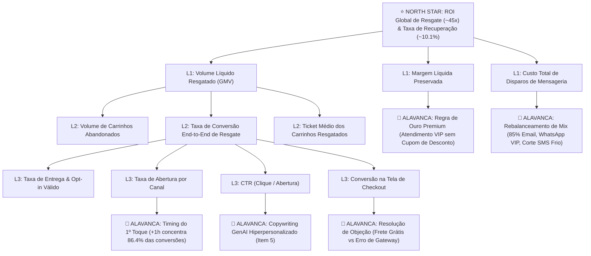

# 🌳 Árvore de Métricas & Driver Tree (Decomposição Causal da North Star)

> **Módulo:** `metrics/`  
> **Finalidade:** Mapeamento da relação de causa e efeito entre alavancas operacionais de CRM/E-commerce e o resultado financeiro consolidado.  
> **Framework Normativo:** [`DEC-001`](../docs/relatorios/decision-making/pitch/pitch.txt) (% e Ratios) • [`DEC-003`](../docs/specifications/data-platform-specification.md) (Insights em Markdown)  
> **Referência do Pitch:** [`presentation/pitch/pitch_spec.md`](../presentation/pitch/pitch_spec.md) (Seção 3)

---

## 📌 1. Conceito da Driver Tree

A **Driver Tree (Árvore de Drivers)** decompõe a métrica principal do negócio (*North Star Metric*) em variáveis matemáticas menores e diretamente operáveis pelas equipes de Growth, CRM e Produto. Isso permite identificar exatamente **onde intervir** para maximizar a receita recuperada sem destruir a margem de contribuição.

---

## 📐 2. Decomposição Matemática da North Star Metric

A métrica central de sucesso financeiro é o **ROI Global de Resgate**, formulado como:

$$\text{ROI Global} = \frac{\text{GMV Recuperado} - \text{Descontos Concedidos} - \text{Custo Total de Disparos}}{\text{Custo Total de Disparos}}$$

Onde cada componente é governado por drivers operacionais:

### 2.1 Driver de Faturamento Recuperado ($\text{GMV Recuperado}$)
$$\text{GMV Recuperado} = \sum_{\text{canais } c} \left( N_{\text{abandonos}} \times \%_{\text{elegíveis}}(c) \times \text{Abertura}(c) \times \text{CTR}(c) \times \text{Conv}_{\text{checkout}}(c) \times \overline{\text{Ticket}}(c) \right)$$

- **$N_{\text{abandonos}}$**: Volume bruto de carrinhos que atingiram 30 min de inatividade (~7.500 no dataset padrão).
- **$\%_{\text{elegíveis}}(c)$**: Cobertura de opt-in e cadastro limpo (auditado pelo pipeline de Data Quality - Item 4).
- **$\text{Abertura}(c)$**: WhatsApp ~68%, SMS ~55%, Email ~42%, Push ~30%.
- **$\text{CTR}(c)$**: WhatsApp ~35%, Email ~28%, SMS ~22%, Push ~18%.
- **$\text{Conv}_{\text{checkout}}(c)$**: Taxa de fechamento pós-clique no carrinho restaurado.

---

### 2.2 Driver de Custo Operacional de Comunicação ($\text{Custo Total}$)
$$\text{Custo Total} = \sum_{\text{canais } c} \left( \text{Disparos Realizados}(c) \times \text{Custo Unitário}(c) \right)$$

- **Email**: $N \times \text{R\$ 0,05}$ (Baixo custo, alta escala).
- **Push App**: $N \times \text{R\$ 0,02}$ (Custo marginal quase nulo).
- **SMS**: $N \times \text{R\$ 0,15}$ (Custo intermediário; exige segmentação criteriosa).
- **WhatsApp**: $N \times \text{R\$ 0,30}$ (Custo mais alto; restrito a cestas de alto valor e clientes Premium).

---

### 2.3 Driver de Preservação de Margem ($\text{Margem Líquida}$)
$$\text{Margem Líquida} = \text{GMV Recuperado} \times \text{Margem Bruta (\%)} - \text{Descontos Concedidos}$$

- **Vício Clássico de E-commerce:** Enviar cupom de 10% a 15% para todos os clientes destrói a margem de contribuição.
- **Solução Dadosfera:** **Segmentação Prescritiva**. Clientes Premium possuem alta propensão orgânica de retorno (~18%), portanto recebem suporte consultivo ("Precisa de ajuda com seu pedido?") com **0% de desconto**, preservando 100% da margem bruta.

---

## 🎯 3. Matriz de Sensibilidade & Alavancas de Intervenção

A tabela abaixo demonstra o impacto relativo de cada driver na alavancagem da North Star:

| Nível | Driver Operacional | Baseline Atual | Alavanca de Otimização Dadosfera | Elasticidade / Impacto no ROI |
|---|---|:---:|---|:---:|
| **L1** | **Timing do 1º Toque** | Média 12h | Disparo automatizado em até **+1h** via triggers da Dadosfera | 🔴 **Altíssimo (+35% no volume recuperado)** |
| **L1** | **Qualidade Cadastral (Opt-in)** | 92.4% | Quarentena e higienização cadastral automática (Silver Qualify) | 🟡 **Alto (+8% de entregabilidade)** |
| **L2** | **Personalização de Copy (GenAI)** | Texto Padrão | Modelos LLM ajustados por diferencial técnico e motivo (Item 5) | 🟡 **Alto (+22% no CTR de Email)** |
| **L2** | **Mix de Canais (WhatsApp VIP)** | Disparo Flat | WhatsApp prioritário apenas para cestas $> \text{R\$ 500}$ | 🔴 **Altíssimo (Redução de 40% no CAC de Resgate)** |
| **L3** | **Remoção de Fricção de Frete** | Cupom Genérico | Concessão de Frete Grátis focalizada apenas em carrinhos onde `motivo = 'frete'` | 🟢 **Médio (+15% conversão em Moda/Decoração)** |
| **L3** | **Falha de Checkout / Gateway** | Nenhuma ação | Oferta imediata de chave PIX / Boleto quando `motivo = 'pagamento'` | 🟡 **Alto (Recuperação de 60% dos erros de cartão)** |

---

## 🔗 4. Vínculo com os Consumidores da Codebase

- **Data App Streamlit (Item 9):** Implementa a árvore de drivers no [`app/services/simulation_service.py`](../app/services/simulation_service.py), permitindo ao gestor simular o impacto financeiro de alterar o timing ou o mix de canais.
- **Dashboards Metabase (Item 7):** Monitora os drivers de L1 e L2 nos painéis de série temporal e eficiência de canais ([`dashboards/dashboard_recuperacao_carrinho.md`](../dashboards/dashboard_recuperacao_carrinho.md)).
- **Apresentação Executiva (Item 10):** Estrutura a narrativa de vendas evidenciando como a Dadosfera atua em cada nó da árvore ([`presentation/pitch/pitch_spec.md`](../presentation/pitch/pitch_spec.md)).
