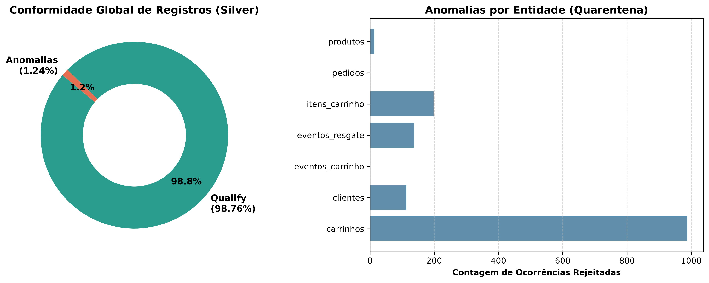
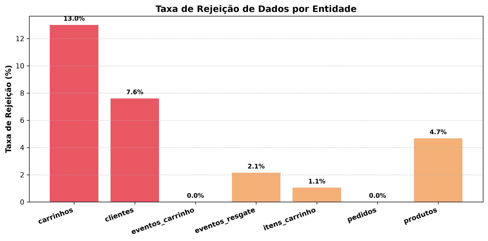
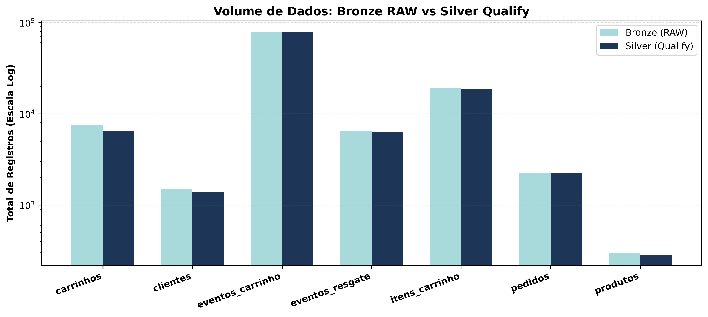

# 📊 Data Quality & Anomaly Report (Outputs Autocontidos)

> **Módulo:** `notebooks/pipelines/quality_report/outputs/`  
> **Data de Avaliação:** 2026-08-23 04:26:06Z  
> **Conformidade Global:** **98.76%**  

## 1. Executive Summary
- **Total de Registros Avaliados:** 115,775
- **Registros Aprovados (Silver Qualify):** 114,336 (98.76%)
- **Registros Isolados (Silver Anomalies):** 1,439 (1.24%)

## 2. Resumo por Entidade
| Entidade | Registros RAW | Registros Qualify | Ocorrências de Anomalia | Taxa de Rejeição (%) |
|---|:---:|:---:|:---:|:---:|
| `carrinhos` | 7,500 | 6,525 | 988 | 13.0% |
| `clientes` | 1,500 | 1,386 | 114 | 7.6% |
| `eventos_carrinho` | 78,931 | 78,931 | 0 | 0.0% |
| `eventos_resgate` | 6,427 | 6,289 | 138 | 2.15% |
| `itens_carrinho` | 18,888 | 18,690 | 198 | 1.05% |
| `pedidos` | 2,229 | 2,229 | 0 | 0.0% |
| `produtos` | 300 | 286 | 14 | 4.67% |

## 3. Galeria de Gráficos
### 3.1 Conformidade Global & Quarentena

### 3.2 Taxa de Rejeição por Entidade

### 3.3 Volume Comparativo: RAW vs Qualify

