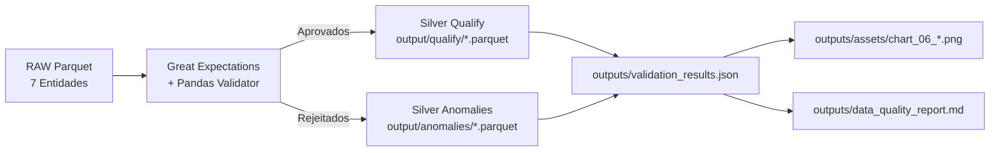

# 📋 Especificação do Pipeline de Relatório e Qualificação (Quality Report)

> **Módulo:** `notebooks/pipelines/quality_report/`  
> **Notebook Principal:** [`qualification_raw.ipynb`](file:///c:/Users/pedro/OneDrive/Desktop/wheels/notebooks/pipelines/quality_report/qualification_raw.ipynb)  
> **Script de Suporte:** [`run_quality_pipeline.py`](file:///c:/Users/pedro/OneDrive/Desktop/wheels/notebooks/pipelines/quality_report/run_quality_pipeline.py)  
> **Diretório de Outputs:** `notebooks/pipelines/quality_report/outputs/` (Autocontido no módulo do pipeline)  
> **Case Oficial Dadosfera:** Item 4 — Data Quality & Relatório de Anomalias  
> **Arquitetura:** Dual-Artifact Pipeline (Silver Qualify vs Silver Anomaly)  

---

## 1. 📌 Objetivo e Organização de Arquivos

Este pipeline realiza a auditoria e qualificação técnica e de negócio da camada **RAW (Bronze)** para as 7 entidades do modelo de dados (`clientes`, `produtos`, `carrinhos`, `itens_carrinho`, `eventos_carrinho`, `eventos_resgate`, `pedidos`), lendo diretamente os arquivos **Parquet**.

### 📁 Estrutura Autocontida do Módulo (`notebooks/pipelines/quality_report/`):

```text
notebooks/pipelines/quality_report/
├── qualification_raw.ipynb      # Notebook interativo (Colab / Local)
├── pipeline_spec.md             # Esta especificação técnica do pipeline
├── run_quality_pipeline.py      # Script batch de execução automatizada
└── outputs/                     # TODOS OS OUTPUTS DO NOTEBOOK / PIPELINE
    ├── data_quality_report.md   # Relatório executivo gerado pela execução
    ├── validation_results.json  # Log estruturado com métricas e parâmetros
    └── assets/                  # Gráficos e evidências visuais geradas
        ├── chart_01_global_compliance_and_quarantine.png
        ├── chart_02_rejection_rates_by_entity.png
        └── chart_03_before_vs_after_volume.png
```

---

## 2. 🔍 Regras de Validação por Entidade

### 2.1 Entidade `clientes`
- `ERR_CLI_001` (Crítica): `cliente_id` não nulo.
- `ERR_CLI_002` (Alta): `email` não nulo.
- `ERR_CLI_003` (Média): `email` em formato regex válido.

### 2.2 Entidade `produtos`
- `ERR_PROD_001` (Crítica): `produto_id` não nulo.
- `ERR_PROD_002` (Alta): `preco_atual > 0`.
- `ERR_PROD_003` (Alta): `preco_atual <= preco_original` (sem promoção invertida).

### 2.3 Entidade `carrinhos`
- `ERR_CAR_001` (Crítica): `carrinho_id` não nulo.
- `ERR_CAR_002` (Crítica): `cliente_id` não nulo.
- `ERR_CAR_003` (Média): `status` em `['comprado', 'abandonado', 'expirado', 'ativo', 'recuperado']`.
- `ANOM-01` (Alta): `valor_frete >= 0` (frete negativo detectado).
- `ANOM-02` (Alta): `valor_subtotal > 0` (subtotal zerado detectado).
- `ANOM-03` (Crítica): `valor_desconto <= valor_subtotal` (desconto abusivo).
- `ANOM-04` (Alta): `valor_total == subtotal + frete - desconto` (consistência contábil).
- `ANOM-05` (Alta): `data_abandono >= data_criacao` (consistência temporal).

### 2.4 Entidade `itens_carrinho`
- `ERR_ITM_001` (Crítica): `item_id` não nulo.
- `ERR_ITM_002` (Crítica): `carrinho_id` não nulo.
- `ERR_ITM_003` (Alta): `quantidade > 0`.
- `ERR_ITM_004` (Alta): `preco_unitario > 0`.
- `ERR_ITM_005` (Alta): `data_remocao >= data_adicao`.

### 2.5 Entidades de Eventos e Transações
- `eventos_carrinho`: `evento_id` e `carrinho_id` não nulos.
- `eventos_resgate`: `resgate_id` e `carrinho_id` não nulos; `data_abertura >= data_envio`.
- `pedidos`: `pedido_id`, `cliente_id` e `carrinho_id` não nulos.

---

## 3. 📊 Fluxo e Saídas Estruturadas



---

## 4. 💻 Instruções de Execução

1. **Executar via Jupyter Notebook:**
   Abrir [`qualification_raw.ipynb`](file:///c:/Users/pedro/OneDrive/Desktop/wheels/notebooks/pipelines/quality_report/qualification_raw.ipynb) e executar todas as células.
2. **Executar via Script Batch:**
   ```bash
   python notebooks/pipelines/quality_report/run_quality_pipeline.py
   ```
3. **Executar via Makefile:**
   ```powershell
   python make.py quality-eval
   ```
