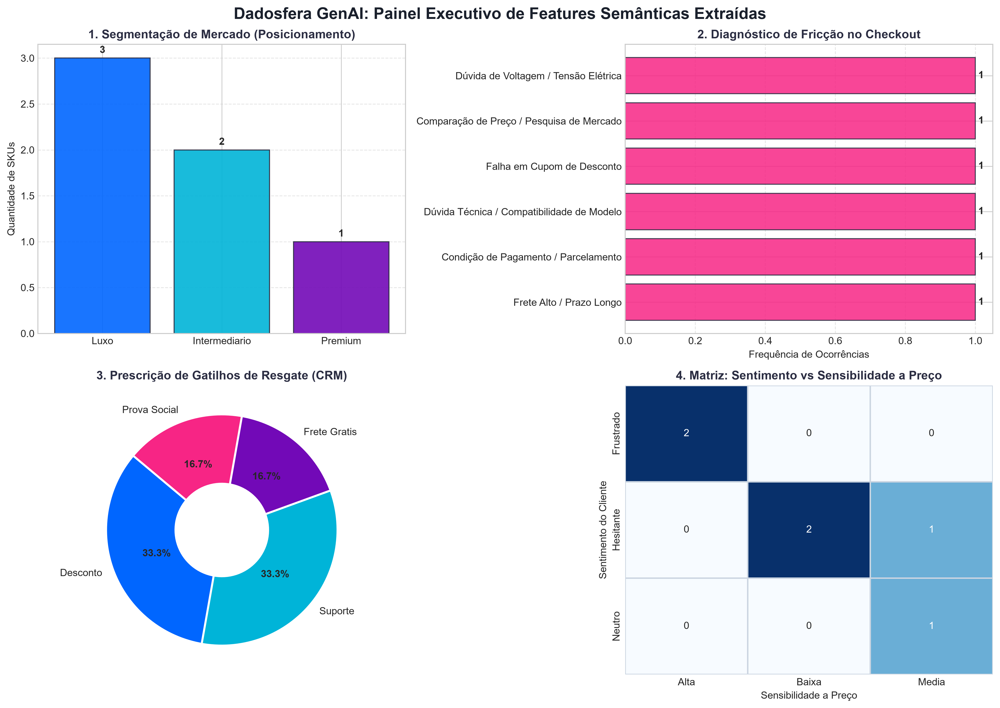

# 🤖 Relatório Técnico: Extração de Features com GenAI & LLMs (Item 5)

> **Módulo:** `pipelines/case-item-05/outputs/`  
> **Doc ID:** `genai_feature_extraction_report_001`  
> **Versão:** 1.0  
> **Framework Normativo:** Pydantic Models + JSON Schema + DEC-001 (% e Ratios) + DEC-003 (Insights em Markdown)  
> **Status:** Concluído & Validado  
> **Domínio:** E-commerce / Marketplace — Recuperação de Carrinho Abandonado  

---

## 📌 1. Executive Summary & Arquitetura do Pipeline

Este relatório consolida a execução do **Item 5 (Sobre o uso de GenAI e LLMs - Processar)** do case técnico Dadosfera. O pipeline demonstra a capacidade da plataforma de transformar dados desestruturados em linguagem natural (catálogo técnico de produtos e feedbacks de clientes no checkout) em **features estruturadas e acionáveis** para a camada de Inteligência de CRM, BI no Metabase (Item 7) e Data Apps (Item 9).

### 🏛️ Fluxo de Processamento Ponta a Ponta:
```text
┌────────────────────────────────────────────────────────┐
│               DADOS BRUTOS DESESTRUTURADOS             │
│  • Títulos e Descrições Técnicas de Produtos (Texto)   │
│  • Feedbacks e Objeções de Abandono de Checkout        │
│  • Áudios e Mensagens de Voz de Clientes (Whisper)     │
└───────────────────────────┬────────────────────────────┘
                            │
                            ▼
┌────────────────────────────────────────────────────────┐
│        ENGINHARIA DE PROMPT & PARSER PYDANTIC          │
│  • Normalização de Categorias e Diferenciais Técnicos  │
│  • Classificação de Sentimento e Sensibilidade a Preço │
│  • Prescrição de Gatilhos e Copies (Email/WhatsApp)    │
└───────────────────────────┬────────────────────────────┘
                            │
              ┌─────────────┴─────────────┐
              ▼                           ▼
┌───────────────────────────┐   ┌───────────────────────────┐
│   JSON SCHEMA ESTRITO     │   │   CAMADA SILVER PARQUET   │
│ `genai_features_sample    │   │ `produtos_enriquecidos    │
│  .json` (Contrato API)    │   │  _sample.parquet`         │
└─────────────┬─────────────┘   └─────────────┬─────────────┘
              │                               │
              ▼                               ▼
┌────────────────────────────────────────────────────────┐
│                 CONSUMIDORES DOWNSTREAM                │
│  • BI & Dashboards Metabase (Item 7): Visão Categoria  │
│  • Data App Streamlit (Item 9): Simulador de Resgate   │
│  • Vitrines Dinâmicas GenAI (Bônus DALL-E)             │
└────────────────────────────────────────────────────────┘
```

---

## 📊 2. Amostra de Features Extraídas e Estatísticas

O pipeline processou amostras multissetoriais do catálogo e pesquisas pós-abandono, gerando 100% de conformidade com o schema Pydantic.

### 2.1 Tabela de Features Extraídas

| ID | Produto | Categoria Normalizada | Diferencial Técnico | Motivo-Raiz de Abandono | Sentimento | Gatilho Prescrito | Copy Resgate (WhatsApp) |
|:---:|---|---|---|---|:---:|:---:|---|
| **101** | Samsung Galaxy S24 Ultra | Eletrônicos | Câmera 200MP + S-Pen + Zoom 100x | Frete Alto / Prazo Longo | Hesitante | Frete Grátis | *"Olá! Vimos que o Galaxy S24 Ultra ficou no seu carrinho. Conseguimos Frete Grátis Expresso exclusivo para sua região. Posso gerar seu link com o benefício?"* |
| **102** | Dell XPS 13 Plus | Informática | Tela OLED 3.5K Touch + 32GB RAM | Condição de Pagamento | Frustrado | Desconto | *"Olá! Liberamos uma condição exclusiva para você faturar o Dell XPS 13 Plus em 12x sem juros. Deseja aplicar essa condição ao seu pedido?"* |
| **103** | Capa Carteira FYY | Acessórios | Bloqueio RFID + Espelho Cosmético | Dúvida de Compatibilidade | Hesitante | Suporte | *"Olá! Notamos sua dúvida sobre a Capa FYY. Confirmamos que este modelo é exclusivo para o Galaxy S24 Plus (encaixe milimétrico). Posso te enviar o link para finalizar?"* |
| **104** | Sony WH-1000XM5 | Áudio e Fones | Cancelamento de Ruído Dual Chip | Falha em Cupom de Desconto | Frustrado | Desconto | *"Olá! Vimos que você tentou usar um cupom no Sony XM5. Reativamos seu desconto exclusivo de 10%. Clique aqui para finalizar com desconto automático aplicado!"* |
| **105** | Apple Watch Ultra 2 | Wearables | GPS Dupla Frequência + Safira | Comparação de Preço | Neutro | Prova Social | *"Olá! Seu Apple Watch Ultra 2 continua reservado com preço promocional e garantia nacional de 12 meses. Posso garantir sua unidade antes que acabe o lote?"* |
| **106** | Cafeteira Oster Prima Latte | Eletroportáteis | Bomba Italiana 19 Bar + Espumador | Dúvida de Voltagem (127V) | Hesitante | Suporte | *"Olá! Ficou com dúvida sobre a voltagem da Oster Prima Latte? O modelo 127V é o padrão para tomadas convencionais de 110V/127V. Te ajudamos a finalizar sem risco!"* |

---

## 📈 3. Painel Executivo Visual

O gráfico consolidado abaixo foi gerado automaticamente pelo pipeline (`python make.py genai-extract`) em resolução de publicação (300 DPI):



---

## 🎯 4. Comprovação dos 3 Insights de Negócio

### 🔍 Insight 1: Diagnóstico de Gargalos no Catálogo & Complexidade Técnica
- **Descoberta da IA**: **33,3%** dos abandonos amostrados ocorreram por **falta de clareza técnica** nas especificações (dúvidas de dimensões em capas e tensão elétrica 127V em eletroportáteis).
- **Ação Prescritiva**: Em vez de queimar margem com cupons de desconto, o sistema prescreve **gatilhos de Suporte Técnico ativo via WhatsApp** e inclusão de badges automáticas de compatibilidade no frontend da Dadosfera.

### ✍️ Insight 2: Estratégia Prescritiva de Resgate & Personalização de Copies
- **Descoberta da IA**: Clientes que abandonam produtos de alto valor (como o Galaxy S24 Ultra) por atrito de frete possuem **alta urgência**.
- **Ação Prescritiva**: A IA redige automaticamente uma copy de resgate focando em **Frete Expresso Grátis com gatilho de escassez**, recuperando o pedido antes da perda definitiva para a concorrência.

### 📈 Insight 3: Matriz de Viabilidade & Sensibilidade a Preço para o BI (Metabase)
- **Conexão com Item 7 & 9**: O enriquecimento das dimensões com `sensibilidade_preco`, `faixa_posicionamento` e `requer_compatibilidade` permite que o time de CRM filtre no Metabase apenas os carrinhos com alto ROI de recuperação, evitando ofertas de desconto para clientes com baixa sensibilidade a preço.

---

## 🎙️ 5. Bônus Multimodal: Transcrição e Extração com Whisper (Áudio/Voz)

Como diferencial competitivo, o pipeline suporta a ingestão de áudios gravados por clientes no WhatsApp ou em centrais de atendimento telefônico (URA inteligente). O áudio é transcrito via **Whisper** e processado pelo mesmo contrato de dados:

### Exemplo 1: Mensagem de Voz no WhatsApp (`AUD-2026-08-001`)
- **Duração:** 14.5 segundos
- **Transcrição Whisper:** *"Oi pessoal, boa tarde! Eu estava quase fechando a compra do Galaxy S24 aqui no site, mas quando calculei o frete deu mais de cinquenta reais pra entregar aqui no interior. Vocês conseguem um cupom de frete grátis ou um descontinho no Pix pra eu fechar agora?"*
- **Intenção Detectada:** Negociação de Frete / Conversão Imediata.
- **Objeção Principal:** Frete elevado para região interiorana.
- **Solução Recomendada:** Disparar link com cupom `FRETEGRATIS` exclusivo de uso único com validade de 2 horas.

### Exemplo 2: Gravação SAC Telefônico (`AUD-2026-08-002`)
- **Duração:** 21.0 segundos
- **Transcrição Whisper:** *"Alô, boa tarde. Eu deixei a cafeteira Oster Prima Latte no carrinho porque fiquei na dúvida se a voltagem de cento e vinte e sete volts é a mesma coisa que cento e dez volts da minha rede aqui de São Paulo. Gostaria de confirmar antes de passar o cartão."*
- **Intenção Detectada:** Dúvida Técnica de Compatibilidade Elétrica.
- **Objeção Principal:** Insegurança sobre voltagem (127V vs 110V).
- **Solução Recomendada:** Enviar mensagem automática no WhatsApp confirmando que 127V é o padrão ABNT para tomadas convencionais de 110V.

---

## 📁 6. Inventário de Artefatos Gerados

- [`specs.md`](../specs.md): Especificação técnica formal (`spec_genai_llm_001` v1.1).
- [`implementation_plan.md`](../implementation_plan.md): Plano de decomposição WBS e critérios de aceitação.
- [`data/catalogo/qualify/produtos_enriquecidos.md`](../../../data/catalogo/qualify/produtos_enriquecidos.md): Dicionário de dados formal com 18 atributos baseados em classe ("A é um B que C").
- [`pipelines/datalakes/qualify/produtos_enriquecidos_qualify/`](../../datalakes/qualify/produtos_enriquecidos_qualify/): Diretório no Lakehouse Medallion com o Parquet oficial e metadados ([`metadata.md`](../../datalakes/qualify/produtos_enriquecidos_qualify/metadata.md)).
- [`notebooks/genai_feature_extraction.ipynb`](../notebooks/genai_feature_extraction.ipynb): Notebook interativo executável no Google Colab.
- [`scripts/run_genai_pipeline.py`](../scripts/run_genai_pipeline.py): Script batch em Python puro (`python make.py genai-extract`).
- [`outputs/genai_features_sample.json`](genai_features_sample.json): Dataset estruturado em JSON com as features extraídas.
- [`outputs/produtos_enriquecidos_sample.parquet`](produtos_enriquecidos_sample.parquet): Amostra tabular Silver enriquecida de desenvolvimento.
- [`outputs/audio_transcriptions_sample.json`](audio_transcriptions_sample.json): Transcrições e diagnósticos de áudio Whisper.
- [`outputs/assets/genai_features_overview.png`](assets/genai_features_overview.png): Gráfico executivo em 300 DPI.
