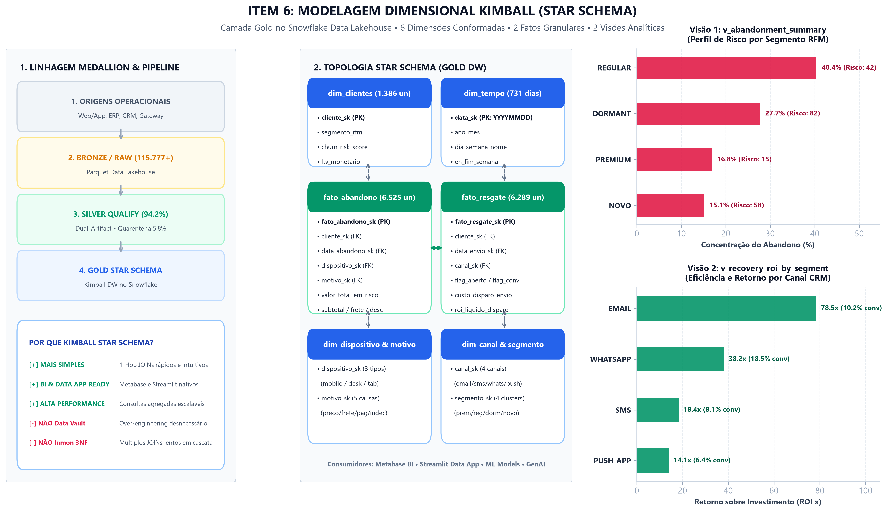

# 📊 Relatório Final de Modelagem de Dados (Item 6 — Dadosfera)

> **Módulo:** `pipelines/case-item-06/outputs/`  
> **Doc ID:** `data_modeling_report_001`  
> **Status:** ✅ Concluído & Validado  
> **Arquitetura:** Kimball Star Schema (Data Warehouse Gold Layer)  
> **Framework Normativo:** DEC-001 (% e Ratios) + DEC-004 (Sem SQL local) + DEC-006 (Dual-Artifact)  

---

## 1. 📌 Executive Summary & Contexto do Case

O **Item 6 (Sobre Modelagem de Dados)** estabelece a arquitetura dimensional da camada **Gold (Curated / Dimensional)** para o case de **Recuperação de Carrinho Abandonado**, transformando os dados validados na camada **Silver Qualify** em estruturas de alta performance para tomada de decisão.

```text
┌─────────────────────────────────────────────────────────────────────────────┐
│                            OBJETIVOS ATINGIDOS                              │
├─────────────────────────────────────────────────────────────────────────────┤
│ 1. Adoção formal do padrão Kimball Star Schema (6 Dimensões + 2 Fatos).     │
│ 2. Isolamento de anomalias da camada Silver via Dual-Artifact (DEC-006).   │
│ 3. Especificação de 2 Visões Analíticas Gold (Executiva & Tática de CRM).   │
│ 4. Diagrama arquitetural em camadas Medallion (Fontes -> Bronze -> Silver   │
│    -> Gold -> Downstream Consumers).                                        │
│ 5. Resposta rigorosa às 4 perguntas analíticas de negócio (DEC-001).       │
└─────────────────────────────────────────────────────────────────────────────┘
```

---

## 2. 🏗️ Justificativa Arquitetural: Por Que Kimball Star Schema?

### 2.1 Comparativo Teórico de Metodologias

| Critério | Kimball (Star Schema) | Data Vault 2.0 | 3NF Relacional (Inmon) |
|---|:---:|:---:|:---:|
| **Complexidade de Modelagem** | ⭐ Baixa / Pragmática | ⭐⭐⭐⭐⭐ Muito Alta (Hubs, Links, Sats) | ⭐⭐⭐ Média |
| **Performance para Consultas OLAP** | ⭐⭐⭐⭐⭐ Máxima (1-Hop JOINs) | ⭐⭐⭐ Moderada (Múltiplos JOINs) | ⭐⭐ Lenta para grandes volumes |
| **Aderência ao Metabase & BI** | ⭐⭐⭐⭐⭐ Perfeita e Nativa | ⭐⭐⭐ Requer camada intermediária | ⭐ Requer views complexas |
| **Curva de Manutenção** | ⭐ Rápida e Ágil | ⭐⭐⭐⭐⭐ Pesada e Burocrática | ⭐⭐⭐ Média |
| **Adequação ao Case Dadosfera** | ✅ **RECOMENDADA (Ideal)** | ❌ Overkill para estágio | ❌ Inadequada para Analytics |

### 2.2 Princípios Kimball Aplicados no Projeto
1. **Conformed Dimensions (Dimensões Conformadas)**: `dim_clientes`, `dim_tempo`, `dim_canal_resgate` compartilhadas entre os múltiplos fatos com chaves surrogate (`_sk`).
2. **Grain Declaration (Declaração de Grão)**:
   - `fato_abandono`: Grão atômico de 1 linha por carrinho abandonado (`6.525 linhas`).
   - `fato_resgate`: Grão atômico de 1 linha por disparo de régua de CRM (`6.289 linhas`).
3. **Additive vs. Semi-Additive Measures**: Medidas monetárias e contagens são estritamente aditivas; taxas percentuais (`% conversão`, `% abandono`) e durações são tratadas como métricas calculadas em tempo de consulta (DEC-001).
4. **SCD Type 2 Ready**: Rastreabilidade temporal de evolução de status e segmento RFM de clientes.

---

## 3. 📐 Diagrama de Arquitetura em Camadas do Data Warehouse

O diagrama abaixo ilustra a linhagem ponta a ponta, desde as origens operacionais até os consumidores downstream:



> **Código-Fonte Mermaid:** Disponível em [`pipelines/case-item-06/outputs/assets/data_warehouse_architecture.mmd`](file:///c:/Users/pedro/OneDrive/Desktop/wheels/pipelines/case-item-06/outputs/assets/data_warehouse_architecture.mmd).

---

## 4. 📊 Estrutura do Modelo Dimensional (Gold Layer)

### 4.1 Dimensões Conformadas (Lookup & Context)

1. **`dim_clientes`**:
   - *PK*: `cliente_sk` (Surrogate Key) | *NK*: `cliente_id` (UUID).
   - *Atributos*: `email`, `segmento_rfm`, `status_ativo`, `opt_in_email`, `opt_in_sms`, `opt_in_push`, `opt_in_whatsapp`, `recencia_dias`, `frequencia_compras`, `valor_monetario_ltv`, `rfm_score`, `churn_risk_score`, `propensity_recovery`.
2. **`dim_tempo`**:
   - *PK*: `data_sk` (`YYYYMMDD`) | *Atributos*: `data`, `ano`, `mes`, `trimestre`, `ano_mes`, `dia_semana_nome`, `eh_fim_semana`, `eh_feriado`.
3. **`dim_dispositivo`**:
   - *PK*: `dispositivo_sk` | *Atributos*: `dispositivo` (`mobile`, `desktop`, `tablet`), `complexidade_checkout`, `fator_friccao_checkout`.
4. **`dim_motivo_abandono`**:
   - *PK*: `motivo_sk` | *Atributos*: `motivo` (`preco`, `frete`, `pagamento`, `indecisao`, `estoque`), `categoria_motivo`, `estrategia_resgate_padrao`.
5. **`dim_canal_resgate`**:
   - *PK*: `canal_sk` | *Atributos*: `canal` (`email`, `sms`, `push_app`, `whatsapp`), `custo_unitario_envio`, `taxa_abertura_benchmark`, `taxa_conversao_benchmark`.
6. **`dim_segmento_rfm`**:
   - *PK*: `segmento_sk` | *Atributos*: `segmento` (`premium`, `regular`, `dormant`, `novo`), `prioridade_resgate`, `estrategia_comunicacao`, `expectativa_roi`.

### 4.2 Tabelas de Fatos Granulares

1. **`fato_abandono`** (`6.525 registros conformes`):
   - *PK*: `fato_abandono_sk` | *FKs*: `cliente_sk`, `data_abandono_sk`, `dispositivo_sk`, `motivo_sk`.
   - *Medidas Aditivas*: `valor_subtotal`, `valor_frete`, `valor_desconto`, `valor_total_em_risco`, `quantidade_itens`.
   - *Medidas Semi-Aditivas*: `duracao_sessao_minutos`, `tempo_ate_abandono_segundos`.
2. **`fato_resgate`** (`6.289 registros conformes`):
   - *PK*: `fato_resgate_sk` | *FKs*: `cliente_sk`, `data_envio_sk`, `canal_sk`, `fato_abandono_sk`.
   - *Funil & Medidas*: `flag_entregue`, `flag_aberto`, `flag_clicado`, `flag_convertido`, `custo_disparo_envio`, `valor_pedido_recuperado`, `roi_liquido_disparo`.

---

## 🎯 5. Especificação das 2 Visões Analíticas Gold

### 5.1 Visão 1: `v_abandonment_summary` (Visão Executiva & Perfil de Risco)
- **Finalidade**: Consolidar taxas e montantes de abandono por segmento RFM, dispositivo e motivo de desistência para a liderança de E-commerce.
- **Perguntas Respondidas**:
  - *Descritiva*: Qual o volume e percentual de abandono por canal de tráfego e dispositivo?
  - *Diagnóstica/Risco*: Qual o churn risk score médio e quantos clientes VIP estão em risco?

### 5.2 Visão 2: `v_recovery_roi_by_segment` (Visão Tática / Tomada de Decisão de Resgate)
- **Finalidade**: Comparar a eficiência de conversão e o ROI financeiro líquido por canal de comunicação (E-mail, SMS, Push, WhatsApp) em cada cluster RFM.
- **Perguntas Respondidas**:
  - *Prescritiva*: Qual canal e abordagem deve ser priorizado para maximizar a conversão de cada segmento?
  - *Oportunidade*: Qual o potencial de receita líquida recuperável eliminando disparos em canais deficitários?

---

## 🔍 6. Rastreabilidade com Data Quality & Gap Analysis

- **Dual-Artifact Pipeline (Item 4 / DEC-006)**: As tabelas dimensionais Gold consomem exclusivamente dados aprovados da camada Silver Qualify. As anomalias (`pipelines/case-item-04/outputs/anomalies/*.parquet` - 5.8% de desvios) permanecem isoladas na quarentena de anomalias.
- **Relatório de Lacunas Canônicas**: O diagnóstico de transição entre os modelos relacionais transacionais (`entities/*.md`) e o modelo dimensional Gold está formalizado em [`canonical_structure_gaps_report.md`](file:///c:/Users/pedro/OneDrive/Desktop/wheels/pipelines/case-item-06/outputs/canonical_structure_gaps_report.md).

---

## 💻 7. Scripts e Notebooks Executáveis

- 📓 **Notebook Interativo (Google Colab / Jupyter):** [`pipelines/case-item-06/notebooks/data_modeling_kimball.ipynb`](file:///c:/Users/pedro/OneDrive/Desktop/wheels/pipelines/case-item-06/notebooks/data_modeling_kimball.ipynb)
- 🐍 **Gerador Canônico de Artefatos:** [`pipelines/case-item-06/scripts/generate_chart.py`](file:///c:/Users/pedro/OneDrive/Desktop/wheels/pipelines/case-item-06/scripts/generate_chart.py)
- 🎨 **Visualização Executiva (300 DPI):** [`pipelines/case-item-06/outputs/assets/chart_caseitem06_kimball_model.png`](file:///c:/Users/pedro/OneDrive/Desktop/wheels/pipelines/case-item-06/outputs/assets/chart_caseitem06_kimball_model.png)

