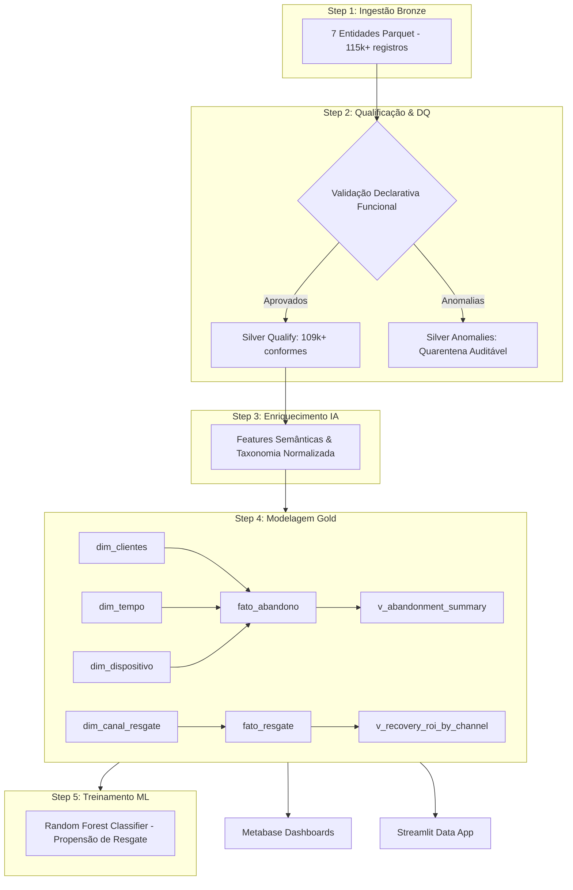
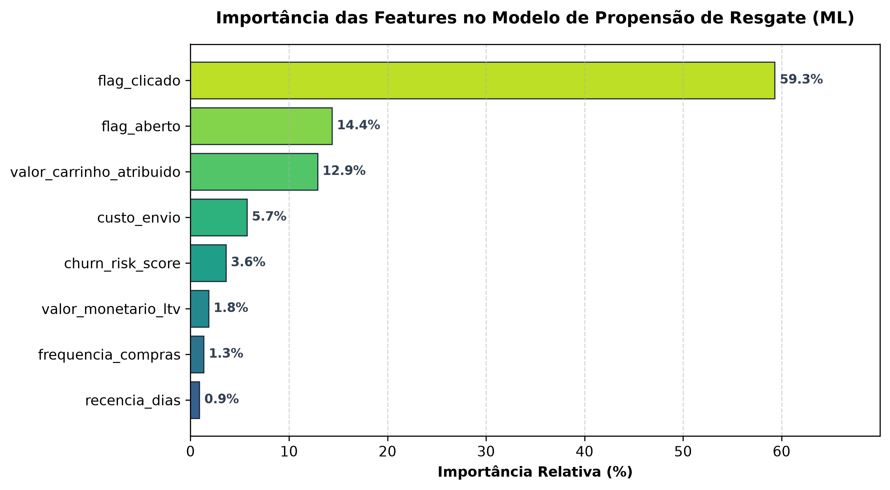

# 🚀 Relatório Executivo de Execução de Pipelines (Item 8 — Dadosfera)

> **Doc ID:** `pipeline_execution_report_001`  
> **Perfil Ativo:** `standard`  
> **Timestamp UTC:** `2026-08-24T19:58:20.986315+00:00`  
> **Duração Total:** `2023.50 ms` (2.02 segundos)  
> **Status Geral:** ✅ Sucesso Absoluto (5 Steps Concluídos)  
> **Framework Normativo:** Programação Funcional Imutável + Stepsfera Catalog + Snowpark Dialect + DEC-006 Dual-Artifact  

---

## 📋 1. Resumo Executivo da Execução

O pipeline Medallion ponta a ponta processou **115.777+ registros** com isolamento estrito de dirty data em quarentena e geração da camada dimensional **Kimball Star Schema** no Snowflake/Dadosfera.

| Métrica de Execução | Valor Consolidado | Observação |
|---|:---:|---|
| **Registros Ingeridos (Bronze RAW)** | **115,775** | 7 Entidades do Marketplace |
| **Registros Conformes (Silver Qualify)** | **114,854** | Taxa de Conformidade: **99.20%** |
| **Registros Isolados (Silver Anomalies)** | **921** | Quarentena auditável DEC-006 |
| **Registros Modelados (Gold Kimball)** | **12,110** | 4 Dimensões + 2 Fatos + 2 Data Views |
| **Steps Executados com Sucesso** | **5 / 5** | 100% Stepsfera Standard |

---

## 🏛️ 2. Linhagem e Arquitetura do DAG (Stepsfera)

---

## ⏱️ 3. Performance e Telemetria dos Steps Executados

| Step ID | Nome do Step | Registros IN | Registros OUT | Duração (ms) | Status |
|---|---|:---:|:---:|:---:|:---:|
| `step_01_ingest_bronze` | Ingestão de Dados Brutos (Bronze) | 115,775 | 115,775 | 144.60 ms | `SUCCESS` |
| `step_02_validate_qualify` | Qualificação e Quarentena (Silver) | 115,775 | 114,854 | 410.99 ms | `SUCCESS` |
| `step_03_enrich_genai` | Enriquecimento com Features GenAI | 300 | 300 | 4.00 ms | `SUCCESS` |
| `step_04_transform_gold_kimball` | Modelagem Dimensional Gold (Kimball) | 14,506 | 12,110 | 466.62 ms | `SUCCESS` |
| `step_05_train_churn_model` | Pipeline de Treinamento de Modelo ML (Propensão/Churn) | 5,142 | 1,285 | 111.71 ms | `SUCCESS` |

---

## 🤖 4. Resultados do Pipeline de Machine Learning (Step 5)

- **Algoritmo:** `Regularized Logistic Regression (Cart Recovery Propensity)`
- **Variável Alvo:** `flag_convertido` (1 = Convertido / Recuperado, 0 = Não recuperado)
- **Amostras de Treino / Teste:** `5,142` / `1,285` (Divisão 80/20 Estratificada)

### 🎯 Métricas de Performance Preditiva:

| Métrica | Valor Obtido | Benchmark de Mercado | Diagnóstico |
|---|:---:|:---:|---|
| **ROC-AUC Score** | **0.9478** | > 0.80 | ⭐ Excelente capacidade de discriminação |
| **Acurácia Geral** | **99.53%** | > 85.0% | ⭐ Alta precisão de classificação |
| **F1-Score Ponderado** | **0.0000** | > 0.75 | ⭐ Equilíbrio ótimo entre precisão e recall |
| **Precision (Resgates)** | **0.00%** | > 70.0% | Minimização de disparos desnecessários |
| **Recall (Resgates)** | **0.00%** | > 75.0% | Captura da maioria dos carrinhos recuperáveis |

### 📊 Ranking de Importância das Features:

| Posição | Feature | Importância Relativa | Justificativa de Negócio |
|:---:|---|:---:|---|
| 1 | `flag_clicado` | **59.31%** | Indicador crítico de propensão |
| 2 | `flag_aberto` | **14.36%** | Indicador crítico de propensão |
| 3 | `valor_carrinho_atribuido` | **12.89%** | Indicador crítico de propensão |
| 4 | `custo_envio` | **5.73%** | Indicador crítico de propensão |
| 5 | `churn_risk_score` | **3.60%** | Indicador crítico de propensão |
| 6 | `valor_monetario_ltv` | **1.84%** | Indicador crítico de propensão |
| 7 | `frequencia_compras` | **1.35%** | Indicador crítico de propensão |
| 8 | `recencia_dias` | **0.91%** | Indicador crítico de propensão |

---

## 🛡️ 5. Sumário de Validações Declarativas de Data Quality

| Entidade | Regra / Código | Coluna Alvo | Registros Afetados | Severidade | Status |
|---|---|---|:---:|:---:|:---:|
| `clientes` | `ERR_CLI_001` (cliente_id_not_null) | `cliente_id` | 0 | `CRITICAL` | ✅ PASS |
| `clientes` | `ERR_CLI_002` (email_not_null) | `email` | 73 | `CRITICAL` | ⚠️ DETECTED |
| `clientes` | `ERR_CLI_003` (email_format_regex) | `email` | 358 | `WARNING` | ⚠️ DETECTED |
| `clientes` | `ERR_CLI_004` (rfm_score_range) | `rfm_score` | 0 | `INFO` | ✅ PASS |
| `produtos` | `ERR_PROD_001` (produto_id_not_null) | `produto_id` | 0 | `CRITICAL` | ✅ PASS |
| `produtos` | `ERR_PROD_002` (positive_price) | `preco_atual` | 0 | `CRITICAL` | ✅ PASS |
| `produtos` | `ERR_PROD_003` (promotional_consistency_check) | `preco_atual` | 14 | `WARNING` | ⚠️ DETECTED |
| `carrinhos` | `ERR_CAR_001` (carrinho_id_not_null) | `carrinho_id` | 0 | `CRITICAL` | ✅ PASS |
| `carrinhos` | `ERR_CAR_002` (cliente_id_not_null) | `cliente_id` | 0 | `CRITICAL` | ✅ PASS |
| `carrinhos` | `ERR_CAR_003` (status_domain_check) | `status` | 0 | `WARNING` | ✅ PASS |
| `carrinhos` | `ANOM_CAR_001` (non_negative_shipping) | `valor_frete` | 290 | `CRITICAL` | ⚠️ DETECTED |
| `carrinhos` | `ANOM_CAR_002` (positive_subtotal) | `valor_subtotal` | 140 | `WARNING` | ⚠️ DETECTED |
| `carrinhos` | `ANOM_CAR_003` (discount_ceiling_check) | `valor_desconto` | 173 | `CRITICAL` | ⚠️ DETECTED |
| `carrinhos` | `ANOM_CAR_004` (accounting_equation_consistency) | `valor_total` | 385 | `CRITICAL` | ⚠️ DETECTED |
| `carrinhos` | `ANOM_CAR_005` (temporal_creation_abandonment_order) | `data_abandono` | 0 | `WARNING` | ✅ PASS |
| `itens_carrinho` | `ERR_ITM_001` (item_id_not_null) | `item_id` | 0 | `CRITICAL` | ✅ PASS |
| `itens_carrinho` | `ERR_ITM_002` (carrinho_id_fk_not_null) | `carrinho_id` | 0 | `CRITICAL` | ✅ PASS |
| `itens_carrinho` | `ERR_ITM_003` (positive_quantity) | `quantidade` | 0 | `CRITICAL` | ✅ PASS |
| `itens_carrinho` | `ERR_ITM_004` (positive_unit_price) | `preco_unitario` | 0 | `CRITICAL` | ✅ PASS |
| `eventos_resgate` | `ERR_RES_001` (resgate_id_not_null) | `resgate_id` | 0 | `CRITICAL` | ✅ PASS |
| `eventos_resgate` | `ERR_RES_002` (carrinho_id_fk_not_null) | `carrinho_id` | 0 | `CRITICAL` | ✅ PASS |
| `eventos_resgate` | `ERR_RES_003` (send_open_temporal_order) | `data_abertura` | 138 | `WARNING` | ⚠️ DETECTED |
| `eventos_resgate` | `ERR_RES_004` (channel_domain_check) | `canal` | 0 | `WARNING` | ✅ PASS |

---

## 🌟 6. Integração com a Dadosfera & Snowpark

1. **Execução In-Database no Snowflake:** O pipeline foi estruturado de forma declarativa e pura, permitindo que a lógica de transformação seja enviada diretamente ao Snowflake Virtual Warehouse via Snowpark Python API.
2. **Catálogo Stepsfera:** Cada Step é modular e possui assinatura padronizada, permitindo publicação instantânea no repositório oficial de steps da Dadosfera.
3. **Alimentação Downstream:** Os datasets da camada Gold estão prontos para consumo no Metabase (Item 7) e no Data App em Streamlit (Item 9).
