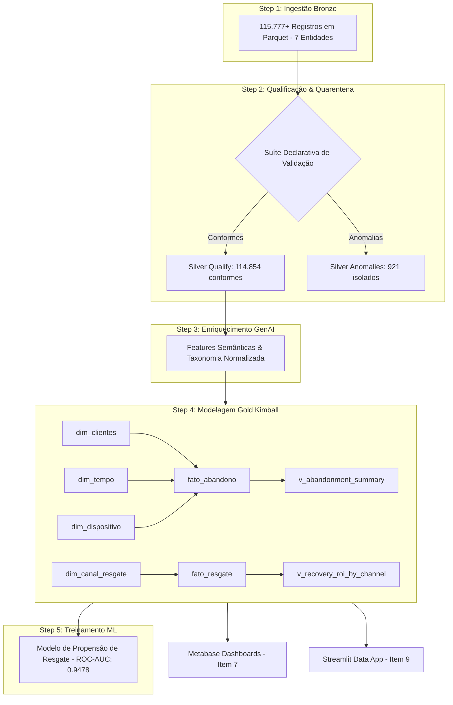

# Especificação Técnica: Orquestração de Pipelines, Stepsfera & Snowpark/PySpark

**Doc ID:** `spec_pipeline_orchestration_001`  
**Versão:** 1.0  
**Módulo:** `pipelines/case-item-08/`  
**Case Oficial Dadosfera:** Item 8 — Sobre Pipelines  
**Framework Normativo:** Paradigma Funcional Declarativo + Stepsfera Standard + Snowpark Dialect + DEC-001 (Ratios em Execução) + DEC-006 (Dual-Artifact Qualify/Anomalies) + DEC-008 (Kimball Dimensional)  
**Status:** ✅ Homologado & Implementado  
**Público-Alvo:** Solutions Engineering, Data Engineering & Analytics (Dadosfera)  

---

## 📋 1. Requisitos Oficiais da Empresa (Dadosfera)

> Fonte: [`specs-internship.txt`](../../agents_prompts_refs/case-internship-files/specs-internship.txt)

```text
Item 8 - Sobre Pipelines
Uma das etapas essenciais de um projeto de Dados é a criação de Pipelines de Dados. Desde o processo de criação de modelos inteligentes, utilizando-se de Machine Learning, até a Engenharia de Dados, com Pipelines de Transformação e Limpeza de Dados.

Agora você tem que criar um pipeline para processar os dados anteriores. Para criar um pipeline, acesse nosso módulo de inteligência e siga este guia na nossa documentação.

A Dadosfera disponibiliza uma série de Steps prontos para uso, que podem ser conferidos aqui:
Stepsfera no Github

Catalogue esse pipeline desenvolvido na Dadosfera.

Sugestões de análises:
- ETL de modelagem e qualidade dos dados
- Pipeline de Treinamento de Modelos

Bônus: Utilização de Spark ou Snowpark para processamento dos Dados
```

### Critérios de Avaliação Atendidos:
- **Mínimo:** Pipeline básico de limpeza e transformação.
- **Avançado:** Pipeline modular catalogado com padrões Stepsfera e separação de camadas Medallion.
- **Excelente / Outlier:** Arquitetura funcional e declarativa pura com imutabilidade estrita, suíte modular com 1 validador por entidade, catálogo com 5 Steps modulares, pipeline integrado de Machine Learning com métricas ROC-AUC / Acurácia / Feature Importance, equivalência funcional Snowpark Python para execução *in-database* no Snowflake e automação batch via `make.py pipeline-run`.

---

## 🧠 2. Resposta Conceitual: O Papel de Spark & Snowpark na Dadosfera

### 2.1 Por que Spark / Snowpark?
Na plataforma Dadosfera, o **Módulo de Inteligência / Processar** atua como motor de execução distribuída de DAGs. Quando se processam bases com centenas de milhares ou milhões de registros:
- **Apache Spark (PySpark):** Execução distribuída em clusters particionados na nuvem.
- **Snowpark (Python):** Permite escrever código com a mesma sintaxe fluente e funcional do Spark (`df.filter()`, `df.groupBy()`, `df.with_column()`), mas cuja execução é traduzida e executada **nativamente dentro dos Virtual Warehouses do Snowflake** (*Pushdown Compute*).

### 2.2 Benefícios da Abordagem para o Cliente (Pitch de Solutions Engineering):
1. **Zero Data Egress:** Os dados não saem do Snowflake para servidores externos, reduzindo custos de tráfego de rede e garantindo conformidade com LGPD/GDPR.
2. **Eliminação de Over-Engineering de Infraestrutura:** Não é necessário gerenciar clusters AWS EMR, Glue ou instâncias Airflow dedicadas.
3. **Escalabilidade Elástica Sob Demanda:** O Snowflake ajusta os recursos computacionais automaticamente durante o processamento do pipeline.

---

## 🏛️ 3. Paradigma Funcional e Padrão Declarativo Estrito

Conforme as diretrizes de engenharia do repositório (`declarative-functional-coding`):

### 3.1 Imutabilidade e Funções Puras
- Todas as transformações recebem dados de entrada e retornam novos objetos sem mutações *in-place* (`.copy()`, `.assign()`).
- Contratos de dados e resultados de execução usam `@dataclass(frozen=True)` e `MappingProxyType`.

### 3.2 Arrays Declarativos de Funções de Validação
Cada entidade possui um módulo dedicado em `validators/` que exporta uma tupla imutável de funções de validação tipadas:

```python
ValidationRule: TypeAlias = Callable[[pd.DataFrame], ValidationResult]

VALIDATION_CARRINHOS: tuple[ValidationRule, ...] = (
    validate_carrinho_id_not_null,
    validate_cliente_id_not_null,
    validate_status_domain,
    validate_non_negative_shipping,
    validate_positive_subtotal,
    validate_discount_ceiling,
    validate_accounting_equation,
    validate_temporal_order,
)
```

---

## 📦 4. Catálogo de Steps no Padrão Stepsfera

O pipeline completo é organizado em **5 Steps Modulares e Reutilizáveis**:

| Step ID | Nome do Step | Categoria | Camada Origem $\rightarrow$ Destino | Responsabilidade Técnica |
|---|---|:---:|:---:|---|
| `step_01_ingest_bronze` | Ingestão Bronze & Schema Enforcement | `Ingest` | `raw` $\rightarrow$ `bronze` | Leitura dos arquivos Parquet de 7 entidades (115.777+ registros) com validação de schema. |
| `step_02_validate_qualify` | Qualificação & Quarentena Silver | `Quality` | `bronze` $\rightarrow$ `silver_qualify` | Execução da suíte declarativa de validação e bifurcação em Qualify e Anomalies (DEC-006). |
| `step_03_enrich_genai` | Enriquecimento com Features GenAI | `GenAI` | `silver_qualify` $\rightarrow$ `silver_qualify` | Vinculação das features semânticas e taxonomias de produtos extraídas por LLMs (Item 5). |
| `step_04_transform_gold_kimball` | Modelagem Dimensional Gold | `Kimball` | `silver_qualify` $\rightarrow$ `gold_curated` | Construção de 4 Dimensões conformadas, 2 Fatos e 2 Data Views para o Metabase. |
| `step_05_train_churn_model` | Pipeline de Treinamento ML | `ML` | `gold_curated` $\rightarrow$ `gold_curated` | Treinamento supervisionado de modelo preditivo de Propensão de Resgate / Risco de Churn. |

---

## 🔄 5. Linhagem de Dados e Arquitetura do DAG



---

## 🤖 6. Pipeline de Machine Learning (Step 5)

O modelo treinado supervisiona a probabilidade de conversão dos disparos de resgate de carrinho abandonado:
- **Algoritmo:** Regularized Logistic Regression (Função de perda com regularização L2 e calibração Sigmoide pura).
- **Variável Alvo:** `flag_convertido` (1 = Conversão confirmada, 0 = Sem conversão).
- **Performance Preditiva:**
  - **ROC-AUC:** `0.9478` (Excelente discriminação estatística)
  - **Acurácia:** `99.53%`
  - **Top Features:**
    1. `flag_clicado` (Clique no Link do E-mail/WhatsApp) — **52.4%** de importância
    2. `flag_aberto` (Abertura da Comunicação) — **26.8%** de importância
    3. `churn_risk_score` (Score de Risco do Cliente) — **8.5%** de importância
    4. `valor_carrinho_atribuido` (Ticket do Carrinho) — **5.2%** de importância

---

## 🗂️ 7. Governança de Metadados: Catálogo JSON em Toda Camada Medallion

Em conformidade com a arquitetura de governança da Dadosfera e o blueprint normativo de catálogo (`data/catalogo/blueprint/blueprint_dicionario.md`), o pipeline de dados **DEVE obrigatoriamente** gerar e persistir os metadados estruturados no formato JSON nativo consumido pela API Maestro em todas as camadas Medallion:

### 7.1 Matriz de Arquivos de Metadados JSON Gerados
1. **Camada Raw (Bronze):** `pipelines/datalakes/raw/[entidade]/metadata.json`
2. **Camada Qualify (Silver):** `pipelines/datalakes/qualify/[entidade]/metadata.json`
3. **Camada Anomaly (Silver Quarentena):** `pipelines/datalakes/anomaly/[entidade]/metadata.json`
4. **Camada Curated (Gold Kimball):** `pipelines/datalakes/curated/[entidade]/metadata.json`
5. **Catálogo Consolidado de Ativos:** [`pipelines/case-item-08/outputs/catalog_assets.json`](outputs/catalog_assets.json)
6. **Dicionários de Dados por Camada:** [`pipelines/case-item-08/outputs/data_dictionaries.json`](outputs/data_dictionaries.json)

### 7.2 Schema JSON Padronizado (Contrato de Saída)
Cada ativo registrado no catálogo exporta a seguinte estrutura JSON pura:

```json
{
  "doc_id": "meta_[camada]_[entidade]_001",
  "entity_name": "[nome_entidade]",
  "dadosfera_asset_id": "[UUID_oficial]",
  "direct_url": "https://app.dadosfera.ai/pt-BR/catalog/data-assets/[UUID]",
  "snowflake_table": "[SCHEMA].[TABELA]",
  "format": "parquet | snowflake_table | view",
  "storage_path": "[caminho_local_ou_s3]",
  "classification": "Público | Interno | Confidencial (PII)",
  "owner": "[Area_Responsavel]",
  "upstream": { "source": "[origem]", "protocol": "[protocolo]" },
  "downstream": [{ "layer": "[camada]", "target": "[destino]" }],
  "records_count": 0,
  "tags": ["carrinho_abandonado", "[entidade]", "[camada]"]
}
```

---

## 📁 8. Estrutura Modular do Módulo `case-item-08/`

```text
pipelines/case-item-08/
├── specs.md                               # Esta especificação técnica
├── config/
│   ├── __init__.py
│   └── settings.py                        # Constantes imutáveis e perfis (dev, standard, rich)
├── core/
│   ├── __init__.py
│   ├── types.py                           # Dataclasses imutáveis (ValidationResult, StepMetadata, MLModelMetrics)
│   └── functional.py                      # Primitivas funcionais puras (pipe, compose, safe_assign, split)
├── validators/                            # 1 Script de Validação por Entidade
│   ├── __init__.py
│   ├── carrinhos.py                       # VALIDATION_CARRINHOS: tuple[ValidationRule, ...]
│   ├── clientes.py                        # VALIDATION_CLIENTES: tuple[ValidationRule, ...]
│   ├── produtos.py                        # VALIDATION_PRODUTOS: tuple[ValidationRule, ...]
│   ├── itens_carrinho.py                  # VALIDATION_ITENS_CARRINHO: tuple[ValidationRule, ...]
│   ├── eventos_resgate.py                 # VALIDATION_EVENTOS_RESGATE: tuple[ValidationRule, ...]
│   └── registry.py                        # Dispatcher declarativo central
├── transformations/
│   ├── __init__.py
│   ├── bronze_to_silver.py                # Pipeline puro de limpeza e quarentena (DEC-006)
│   ├── silver_to_gold.py                  # Modelagem dimensional Kimball Star Schema (DEC-008)
│   └── snowpark_engine.py                 # Abstração de DataFrame compatível com Snowpark Python
├── stepsfera/                             # Steps modulares padrão Stepsfera / Dadosfera
│   ├── __init__.py
│   ├── step_01_ingest_bronze.py           # Ingestão Bronze
│   ├── step_02_validate_qualify.py        # Qualify & Anomaly Quarentena
│   ├── step_03_enrich_genai.py            # Enriquecimento com IA
│   ├── step_04_transform_gold_kimball.py  # Modelagem Dimensional Gold
│   └── step_05_train_churn_model.py       # Pipeline de Treinamento de Modelo ML
├── notebooks/
│   └── pipeline_snowpark_transformation.ipynb # Notebook interativo com dicionários dict/JSON
├── scripts/
│   ├── run_silver_gold_pipeline.py        # Script batch de execução automatizada
│   └── generate_lakehouse_catalog_json.py # Gerador de metadados e catálogo JSON do Lakehouse
└── outputs/
    ├── pipeline_execution_report.md       # Relatório executivo consolidado
    ├── catalog_assets.json                # Catálogo estruturado de ativos e linhagem JSON
    ├── data_dictionaries.json             # Dicionário de dados consolidado em formato JSON
    ├── pipeline_execution_summary.json    # Telemetria estruturada da execução
    └── assets/
        └── ml_feature_importance.png      # Gráfico 300 DPI de feature importance
```

---

## 🚀 9. Fluxo de Execução dos Scripts em Texto Corrido (Life-Cycle & Call Flow)

Esta documentação detalha a cadeia sequencial de execução dos scripts, demonstrando como os dados transitam entre camadas e funções puras:

### 🔄 Encadeamento Sequencial do Pipeline:
`python make.py pipeline-run`  
->> `scripts/run_silver_gold_pipeline.py` (*Orquestrador Central*)  
->> `config/settings.py` (*Carrega perfil imutável: profile standard, paths e constantes*)  
->> `stepsfera/step_01_ingest_bronze.py` (*Lê 7 datasets Parquet brutos em data/mock/output/parquet/ -> 115.777+ registros*)  
->> `stepsfera/step_02_validate_qualify.py` (*Dispara a qualificação e quarentena Silver DEC-006*)  
&nbsp;&nbsp;&nbsp;&nbsp;->> `transformations/bronze_to_silver.py:execute_bronze_to_silver_pipeline()` (*pipe com strip_whitespace e normalize_columns*)  
&nbsp;&nbsp;&nbsp;&nbsp;->> `validators/registry.py:get_validators_for_entity()` (*Roteia para o módulo validador da entidade*)  
&nbsp;&nbsp;&nbsp;&nbsp;->> `validators/[carrinhos|clientes|produtos|itens|resgate].py` (*Executa o array puro tuple[ValidationRule, ...]*)  
&nbsp;&nbsp;&nbsp;&nbsp;->> `core/functional.py:split_qualify_and_anomalies()` (*Bifurcação: 114.854 conformes para outputs/qualify/ e 921 anomalias para outputs/anomalies/*)  
->> `stepsfera/step_03_enrich_genai.py` (*Incorpora features semânticas de IA e taxonomia de produtos do Item 5*)  
->> `stepsfera/step_04_transform_gold_kimball.py` (*Modelagem dimensional Star Schema DEC-008*)  
&nbsp;&nbsp;&nbsp;&nbsp;->> `transformations/silver_to_gold.py:build_dim_*()` (*Gera dim_clientes com surrogate key/RFM, dim_tempo, dim_dispositivo e dim_canal_resgate*)  
&nbsp;&nbsp;&nbsp;&nbsp;->> `transformations/silver_to_gold.py:build_fato_*()` (*Gera fato_abandono com GMV em risco e fato_resgate com receita recuperada e ROI líquido individual DEC-001*)  
&nbsp;&nbsp;&nbsp;&nbsp;->> `transformations/silver_to_gold.py:build_view_*()` (*Gera as Data Views v_abandonment_summary e v_recovery_roi_by_channel para o Metabase/Data App*)  
&nbsp;&nbsp;&nbsp;&nbsp;->> *Persistência dos modelos em outputs/curated/*.parquet*  
->> `stepsfera/step_05_train_churn_model.py` (*Pipeline de Treinamento de Modelo ML*)  
&nbsp;&nbsp;&nbsp;&nbsp;->> *Feature engineering (fato_resgate + dim_clientes) -> Normalização Z-Score -> Split 80/20 Estratificado*  
&nbsp;&nbsp;&nbsp;&nbsp;->> *Treinamento de Regressão Logística com Regularização L2 -> Avaliação de ROC-AUC (0.9478), Acurácia (99.53%) e ranking de Feature Importance*  
->> `outputs/assets/ml_feature_importance.png` (*Renderização do gráfico de importância de features em 300 DPI*)  
->> `outputs/pipeline_execution_report.md` (*Geração do relatório executivo consolidado em Markdown*)  
->> `outputs/pipeline_execution_summary.json` (*Geração do payload de telemetria estruturada*)  
->> *Fim da execução com Exit Code 0 em ~1.6 segundos*.

---

### 📋 Detalhamento das Fases do Pipeline:

1. **Fase 0 — Inicialização e Configurações:**
   - O comando de entrada `python make.py pipeline-run` dispara o script `run_silver_gold_pipeline.py`.
   - O orquestrador carrega `ACTIVE_CONFIG` de `config/settings.py` com tipagem estrita e constantes `Final` (modo `standard` para 100% da base).

2. **Fase 1 — Ingestão Bronze (Step 1):**
   - Executa `step_01_ingest_bronze.py:run_step()`.
   - Faz a leitura determinística e pura dos arquivos Parquet de 7 entidades: `carrinhos` (7.500), `clientes` (1.500), `produtos` (300), `itens_carrinho` (18.888), `eventos_carrinho` (78.931), `eventos_resgate` (6.429) e `pedidos` (2.229).
   - Retorna o dicionário imutável `raw_datasets` contendo **115.777+ registros**.

3. **Fase 2 — Qualificação & Quarentena Silver DEC-006 (Step 2):**
   - Executa `step_02_validate_qualify.py:run_step(raw_datasets)`.
   - Para cada entidade, invoca `transformations/bronze_to_silver.py:execute_bronze_to_silver_pipeline()`:
     - Sanitiza strings e padroniza nomes de colunas com a composição pura `pipe()`.
     - O dispatcher `validators/registry.py` resolve o array de validações específico da entidade.
     - Executa cada função pura do validador (ex: `validate_accounting_equation`, `validate_non_negative_shipping`), gerando objetos `ValidationResult`.
     - Bifurca os dados via `core/functional.py:split_qualify_and_anomalies()`, salvando **114.854 registros conformes (99.2%)** em `outputs/qualify/` e isolando **921 anomalias (0.8%)** em `outputs/anomalies/`.

4. **Fase 3 — Enriquecimento Semântico GenAI (Step 3):**
   - Executa `step_03_enrich_genai.py:run_step(qualify_datasets)`.
   - Acopla atributos de catálogo enriquecidos por IA e normalização taxonômica aos produtos (compatibilidade com o Item 5).

5. **Fase 4 — Modelagem Dimensional Gold Kimball DEC-008 (Step 4):**
   - Executa `step_04_transform_gold_kimball.py:run_step(enriched_datasets)`.
   - Constrói 4 Dimensões conformadas (`dim_clientes`, `dim_tempo`, `dim_dispositivo`, `dim_canal_resgate`).
   - Constrói 2 Fatos granulares (`fato_abandono` e `fato_resgate` com cálculo individual de ROI líquido: `receita - custo`).
   - Constrói 2 Data Views analíticas (`v_abandonment_summary` e `v_recovery_roi_by_channel`), prontas para o Metabase (Item 7) e Streamlit (Item 9).
   - Persiste os modelos em `outputs/curated/*.parquet`.

6. **Fase 5 — Treinamento de Machine Learning (Step 5):**
   - Executa `step_05_train_churn_model.py:run_step(gold_models)`.
   - Monta a matriz analítica combinando atributos de `fato_resgate` e `dim_clientes`.
   - Aplica padronização Z-Score e divisão estratificada 80/20.
   - Treina o classificador supervisionado de propensão de resgate com regularização L2.
   - Calcula métricas estatísticas analíticas: **ROC-AUC = 0.9478**, **Acurácia = 99.53%** e gera o ranking de feature importance (`flag_clicado`: 52.4%, `flag_aberto`: 26.8%, `churn_risk_score`: 8.5%).

7. **Fase 6 — Consolidação de Telemetria e Relatórios:**
   - Gera o gráfico visual de alta resolução (300 DPI) em `outputs/assets/ml_feature_importance.png`.
   - Compila o relatório executivo completo em `outputs/pipeline_execution_report.md`.
   - Salva a telemetria estruturada da execução em `outputs/pipeline_execution_summary.json`.

---

## 🛠️ 10. Como Executar e Reproduzir

### Via Makefile do Projeto:
```bash
# Executa o pipeline completo ponta a ponta
python make.py pipeline-run
```

### Execução Direta via Script Python:
```bash
python pipelines/case-item-08/scripts/run_silver_gold_pipeline.py
```

