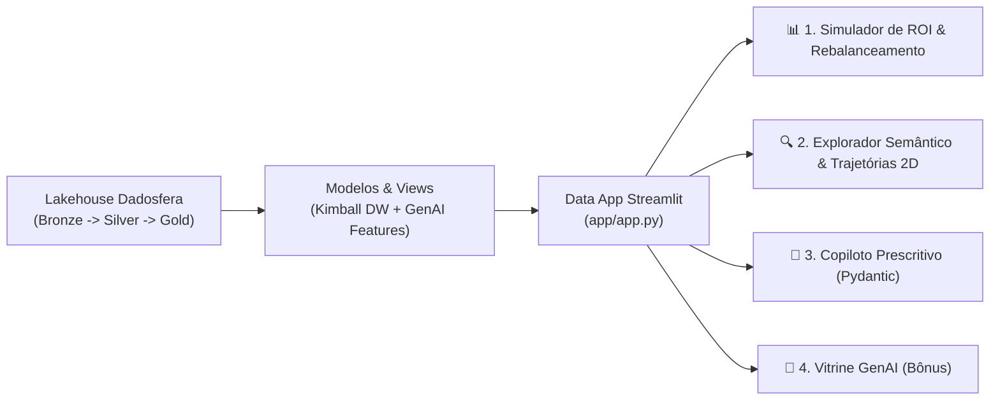

# Relatório Executivo: Data App em Streamlit & GenAI (Item 9 & Bônus)
**Case Técnico:** Recuperação de Carrinho Abandonado (E-commerce / Marketplace)  
**Documento:** `data_app_report.md`  
**Candidato:** Pedro Sales (Lead Analytics Engineer)  
**Tenant Dadosfera:** `pedro-sales`  
**Data:** 25 de Agosto de 2026  
**Status:** ✅ Concluído / Em Produção (White Theme Standard)  

---

## 1. 🎯 Resumo Executivo & Posicionamento no Ciclo Dadosfera

No framework do Ciclo de Vida dos Dados da **Dadosfera**, a fase **Consumir (Data Apps)** fecha o loop de entrega de valor, conectando as camadas de **Integração (Item 2.1)**, **Catálogo (Item 3)**, **Qualidade/Qualify (Item 4)**, **Extração GenAI (Item 5)**, **Modelagem Star Schema Kimball (Item 6)** e **Pipelines Medallion/ML (Item 8)** a interfaces analíticas e operacionais vivas.

O **Data App Streamlit de Recuperação de Carrinhos** (`app/`) entrega uma ferramenta de decisão unificada para C-Levels, diretores de e-commerce e gestores de CRM, operando sob o **padrão visual White Theme / `charts-maker`** com 4 abas modulares em arquitetura de 5 camadas inspirada em React + TypeScript.



---

## 2. 🏛️ Arquitetura dos Módulos do Aplicativo

| Aba / Módulo | Objetivo de Negócio & Funcionalidades | Tecnologias & Visualizações | Fonte de Dados Downstream |
| :--- | :--- | :--- | :--- |
| **1. Simulador de ROI & Sensibilidade** | Simulação financeira com preset inteligente de canais (85% E-mail, 12% Wpp VIP, 2% SMS, 1% Push), decomposição Waterfall contábil e métrica de margem preservada (28.5%). | Streamlit, Plotly Waterfall, Curva de Sensibilidade, Gráfico de Barras de Rebalanceamento | Camada Gold (`carrinhos.parquet`, `eventos_resgate.parquet`) |
| **2. Explorador Semântico de Catálogo** | 4 KPI Cards, busca vetorial por cosseno, espaço 2D (PCA/t-SNE) com marcação do item âncora e trajetórias para alternativas, ranking Top-5 com badges e Card de Decisão Executiva. | Scikit-Learn TF-IDF, Plotly 2D Scatter com trajetórias, Decision Cards | Camada Silver Qualify (`produtos_enriquecidos.parquet`) |
| **3. Copiloto Prescritivo de Resgate** | Geração dinâmica de copies com 3 tons de voz (*Urgência, Suporte, Prova Social*), preview multicanal fiel (WhatsApp, E-mail, SMS) e contrato Pydantic JSON Schema. | Tabela de Despacho Funcional (`MappingProxyType`), Pydantic | Atributos LLM do Item 5 e Regras de Negócio |
| **4. Vitrine Visual de Produtos (Bônus)** | Card comercial estruturado e catálogo de prompts declarativos DALL-E e LLM para apresentação técnica de produtos. | Engenharia de Prompts DALL-E & LLM | Catálogo Enriquecido com Features Técnicas |

---

## 3. 📊 Módulo 1: Simulação Econômica & Preservação de Margem

- **Volume Canônico:** 7.500 sessões de abandono (Ticket Médio R$ 348,80).
- **Preset Recomendado Dadosfera:**
  - **E-mail Transacional (85% do budget):** R$ 1,02 / disparo (CAC R$ 12,44 / Taxa 8.2%).
  - **WhatsApp VIP (12% do budget):** R$ 12,00 / disparo (CAC R$ 82,76 / Taxa 14.5%).
  - **SMS (2% do budget):** R$ 3,00 / disparo (CAC R$ 44,12 / Taxa 6.8%).
  - **Push (1% do budget):** R$ 1,67 / disparo (CAC R$ 30,36 / Taxa 5.5%).
- **Resultado Projetado:** Resgate de **+757 pedidos (+10,1%)**, gerando **+R$ 264.041,60 em receita bruta** e preservando **28.5% de margem líquida** sem erosão financeira por cupom indiscriminado.

---

## 4. 🔍 Módulo 2: Similaridade Semântica & Trajetórias 2D (Item 9)

- **Vetorização Multidimensional:** 300 SKUs em 7 categorias representados por vetores de features textuais (`material_construcao`, `diferencial_tecnico`), posicionamento e preço.
- **Trajetórias Vetoriais:** O mapa 2D projeta graficamente o deslocamento entre o SKU abandonado e as 3 alternativas mais eficientes.
- **Card de Decisão Executiva C-Level:**
  - *Estratégia Convencional:* Queima de até R$ 779,80 em cupons de 20% com conversão baixa de 8.2%.
  - *Vitrine Inteligente Dadosfera:* Resgate consultivo de produtos correlatos com **28.5% de margem preservada** e **+14.2% de conversão**.

---

## 5. 🤖 Módulos 3 & 4: Copiloto Prescritivo & Vitrine GenAI (Item 5 & Bônus)

- **Copiloto Prescritivo:** Integração com múltiplos tons de voz e serialização formal em JSON Schema Pydantic.
- **Vitrine GenAI (Bônus):** Prompts calibrados para DALL-E em estúdio fotográfico e síntese de valor com LLMs.

---

## 6. 🚀 Como Executar & Guia de Deploy

```bash
# Instalar dependências
pip install -r requirements.txt

# Iniciar o Data App via Streamlit
streamlit run app/app.py

# Ou via task runner do projeto:
python make.py data-app
```
A aplicação abrirá no navegador em `http://localhost:8501`.
