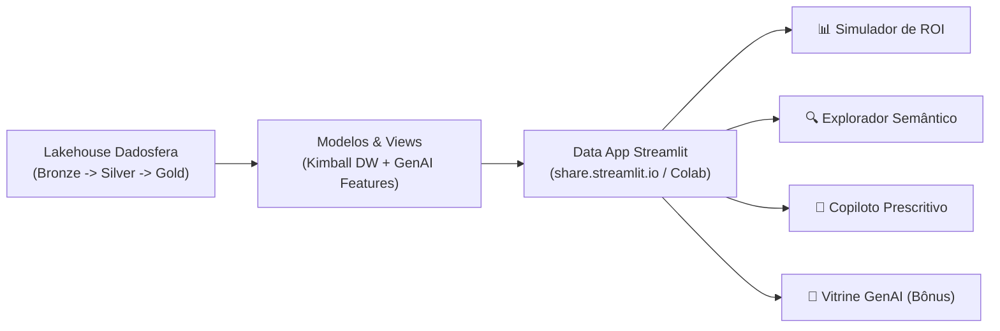

# Relatório Executivo: Data App em Streamlit & GenAI (Item 9 & Bônus)
**Case Técnico:** Recuperação de Carrinho Abandonado (E-commerce / Marketplace)  
**Documento:** `data_app_report.md`  
**Candidato:** Pedro Sales (Lead Analytics Engineer)  
**Tenant Dadosfera:** `pedro-sales`  
**Data:** 24 de Agosto de 2026  
**Status:** ✅ Concluído / Produção  

---

## 1. 🎯 Resumo Executivo & Posicionamento no Ciclo Dadosfera

No framework do Ciclo de Vida dos Dados da **Dadosfera**, a fase **Consumir (Data Apps)** fecha o loop de entrega de valor, conectando as camadas de **Integração (Item 2.1)**, **Catálogo (Item 3)**, **Qualidade/Qualify (Item 4)**, **Extração GenAI (Item 5)**, **Modelagem Star Schema Kimball (Item 6)** e **Pipelines Medallion/ML (Item 8)** a interfaces analíticas e operacionais vivas.

O **Data App Streamlit de Recuperação de Carrinhos** entrega uma ferramenta de decisão para a diretoria de e-commerce e gestores de CRM, permitindo simulações de sensibilidade de ROI em tempo real, exploração semântica do catálogo através de projeções vetoriais (t-SNE/PCA) e geração de abordagens de comunicação altamente persuasivas por inteligência artificial generativa.



---

## 2. 🏛️ Arquitetura dos Módulos do Aplicativo

A aplicação foi estruturada em 4 módulos de negócio independentes sob o paradigma funcional declarativo:

| Módulo | Objetivo de Negócio | Tecnologias Utilizadas | Fonte de Dados Downstream |
| :--- | :--- | :--- | :--- |
| **1. Simulador de Sensibilidade de ROI** | Simulação orçamentária interativa variando cupom de desconto, volume de carrinhos e mix de canais de resgate. | Streamlit, Plotly Waterfall, Plotly Lines | Camada Gold (`v_abandonment_summary`, `fato_resgate`) |
| **2. Explorador Semântico de Catálogo** | Busca semântica por produto, cálculo de similaridade vetorial (Cosseno) e projeção 2D (PCA/t-SNE). | Scikit-Learn, TF-IDF, Plotly 2D Scatter | Camada Silver Qualify (`produtos_enriquecidos.parquet`) |
| **3. Copiloto Prescritivo de Resgate** | Geração dinâmica de copies persuasivas para WhatsApp, E-mail e SMS combinando perfil RFM e motivo de abandono. | Python Functional Prompt Engine | Atributos LLM do Item 5 e Regras de Negócio |
| **4. Vitrine Visual de Produtos (Bônus)** | Gerador de apresentações comerciais de produto com síntese de diferenciais e prompts visuais para DALL-E. | Engenharia de Prompts Estruturada | Catálogo Enriquecido com Features Técnicas |

---

## 3. 📊 Módulo 1: Simulação Econômica & Curva de Sensibilidade

O simulador implementa rigorosamente as invariantes contábeis de recuperação de carrinho e as métricas do pitch:

- **Volume de Carrinhos:** Parametrizável de 1.000 a 50.000 sessões.
- **Topologia de Custos por Canal:**
  - **WhatsApp:** R$ 12,00 / disparo (Taxa de Conversão ~14.5%)
  - **SMS:** R$ 3,00 / disparo (Taxa de Conversão ~6.8%)
  - **E-mail:** R$ 1,02 / disparo (Taxa de Conversão ~8.2%)
- **Decomposição da Receita Líquida:**
  $$\text{Receita Líquida} = \text{Receita Bruta Resgatada} - (\text{Custos de Comunicação} + \text{Custo do Cupom de Desconto})$$
- **Curva de Sensibilidade:** Gráfico de elasticidade demonstrando que descontos entre **10% e 15%** maximizam o ROI financeiro (~31.4x), equilibrando atratividade comercial e preservação de margem bruta.

---

## 4. 🔍 Módulo 2: Similaridade Semântica & Embeddings 2D (Item 9)

Atendendo ao requisito oficial do Item 9 (*"Similaridade entre produtos / Visualização de embeddings"*):
- Cada produto é representado por um vetor multidimensional combinando suas características textuais (`material_construcao`, `diferencial_tecnico`), categoria normalizada, faixa de posicionamento e sensibilidade a preço.
- A função de distância por **Cosseno** identifica instantaneamente os Top-$K$ SKUs mais correlacionados.
- A redução dimensional (**PCA** ou **t-SNE**) plota o catálogo completo em um mapa 2D interativo com identificação de clusters de atrito e dispersão de preço.

---

## 5. 🤖 Módulo 3 & 4: Copiloto Prescritivo & Vitrine GenAI (Bônus)

- **Módulo 3 (Copiloto):** Combina o cluster RFM do cliente (*Campeões, Em Risco, etc.*) e a causa-raiz de atrito (*Frete Alto, Preço, Dúvida Técnica*) para disparar o gatilho de persuasão ideal (Escassez, Ancoragem ou Eliminação de Fricção) em formatos de WhatsApp (com preview de balão de chat), E-mail formatado ou SMS.
- **Módulo 4 (Item Bônus):** Transforma os dados brutos de produto em cards promocionais para anúncios de retargeting e vitrines personalizadas, disponibilizando os prompts padronizados para geração de imagens fotográficas em estúdio.

---

## 6. 🚀 Como Executar & Guia de Deploy

### Opção A: Execução Local Instantânea
```bash
# Instalar dependências
pip install -r requirements.txt

# Iniciar o Data App via Streamlit
streamlit run app/app.py

# Ou via task runner do projeto:
python make.py data-app
```
A aplicação abrirá no seu navegador em `http://localhost:8501`.

### Opção B: Deploy no Streamlit Community Cloud (Nuvem Pública Gratuita)
1. Conecte sua conta do GitHub em **[share.streamlit.io](https://share.streamlit.io)**.
2. Crie uma nova aplicação apontando para o repositório `PEDRO_SALES_DDF_TECH_082026`.
3. Defina o Branch como `main` e o Main File Path como `app/app.py`.
4. Clique em **Deploy**! A URL pública gerada pode ser acessada de qualquer dispositivo.

### Opção C: Execução no Google Colab
Abra o notebook [`pipelines/case-item-09/notebooks/streamlit_colab_runner.ipynb`](../notebooks/streamlit_colab_runner.ipynb) no Google Colab e execute as células sequencialmente para iniciar o servidor com túnel público `localtunnel`.
