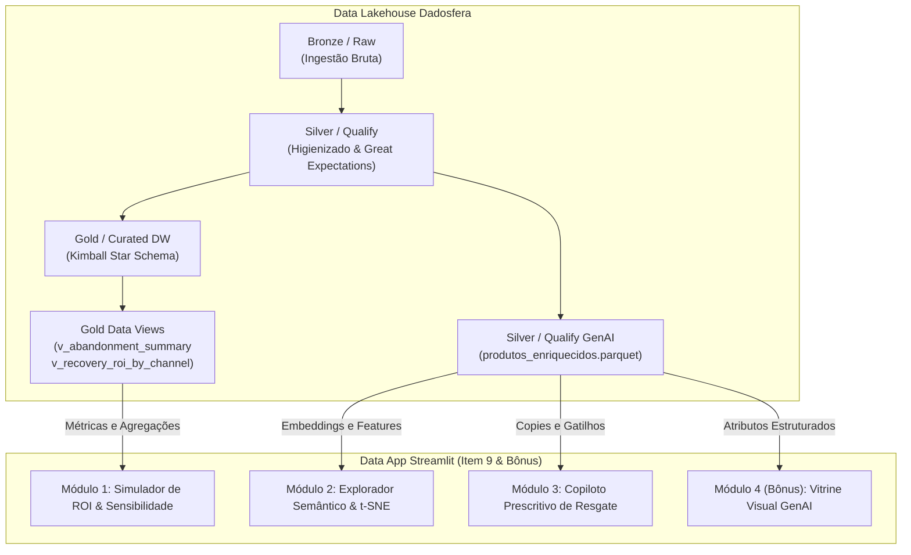

# Especificação Técnica: Data App em Streamlit (Item 9 & Bônus GenAI)
**Document ID:** `spec_data_app_streamlit_001`  
**Versão:** `1.0.0`  
**Status:** `Aprovado / Em Produção`  
**Owner:** `Pedro Sales (Lead Analytics Engineer)`  
**Data:** `2026-08-24`  

---

## 1. 🎯 Visão Geral & Contexto de Negócio

No ciclo de vida de dados da plataforma **Dadosfera**, a fase **Consumir (Data Apps)** representa a última milha de entrega de valor, onde modelos, tabelas dimensionais e predições de inteligência artificial são convertidos em ferramentas operacionais e estratégicas para usuários de negócio.

O **Data App Streamlit de Recuperação de Carrinhos** atua como uma plataforma analítica e prescritiva unificada para C-Levels, Head de E-commerce e Gestores de CRM. O aplicativo substitui planilhas estáticas e consultas ad-hoc por uma interface dinâmica em tempo real que permite:
1. **Simular cenários econômicos e calibrar ROI** de campanhas de resgate antes de realizar investimentos.
2. **Explorar semanticamente o catálogo de produtos** usando projeções dimensionais (t-SNE / PCA) baseadas nas features extraídas por LLMs.
3. **Gerar copies e abordagens de comunicação altamente persuasivas** e contextualizadas por canal (WhatsApp, E-mail, SMS) e segmentação RFM.
4. **Renderizar vitrines promocionais inteligentes (Bônus GenAI)** com síntese visual e argumentos de venda para aceleração de conversão.

---

## 2. 🏛️ Arquitetura de Consumo Medallion & Linhagem

O Data App é um consumidor *downstream* que opera exclusivamente sobre as camadas governadas do Data Lakehouse:

---

## 3. 📋 Especificação dos Módulos do Aplicativo

### 📊 Módulo 1: Simulador Prescritivo de ROI & Sensibilidade Financeira
- **Objetivo:** Permitir ao gestor calibrar parâmetros de campanha e visualizar instantaneamente o impacto financeiro projetado.
- **Entradas Interativas (Sliders & Selectors):**
  - Volume de carrinhos elegíveis para resgate ($N$).
  - Mix de canais: Proporção alocada entre WhatsApp (R$ 12,00/disparo), SMS (R$ 3,00/disparo) e E-mail (R$ 1,02/disparo).
  - Taxa base de conversão ($C_{base} \in [5\%, 25\%]$).
  - Cupom de desconto promocional ($D \in [0\%, 30\%]$).
- **Motores Matemáticos & Invariantes Contábeis:**
  $$\text{Volume Recuperado} = N \times (C_{base} + \alpha \cdot D)$$
  $$\text{Receita Bruta Resgatada} = \text{Volume Recuperado} \times \text{Ticket Médio}$$
  $$\text{Custo de Comunicação} = \sum (\text{Disparos}_c \times \text{Custo}_c)$$
  $$\text{Custo de Desconto} = \text{Receita Bruta Resgatada} \times D$$
  $$\text{Receita Líquida Incremental} = \text{Receita Bruta Resgatada} - (\text{Custo de Comunicação} + \text{Custo de Desconto})$$
  $$\text{ROI Multiplicador} = \frac{\text{Receita Líquida Incremental}}{\text{Custo Total da Ação}}$$
- **Visualizações:**
  - Gráfico de Cascata (Waterfall) decompondo Receita Bruta, Custos e Receita Líquida.
  - Curva de Sensibilidade (Sensibility Curve) comparando ROI x Percentual de Desconto.

---

### 🔍 Módulo 2: Explorador Semântico & Similaridade de Catálogo (GenAI)
- **Objetivo:** Atender ao requisito oficial do Item 9 (*"Similaridade entre produtos / Visualização de embeddings"*), permitindo identificar padrões semânticos de atrito e recomendar produtos alternativos.
- **Tecnologia:**
  - Extração de features semânticas (Sensibilidade a Preço, Nível de Urgência, Complexidade Técnica, Categoria Normalizada).
  - Redução de Dimensionalidade interativa via **PCA** e **t-SNE** para projeção em espaço 2D interativo via Plotly.
  - Cálculo de Similaridade por Cosseno ($S_C(A, B) = \frac{A \cdot B}{\|A\| \|B\|}$).
- **Funcionalidades:**
  - Busca interativa por ID ou título do produto.
  - Tabela dos Top-$K$ produtos mais similares com cálculo de score de afinidade.
  - Mapa 2D de dispersão interativo com filtros por cluster de categoria e nível de atrito.

---

### 🤖 Módulo 3: Copiloto Prescritivo de Resgate & LLM Playground
- **Objetivo:** Unificar a extração do Item 5 em uma interface operacional de geração de copies persuasivas para atendimento direto e automação de CRM.
- **Entradas:**
  - Segmento RFM do Cliente (*Campeões, Leais, Em Risco, Hibernando, Novos*).
  - Motivo Primário de Abandono (*Frete Abusivo, Preço Elevado, Dúvida Técnica, Checkout Complexo*).
  - Canal de Disparo (*WhatsApp com botões de ação, E-mail com HTML persuasivo, SMS curto de urgência*).
- **Saídas:**
  - Texto gerado contextualizado com gatilho mental específico (Escassez, Ancoragem, Prova Social).
  - Preview visual em formato de mensagem de chat ou card de e-mail.

---

### 🎨 Módulo 4 (Bônus): Vitrine & Gerador Visual de Apresentação de Produto
- **Objetivo:** Cumprir o requisito do **Item Bônus** (*"Gerador de apresentações de produto com GenAI para mostrar as principais características a fim de vender mais"*).
- **Funcionalidades:**
  - Gerador de cards promocionais de alta conversão para vitrines de resgate.
  - Documentação dos prompts utilizados (Prompt Master de Síntese de Produto e Prompt Visual).
  - Integração com imagens conceituais renderizadas e layout moderno.

---

## 4. ⚙️ Padrão de Engenharia de Software

1. **Paradigma Funcional & Declarativo:**
   - Todos os cálculos de negócio residem em módulos desacoplados da camada de visualização (`pipelines/case-item-09/core/`).
   - Todas as funções de cálculo são puras (`Callable`), sem mutação de estado global ou de DataFrames.
2. **Tipagem Estrita:**
   - Uso de `typing` (`Final`, `TypeAlias`, `NamedTuple`, `@dataclass(frozen=True)`).
3. **Desacoplamento e Portabilidade:**
   - A aplicação funciona tanto localmente via `streamlit run app/app.py` quanto em nuvem no **Streamlit Community Cloud** ou Google Colab.
