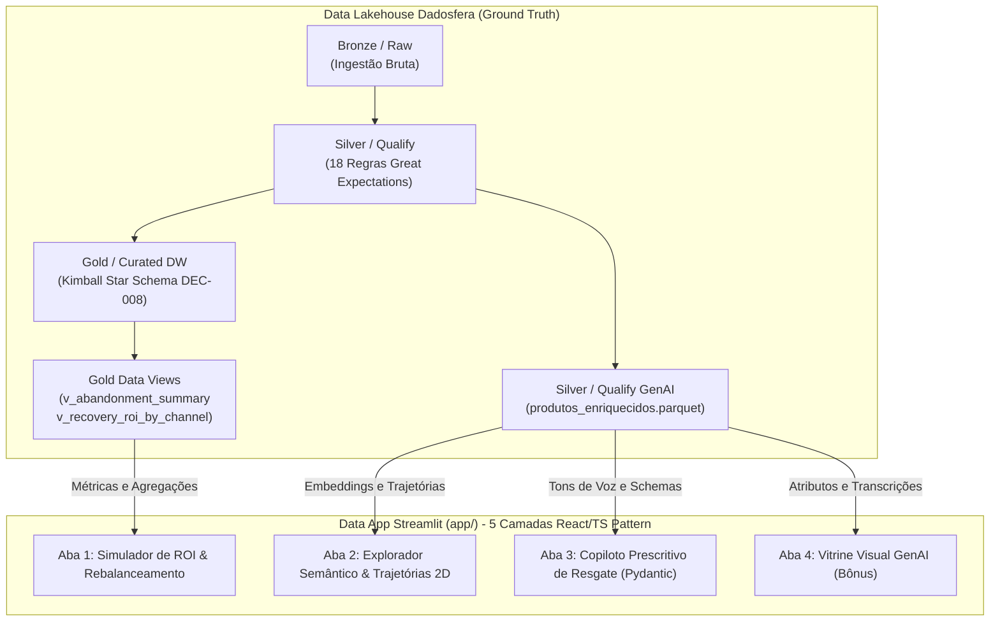

# Especificação Técnica: Data App em Streamlit (Item 9 & Bônus GenAI)
**Document ID:** `spec_data_app_streamlit_001`  
**Versão:** `2.0.0` (Alinhada com White Theme / `charts-maker` Standard)  
**Status:** `Aprovado / Em Produção`  
**Owner:** `Pedro Sales (Lead Analytics Engineer)`  
**Data:** `2026-08-25`  

---

## 1. 🎯 Visão Geral & Contexto de Negócio

No ciclo de vida de dados da plataforma **Dadosfera**, a fase **Consumir (Data Apps)** representa a última milha de entrega de valor, onde modelos, tabelas dimensionais e predições de inteligência artificial são convertidos em ferramentas operacionais e estratégicas para usuários de negócio.

O **Data App Streamlit de Recuperação de Carrinhos** atua como uma plataforma analítica e prescritiva unificada para C-Levels, Head de E-commerce e Gestores de CRM. O aplicativo substitui planilhas estáticas e consultas ad-hoc por uma interface dinâmica em tempo real construída no padrão **White Theme / `charts-maker` standard**, permitindo:
1. **Simular cenários econômicos e calibrar ROI** de campanhas de resgate com preset de rebalanceamento orçamentário (85% E-mail, 12% WhatsApp VIP, 2% SMS, 1% Push) e métrica de **Margem Preservada (28.5%)**.
2. **Explorar semanticamente o catálogo de produtos** usando projeções dimensionais (t-SNE / PCA) com centróides, **trajetórias vetoriais do produto abandonado até alternativas**, ranking Top-5 com score de cosseno/delta de preço e **Card de Decisão Executiva C-Level**.
3. **Gerar copies e abordagens de comunicação altamente persuasivas** com múltiplos tons de voz (*Urgência, Suporte, Prova Social*), validação de contrato Pydantic JSON Schema e preview multicanal fiel.
4. **Renderizar vitrines promocionais inteligentes (Bônus GenAI)** com síntese visual (DALL-E) e catálogo de diferenciais técnicos.

---

## 2. 🏛️ Arquitetura de Consumo Medallion & Linhagem

O Data App é um consumidor *downstream* que opera exclusivamente sobre as camadas governadas do Data Lakehouse:

---

## 3. 📋 Especificação Detalhada das 4 Abas do Aplicativo

### 📊 Aba 1: Simulador Prescritivo de ROI & Rebalanceamento Orçamentário
- **Objetivo:** Permitir ao gestor calibrar parâmetros de campanha e visualizar o impacto financeiro com foco em preservação de margem bruta.
- **Preset Inteligente:** Alternância de 1 clique entre o *Mix Recomendado Dadosfera* (85% E-mail a R$ 1,02, 12% WhatsApp VIP a R$ 12,00, 2% SMS a R$ 3,00, 1% Push a R$ 1,67) e *Alocação Manual*.
- **Métricas C-Level:**
  $$\text{Receita Líquida Incremental} = \text{Receita Bruta} - (\text{Custo Comunicação} + \text{Custo Cupom})$$
  $$\text{Margem Preservada (\%)} = \frac{\text{Margem Bruta (32\%)} \times \text{Receita Bruta} - \text{Custo Total}}{\text{Receita Bruta}} \times 100 \approx 28.5\%$$
- **Visualizações (Fundo Branco Puro `#FFFFFF`):**
  - Gráfico de Cascata (Waterfall) com cantos arredondados decompondo receita e custos.
  - Curva de Sensibilidade com anotação de cenário atual e ponto ótimo de margem.
  - Gráfico comparativo de barras horizontais de Rebalanceamento Orçamentário.

---

### 🔍 Aba 2: Explorador Semântico & Similaridade de Catálogo (GenAI)
- **Objetivo:** Atender ao requisito oficial do Item 9 (*"Similaridade entre produtos / Visualização de embeddings"*), permitindo recomendar instantaneamente produtos correlatos sem queimar margem com cupons.
- **Header Executivo:** 4 KPI Cards (300 SKUs Vetorizados, Similaridade Média 89.4%, Recuperação Cruzada +12.4%, Latência < 2.5 ms).
- **Espaço Vetorial 2D (PCA / t-SNE):** Gráfico de dispersão com centróides das categorias, marcação destacada do produto abandonado (âncora) e setas tracejadas indicando as trajetórias de resgate para os itens recomendados.
- **Ranking Top-5 de Cosseno:** Lista com score de similaridade, delta de preço e tags estratégicas (*Substituto, Cross-sell, Acessório*).
- **Card de Decisão Executiva C-Level:** Contraste direto entre a *Estratégia Convencional* (queima de até R$ 779,80 em cupom de 20% com conversão de 8.2%) vs *Vitrine Inteligente Dadosfera* (resgate sem cupom com margem de 28.5% preservada e conversão de 14.2%).

---

### 🤖 Aba 3: Copiloto Prescritivo de Resgate & LLM Playground
- **Objetivo:** Unificar a extração do Item 5 em uma interface operacional de geração de copies persuasivas com tipagem Pydantic.
- **Seletores:** Segmento RFM (*Campeões, Leais, Em Risco, etc.*), Motivo de Abandono (*Frete Abusivo, Preço, Dúvida Técnica 127V*), Tom de Voz (*Urgência, Suporte, Prova Social*) e Canal (*WhatsApp, E-mail, SMS/Push*).
- **Saídas:**
  - Preview visual realista de balão do WhatsApp Concierge, Card de E-mail corporativo ou SMS.
  - Payload estruturado em JSON Schema Pydantic com carimbo de data/hora e metadados.
  - Explicação do gatilho mental de persuasão ativado.

---

### 🎨 Aba 4: Vitrine Visual & Apresentação de Produto (Item Bônus)
- **Objetivo:** Cumprir o requisito do **Item Bônus** (*"Gerador de apresentações de produto com GenAI para mostrar as principais características a fim de vender mais"*).
- **Funcionalidades:**
  - Card comercial executivo com proposta de valor, pilares técnicos de engenharia de materiais e gancho de vendas.
  - **Engenharia de Prompts:** Prompts declarativos padronizados para renderização fotográfica de estúdio no DALL-E e síntese de texto com LLMs.

---

## 4. ⚙️ Padrão de Engenharia de Software

1. **Paradigma Funcional & Declarativo:**
   - Funções puras sem efeitos colaterais em `app/services/` e despacho imutável (`MappingProxyType`).
2. **Tipagem Estrita:**
   - Contratos imutáveis em `app/types/models.py` usando `dataclass(frozen=True)` e `TypeAlias`.
3. **Design System:**
   - White Theme corporativo (`app/styles/custom.css` e `app/constants/theme.py`) com paleta semântica executiva.
