# 🏗️ Arquitetura de Datalakes — Pipelines de Dados (Medallion & Quarentena)

> **Módulo:** `pipelines/datalakes/`  
> **Padrão Arquitetural:** Lakehouse Medallion + Quarentena de Anomalias (Raw ➔ Qualify / Anomaly ➔ Curated)  
> **Framework Normativo:** DEC-001 (Métricas em Execução) + DEC-004 (Sem SQL Local) + DEC-006 (Dual-Artifact Qualify/Anomaly) + DEC-008 (Kimball Dimensional)  
> **Status:** ✅ Objeto Imutável de Especificação Centralizada  

---

## 📌 Visão Geral da Arquitetura

O Data Lakehouse do projeto **Recuperação de Carrinho Abandonado** organiza seus pipelines de dados em quatro camadas especializadas. A estrutura física adota o padrão de **diretório dedicado por entidade** em cada camada, onde habitam o dataset correspondente e sua respectiva especificação de metadados de catálogo (`metadata.md`).

```text
pipelines/datalakes/
├── README.md                           # Visão Geral da Arquitetura Datalakes & Guia de Navegação
├── raw/                                # Camada Bronze: Ingestão Bruta & Preservação As-Is
│   ├── spec.md                         # Especificação da Camada Raw
│   ├── carrinhos_raw/                  # carrinhos_raw + metadata.md
│   ├── pedidos_raw/                    # pedidos_raw + metadata.md
│   ├── clientes_raw/                   # clientes_raw + metadata.md
│   ├── produtos_raw/                   # produtos_raw + metadata.md
│   ├── itens_carrinho_raw/             # itens_carrinho_raw + metadata.md
│   ├── eventos_carrinho_raw/           # eventos_carrinho_raw + metadata.md
│   └── eventos_resgate_raw/            # eventos_resgate_raw + metadata.md
├── qualify/                            # Camada Silver: Limpeza Técnica & Validação de Contratos
│   ├── spec.md                         # Especificação da Camada Qualify
│   ├── carrinhos_qualify/              # carrinhos_qualify + metadata.md
│   ├── pedidos_qualify/                # pedidos_qualify + metadata.md
│   ├── clientes_qualify/               # clientes_qualify + metadata.md
│   ├── produtos_qualify/               # produtos_qualify + metadata.md
│   ├── itens_carrinho_qualify/         # itens_carrinho_qualify + metadata.md
│   ├── eventos_carrinho_qualify/       # eventos_carrinho_qualify + metadata.md
│   └── eventos_resgate_qualify/        # eventos_resgate_qualify + metadata.md
├── anomaly/                            # Camada Silver Quarentena: Armazenamento & Diagnóstico de Anomalias (DEC-006)
│   ├── spec.md                         # Especificação da Camada Anomaly
│   ├── carrinhos_anomalies/            # carrinhos_anomalies + metadata.md
│   ├── pedidos_anomalies/              # pedidos_anomalies + metadata.md
│   ├── clientes_anomalies/             # clientes_anomalies + metadata.md
│   ├── produtos_anomalies/             # produtos_anomalies + metadata.md
│   ├── itens_carrinho_anomalies/       # itens_carrinho_anomalies + metadata.md
│   ├── eventos_carrinho_anomalies/     # eventos_carrinho_anomalies + metadata.md
│   └── eventos_resgate_anomalies/      # eventos_resgate_anomalies + metadata.md
└── curated/                            # Camada Gold: Modelagem Dimensional Kimball & Analytics (DEC-008)
    ├── spec.md                         # Especificação da Camada Curated
    ├── carrinhos_curated/              # carrinhos_curated + metadata.md
    ├── pedidos_curated/                # pedidos_curated + metadata.md
    ├── clientes_curated/               # clientes_curated + metadata.md
    ├── produtos_curated/               # produtos_curated + metadata.md
    ├── itens_carrinho_curated/         # itens_carrinho_curated + metadata.md
    ├── eventos_carrinho_curated/       # eventos_carrinho_curated + metadata.md
    └── eventos_resgate_curated/        # eventos_resgate_curated + metadata.md
```

---

## 🔄 Fluxo de Maturidade dos Dados

```mermaid
flowchart LR
    subgraph Raw [Zona Raw - Bronze]
        R1[raw_pedidos]
        R2[raw_carrinhos]
        R3[raw_itens_carrinho]
        R4[raw_clientes]
        R5[raw_produtos]
        R6[raw_eventos_carrinho]
        R7[raw_eventos_resgate]
    end

    subgraph Qualify [Zona Qualify - Silver]
        Q1[pedidos]
        Q2[carrinhos]
        Q3[itens_carrinho]
        Q4[clientes]
        Q5[produtos]
        Q6[eventos_carrinho]
        Q7[eventos_resgate]
    end

    subgraph Anomaly [Zona Anomaly - Quarentena de Anomalias]
        AN1[carrinhos_anomalies]
        AN2[pedidos_anomalies]
        AN3[clientes_anomalies]
        AN4[produtos_anomalies]
        AN5[itens_carrinho_anomalies]
        AN6[eventos_carrinho_anomalies]
        AN7[eventos_resgate_anomalies]
    end

    subgraph Curated [Zona Curated - Gold]
        C1[carrinhos_curated]
        C2[pedidos_curated]
        C3[clientes_curated]
        C4[produtos_curated]
        C5[itens_carrinho_curated]
        C6[eventos_carrinho_curated]
        C7[eventos_resgate_curated]
    end

    Raw -->|Validação de Schema & Regras DQ| Qualify
    Raw -->|Isolamento de Desvios DEC-006| Anomaly
    Qualify -->|Modelagem Dimensional Kimball| Curated
```



---

## 📚 Navegação das Especificações por Camada

- 📥 [Especificação da Camada Raw (Bronze)](file:///c:/Users/pedro/OneDrive/Desktop/wheels/pipelines/datalakes/raw/spec.md)
- 🧹 [Especificação da Camada Qualify (Silver)](file:///c:/Users/pedro/OneDrive/Desktop/wheels/pipelines/datalakes/qualify/spec.md)
- ⚠️ [Especificação da Camada Anomaly (Quarentena)](file:///c:/Users/pedro/OneDrive/Desktop/wheels/pipelines/datalakes/anomaly/spec.md)
- 📊 [Especificação da Camada Curated (Gold)](file:///c:/Users/pedro/OneDrive/Desktop/wheels/pipelines/datalakes/curated/spec.md)
