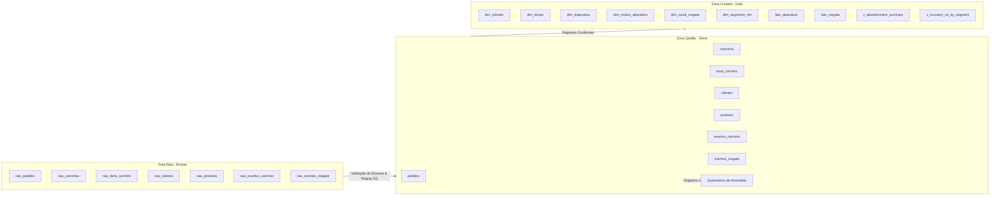

# 🏗️ Arquitetura de Datalakes — Pipelines de Dados (Medallion Architecture)

> **Módulo:** `pipelines/datalakes/`  
> **Padrão:** Lakehouse Medallion (Raw -> Qualify -> Curated)  
> **Framework Normativo:** DEC-001 (Métricas em Tempo de Execução) + DEC-004 (Sem SQL Local) + DEC-006 (Dual-Artifact Qualify/Anomalies)  
> **Status:** Objeto Imutável de Especificação Centralizada  

---

## 📌 Visão Geral do Diretório

Este diretório centraliza os contratos de dados e especificações imutáveis das três camadas do Data Lakehouse para o case de **Recuperação de Carrinho Abandonado**:

```text
pipelines/datalakes/
├── raw/
│   └── spec.md          # Especificação Imutável da Camada Raw (Bronze / Ingestão Bruta)
├── qualify/
│   └── spec.md          # Especificação Imutável da Camada Qualify (Silver / Validação & DQ)
└── curated/
    └── spec.md          # Especificação Imutável da Camada Curated (Gold / Modelagem Dimensional)
```

---

## 🔄 Fluxo de Maturidade dos Dados



---

## 📚 Navegação Rápida

- 📥 [Especificação da Camada Raw](file:///c:/Users/pedro/OneDrive/Desktop/wheels/pipelines/datalakes/raw/spec.md)
- 🧹 [Especificação da Camada Qualify](file:///c:/Users/pedro/OneDrive/Desktop/wheels/pipelines/datalakes/qualify/spec.md)
- 📊 [Especificação da Camada Curated](file:///c:/Users/pedro/OneDrive/Desktop/wheels/pipelines/datalakes/curated/spec.md)
