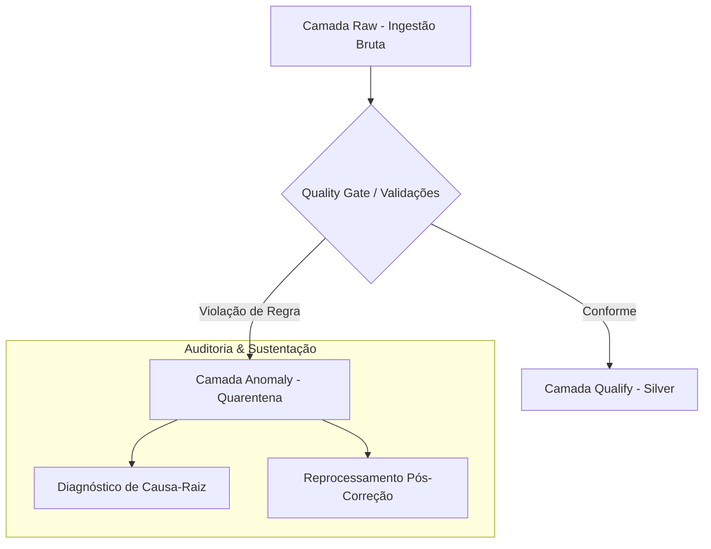

# ⚠️ Especificação Imutável: Camada Anomaly (Silver Dead-Letter / Quarentena de Anomalias)

> **Doc ID:** `spec_datalake_anomaly_001`  
> **Camada:** `Anomaly (Silver Quarentena / Dead-Letter)`  
> **Natureza:** Objeto Imutável de Auditoria, Isolamento e Governança de Falhas  
> **Banco / Schema:** Snowflake `CART_RECOVERY_ANOMALIES.*`  
> **Padrão Arquitetural:** Dual-Artifact Pipeline (DEC-006)  
> **Status:** ✅ Homologado & Ativo  

---

## 1. 📌 Objetivo e Princípios da Camada Anomaly

A camada **Anomaly (Silver Quarentena)** é o mecanismo de tolerância e salvaguarda do Data Lakehouse. Em vez de descartar registros que violam contratos de integridade ou abortar pipelines inteiros, a camada Anomaly isola cada tupla problemática em quarentena dead-letter. Isso garante que a camada Silver Qualify permaneça 100% confiável para consumo downstream, enquanto os times de engenharia e sustentação têm visibilidade total dos desvios para auditoria, diagnóstico de causa-raiz e conciliação.

### Princípios Fundamentais:
1. **Preservação Integral do Payload de Origem:** Cada registro encaminhado à quarentena mantém seu conteúdo original inalterado, permitindo reprocessamento após correções sistêmicas ou ajustes de regras na origem.
2. **Diagnóstico Estruturado de Erro:** Todo registro isolado é acompanhado de metadados técnicos padronizados, incluindo identificador único do evento de anomalia, código do erro, descrição legível, nível de severidade e timestamp de detecção.
3. **Rastreabilidade Bidirecional:** A linhagem vincula o registro anômalo diretamente à sua partição de ingestão na camada Raw e à regra de Data Quality violada.

---

## 2. 📋 Entidades em Quarentena

A camada Anomaly espelha as 7 entidades centrais do domínio, estruturadas em diretórios individuais contendo os dados em quarentena e suas respectivas especificações:

- **`carrinhos_anomalies`**: Isolamento de sessões com desvios contábeis, equações de fechamento financeiro inválidas, fretes negativos ou inconsistências temporais.
- **`pedidos_anomalies`**: Quarentena de ordens com valores totais não-positivos, métodos de pagamento inconsistentes ou parcelamento fora de regras de negócio.
- **`clientes_anomalies`**: Quarentena de cadastros com e-mails corrompidos, sintaxes inválidas de contato ou ausência de campos obrigatórios.
- **`produtos_anomalies`**: Isolamento de itens com preços negativos, inconsistências de precificação promocional ou ausência de identificação no catálogo.
- **`itens_carrinho_anomalies`**: Quarentena de linhas de detalhe com quantidades zeradas, preços inconsistentes ou violações cronológicas de remoção.
- **`eventos_carrinho_anomalies`**: Isolamento de telemetrias com quebras de sequência de checkout ou timestamps inválidos.
- **`eventos_resgate_anomalies`**: Quarentena de disparos de CRM com quebra de monotonicidade do funil de marketing ou inconsistências temporais entre envio e abertura.

---

## 3. 🔍 Validações e Regras de Roteamento em Texto Corrido

O processo de detecção de anomalias avalia as tuplas candidatas contra o conjunto de regras técnicas e de negócio. Para cada entidade, as validações de schema, restrições de tipo, domínios permitidos e limites de valores seguem rigorosamente as **validações declaradas no corpo da entidade**.

Quando um registro falha em qualquer verificação crítica — seja por inconsistência aritmética entre subtotal, frete e desconto, seja por violação sintática ou quebra de integridade referencial —, o motor de transformação não interrompe a carga. O registro é bifurcado (DEC-006), gravando o evento na camada Anomaly com a classificação de severidade correspondente:

- **Severidade CRÍTICA:** Erros que invalidam a identidade do registro, como ausência de chave primária ou corrupção de tipos estruturais.
- **Severidade ALTA:** Erros contábeis e de integridade referencial, como desequilíbrio na equação financeira de carrinho ou cliente inexistente na base cadastral.
- **Severidade MÉDIA:** Erros de formato sintático ou inconsistências temporais secundárias passíveis de saneamento automático ou reprocessamento via régua de CRM.

---

## 4. 🔗 Linhagem e Fluxo de Quarentena

> **Próxima Etapa:** Os registros saneados e conformes avançam pelo fluxo analítico regular detalhado na [Especificação da Camada Qualify](file:///c:/Users/pedro/OneDrive/Desktop/wheels/pipelines/datalakes/qualify/spec.md) e na [Especificação da Camada Curated](file:///c:/Users/pedro/OneDrive/Desktop/wheels/pipelines/datalakes/curated/spec.md).
