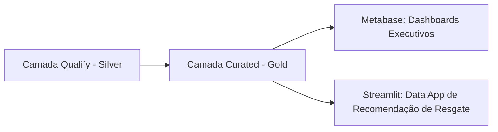

# 📊 Especificação Imutável: Camada Curated (Gold / Modelagem Dimensional & Views)

> **Doc ID:** `spec_datalake_curated_001`  
> **Camada:** `Curated (Gold)`  
> **Natureza:** Objeto Imutável de Modelagem Dimensional, Métricas e Visões Analíticas  
> **Arquitetura:** Kimball Star Schema (Data Warehouse OLAP)  
> **Banco / Schema:** Snowflake `CART_RECOVERY_GOLD.*`  
> **Framework Normativo:** DEC-001 (Métricas Calculadas em Consulta) + DEC-008 (Kimball Simplicidade)  
> **Status:** ✅ Homologado & Ativo  

---

## 1. 📌 Objetivo e Princípios da Camada Curated

A camada **Curated (Gold)** representa a camada de entrega analítica de alto valor do Data Lakehouse. Nela, os dados limpos da camada Silver Qualify são estruturados segundo o paradigma dimensional **Kimball Star Schema** e consolidados em **Data Views** otimizadas para consumo direto por tomadores de decisão no Metabase (BI) e pelo Data App de Inteligência de Resgate.

### Princípios Fundamentais:
1. **Kimball Star Schema Pragmático (DEC-008):** Separação clara entre tabelas de contexto descritivo (**Dimensões Conformadas**) e tabelas de eventos quantitativos (**Fatos Granulares**), unidas por chaves substitutas (*Surrogate Keys - `_sk`*).
2. **Cálculo de Ratios e Percentuais em Tempo de Execução (DEC-001):** As tabelas de fato armazenam exclusivamente medidas base aditivas. Métricas percentuais como `% Taxa de Conversão`, `% Taxa de Abandono` e `ROI Líquido` são calculadas dinamicamente em tempo de consulta para evitar erros de média de médias.
3. **Consistência de Grão Atômico:** Cada entidade declara e respeita rigorosamente seu nível de granularidade mais fino, prevenindo distorções estatísticas em agregações.

---

## 2. 📋 Entidades Integradas na Camada Curated

A camada Curated organiza suas entidades de negócio e modelos dimensionais em diretórios dedicados contendo datasets consolidados e documentação de metadados:

- **`carrinhos_curated`**: Visão enriquecida de sessões de carrinho com métricas de tempo até abandono e status final de recuperação.
- **`pedidos_curated`**: Base de faturamento consolidada com cálculo de receita líquida atribuída a campanhas de resgate.
- **`clientes_curated`**: Perfil analítico do cliente consolidando scores RFM, propensão de recuperação e risco de churn.
- **`produtos_curated`**: Catálogo enriquecido com indicadores de elasticidade e taxa de abandono por categoria.
- **`itens_carrinho_curated`**: Granularidade item-a-item enriquecida com representatividade financeira no carrinho.
- **`eventos_carrinho_curated`**: Telemetria consolidada com funil de transição de etapas de checkout.
- **`eventos_resgate_curated`**: Base analítica de disparos de CRM com indicadores de conversão por canal e cupom.

---

## 3. 🔍 Validações Dimensionais e Agregações em Texto Corrido

A consolidação dimensional na camada Curated aplica validações estritas de conformidade. As regras de tipo, relacionamentos e restrições de integridade baseiam-se nas **validações declaradas no corpo da entidade**:

- **Dimensões e Entidades de Cliente (`clientes_curated`)**: Assegura que os scores RFM e indicadores contínuos permaneçam nos intervalos canônicos de 0.0 a 1.0, com segmentação padronizada conforme as validações declaradas no corpo da entidade.
- **Entidades de Sessão e Abandono (`carrinhos_curated`)**: Valida a unicidade das chaves surrogate e a integridade de junção com dimensões de tempo, canal e dispositivo, seguindo as validações declaradas no corpo da entidade.
- **Entidades de Faturamento e Pedidos (`pedidos_curated`)**: Confere a exatidão dos somatórios contábeis de faturamento recuperado e deduções de cupons promocionais, alinhado às validações declaradas no corpo da entidade.
- **Entidades de Campanhas e Resgate (`eventos_resgate_curated`)**: Valida a precisão do cálculo individual de ROI líquido por disparo (`receita - custo`), preservando a monotonicidade lógica do funil conforme as validações declaradas no corpo da entidade.

---

## 4. 🔗 Linhagem e Consumo Downstream

> **Próxima Etapa:** Os dados modelados desta camada alimentam diretamente as análises executivas e o Data App de Inteligência de Resgate.
