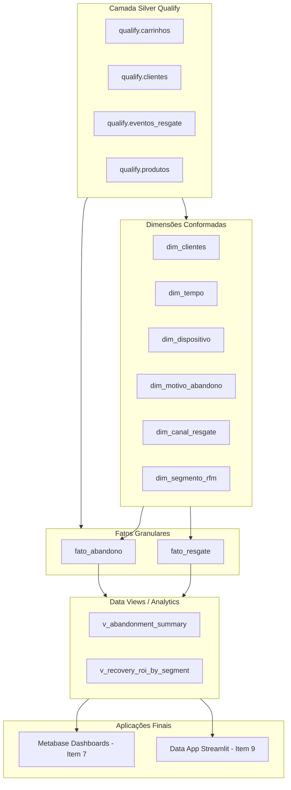

# 📊 Especificação Imutável: Camada Curated (Gold / Modelagem Dimensional & Views)

> **Doc ID:** `spec_datalake_curated_001`  
> **Camada:** `Curated (Gold)`  
> **Natureza:** Objeto Imutável de Modelagem Dimensional, Métricas e Visões Analíticas  
> **Arquitetura:** Kimball Star Schema (Data Warehouse OLAP)  
> **Banco / Schema:** Snowflake `CART_RECOVERY_GOLD.*`  
> **Framework Normativo:** DEC-001 (Métricas Calculadas em Consulta) + DEC-008 (Kimball Simplicidade)  
> **Status:** ✅ Homologado & Ativo  

---

## 1. 📌 Objetivo e Princípios da Camada Curated

A camada **Curated (Gold)** representa a camada de entrega analítica de alto valor do Data Lakehouse. Nela, os dados limpos da camada Silver Qualify são estruturados segundo o paradigma dimensional **Kimball Star Schema** e consolidados em **Data Views** otimizadas para consumo direto por tomadores de decisão no Metabase (BI) e pelo Data App de Inteligência de Resgate.

### Princípios Fundamentais:
1. **Kimball Star Schema Pragmático (DEC-008):** Separação clara entre tabelas de contexto descritivo (**Dimensões Conformadas**) e tabelas de eventos quantitativos (**Fatos Granulares**), unidas por chaves substitutas (*Surrogate Keys - `_sk`*).
2. **Cálculo de Ratios e Percentuais em Tempo de Execução (DEC-001):** As tabelas de fato armazenam exclusivamente medidas base aditivas (numeradores e denominadores). Métricas percentuais como `% Taxa de Conversão`, `% Taxa de Abandono` e `ROI Líquido` são calculadas dinamicamente em tempo de consulta para evitar erros matemáticos de média de médias.
3. **Consistência de Grão Atômico:** Cada tabela de fato declara e respeita rigorosamente seu nível de granularidade mais fino, prevenindo dupla contagem em agregações analíticas.

---

## 2. 📋 Entidades Centrais da Camada Curated

A camada Curated organiza-se em 6 Dimensões Conformadas, 2 Tabelas de Fatos e 2 Visões Analíticas Especializadas:

### 2.1 Dimensões Conformadas (Contexto & Filtros)
| Dimensão | Nome Físico | Chave Primária (PK) | Grão / Descrição |
|:---|:---|:---:|:---|
| **Clientes** | `dim_clientes` | `cliente_sk` | Uma linha por cliente único, contendo scores RFM, risco de churn e propensão. |
| **Tempo / Calendário** | `dim_tempo` | `data_sk` | Uma linha por dia do calendário (`YYYYMMDD`), contendo sazonalidade e feriados. |
| **Dispositivo** | `dim_dispositivo` | `dispositivo_sk` | Uma linha por tipo de hardware (`mobile`, `desktop`, `tablet`) e fricção de UX. |
| **Motivo de Abandono** | `dim_motivo_abandono` | `motivo_sk` | Uma linha por causa diagnosticada (`preco`, `frete`, `pagamento`, `indecisao`, `estoque`). |
| **Canal de Resgate** | `dim_canal_resgate` | `canal_sk` | Uma linha por canal de CRM (`email`, `sms`, `push_app`, `whatsapp`) e custo unitário. |
| **Segmento RFM** | `dim_segmento_rfm` | `segmento_sk` | Uma linha por cluster de cliente (`premium`, `regular`, `dormant`, `novo`) e prioridade de ROI. |

### 2.2 Tabelas de Fatos Granulares
| Fato | Nome Físico | Grão Atômico | Volumetria Conforme | Medidas Aditivas Principais |
|:---|:---|:---|:---:|:---|
| **Fato Abandono** | `fato_abandono` | 1 linha por carrinho abandonado | 6.525 registros | `valor_subtotal`, `valor_frete`, `valor_desconto`, `valor_total_em_risco`, `quantidade_itens` |
| **Fato Resgate** | `fato_resgate` | 1 linha por disparo de régua CRM | 6.289 registros | `flag_entregue`, `flag_aberto`, `flag_clicado`, `flag_convertido`, `custo_disparo_envio`, `valor_pedido_recuperado` |

### 2.3 Visões Analíticas Especializadas (Data Views)
| Visão | Nome Físico | Finalidade de Negócio | Consumidor Downstream |
|:---|:---|:---|:---|
| **Sumário de Abandono** | `v_abandonment_summary` | Monitoramento executivo de taxas e volumes em risco por canal e dispositivo. | Dashboard Metabase — Visão Executiva |
| **ROI de Resgate por Segmento** | `v_recovery_roi_by_segment` | Decisão tática de alocação de verba em canais de resgate por cluster RFM. | Metabase & Data App de Recomendação |

---

## 3. 🔍 Validações em Texto Corrido por Entidade

Abaixo é detalhado o conjunto de validações lógicas, dimensionais e de regras de agregação aplicadas na camada Curated:

### 3.1 Entidade `dim_clientes`
- **Validação de Chave Surrogate e NK:** Validação da geração determinística da chave surrogate `cliente_sk` a partir do identificador de negócio `cliente_id`. A unicidade da PK é 100% estrita (0 duplicações).
- **Validação de Scores Preditivos e Segmentação:** Os scores de perfil (`rfm_score`, `churn_risk_score`, `propensity_recovery`) são validados no intervalo contínuo de `0.0 a 1.0`. A classificação categórica de `segmento_rfm` deve pertencer exclusivamente aos valores normatizados (`premium`, `regular`, `dormant`, `novo`).

### 3.2 Entidade `dim_tempo`
- **Validação de Integridade Calendária:** A surrogate key `data_sk` é validada no formato numérico canônico `YYYYMMDD`. Garante a cobertura contínua e ininterrupta de todos os dias do ano comercial sem gaps temporais, com flags booleanas coerentes para `eh_fim_semana` e `eh_feriado`.

### 3.3 Entidade `dim_dispositivo` e `dim_motivo_abandono`
- **Validação de Domínio Fechado:** Validação de que todas as sessões resolvam para categorias padronizadas de dispositivos e motivos diagnosticados. Registros com motivo não identificado recebem a chave padrão de fallback `motivo_sk = -1` (*Não Informado / Em Diagnóstico*), evitando descarte de métricas agregadas.

### 3.4 Entidade `dim_canal_resgate`
- **Validação de Custos e Benchmarks:** Valida que cada canal possua custo unitário de disparo maior ou igual a zero (`custo_unitario_envio >= 0.0`) e que os benchmarks de mercado estejam calibrados entre `0% e 100%`.

### 3.5 Entidade `fato_abandono`
- **Validação de Integridade Dimensional (No Orphan FKs):** Valida que 100% das chaves estrangeiras (`cliente_sk`, `data_abandono_sk`, `dispositivo_sk`, `motivo_sk`) possuam correspondência exata nas dimensões conformadas correspondentes.
- **Validação de Grão & Aditividade:** Validação de que o grão é estritamente atômico (1 carrinho por linha). As medidas `valor_total_em_risco` e `quantidade_itens` são validadas como puramente aditivas através de todas as dimensões de tempo e geografia.

### 3.6 Entidade `fato_resgate`
- **Validação de Monotonicidade do Funil:** Validação da hierarquia cronológica e lógica do funil de marketing:
  $$\text{flag\_entregue} \ge \text{flag\_aberto} \ge \text{flag\_clicado} \ge \text{flag\_convertido}$$
  Nenhum registro pode apresentar conversão sem entrega prévia confirmada.
- **Validação Contábil de ROI Líquido:** O cálculo de `roi_liquido_disparo` é validado individualmente como `valor_pedido_recuperado - custo_disparo_envio`.

### 3.7 Visões Analíticas `v_abandonment_summary` e `v_recovery_roi_by_segment`
- **Validação de Agregação Segura (DEC-001):** Validação de que as fórmulas SQL das visões implementem razões calculadas sobre a soma dos componentes brutos:
  $$\text{Taxa Conversão} = \frac{\sum \text{flag\_convertido}}{\sum \text{flag\_entregue}} \times 100$$
  Garantindo precisão matemática contra divergências estatísticas em filtros interativos no Metabase.

---

## 4. 🔗 Linhagem de Consumo Dimensional

