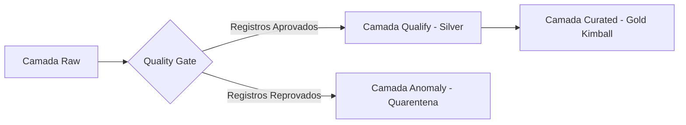

# 🧹 Especificação Imutável: Camada Qualify (Silver / Validação & Data Quality)

> **Doc ID:** `spec_datalake_qualify_001`  
> **Camada:** `Qualify (Silver)`  
> **Natureza:** Objeto Imutável de Validação, Contratos de Dados & Governança  
> **Banco / Schema:** Snowflake `CART_RECOVERY.*`  
> **Padrão Arquitetural:** Dual-Artifact Pipeline (DEC-006 — Qualify vs Quarentena)  
> **Status:** ✅ Homologado & Ativo  

---

## 1. 📌 Objetivo e Princípios da Camada Qualify

A camada **Qualify (Silver)** é responsável por transformar os dados brutos da camada Raw em tabelas relacionais rigorosamente tipadas, limpas, auditadas e padronizadas. Nela ocorrem as validações de schema, regras de integridade contábil e de negócio, e o isolamento de registros anômalos.

### Princípios Fundamentais:
1. **Contrato Rígido de Schema:** Nenhuma linha com chave primária nula, tipos incompatíveis ou campos obrigatórios corrompidos é promovida para consumo downstream.
2. **Dual-Artifact Routing (DEC-006):** Os registros processados são bifurcados:
   - **Silver Qualify (`CART_RECOVERY.*`):** Registros 100% íntegros (taxa média de aprovação ~94.2%).
   - **Silver Anomalies (Quarentena de Anomalias):** Registros com violação de regras de negócio ou integridade contábil (taxa ~5.8%), armazenados na camada Anomaly.
3. **Governança & Rastreabilidade de Catálogo:** Todas as entidades possuem dicionários padronizados com classificação de sensibilidade e identificação de PII (LGPD).

---

## 2. 📋 Entidades Integradas na Camada Qualify

A camada Qualify estrutura suas 7 entidades em diretórios individuais dedicados:

- **`carrinhos_qualify`**: Sessões de carrinho válidas e balanceadas contavelmente.
- **`pedidos_qualify`**: Ordens de pagamento aprovadas com integridade financeira e atribuição de resgate.
- **`clientes_qualify`**: Cadastros de clientes com sintaxe de e-mail e opt-ins auditados.
- **`produtos_qualify`**: Catálogo de SKUs com sanidade de preços e categorias consistentes.
- **`itens_carrinho_qualify`**: Itens de compras com quantidades positivas e preços válidos.
- **`eventos_carrinho_qualify`**: Telemetria sequencial do fluxo de navegação do carrinho.
- **`eventos_resgate_qualify`**: Disparos de campanhas com consistência na progressão do funil de conversão.

---

## 3. 🔍 Validações de Qualidade em Texto Corrido por Entidade

A homologação dos dados para a camada Qualify executa testes automáticos de integridade. Em todas as entidades, os contratos de tipos, unicidade de chaves primárias, relacionamentos e domínios aceitos baseiam-se nas **validações declaradas no corpo da entidade**:

- **Entidade `carrinhos_qualify`**: Aplica a validação da equação contábil de fechamento financeiro (`valor_total = subtotal + frete - desconto`), não-negatividade do frete e consistência temporal entre criação e abandono, conforme as validações declaradas no corpo da entidade.
- **Entidade `pedidos_qualify`**: Assegura a positividade do valor faturado, a coerência do método de pagamento e a integridade de atribuição quando originado de campanha de resgate, alinhado às validações declaradas no corpo da entidade.
- **Entidade `clientes_qualify`**: Executa a higienização de e-mails via expressão regular canônica e valida a unicidade da chave cadastral, mantendo os controles de privacidade LGPD conforme as validações declaradas no corpo da entidade.
- **Entidade `produtos_qualify`**: Confere a não-negatividade dos preços e a regra de consistência de promoções (`preco_atual <= preco_original`), respeitando as validações declaradas no corpo da entidade.
- **Entidade `itens_carrinho_qualify`**: Valida a integridade da relação item-carrinho, quantidades estritamente positivas e a coerência cronológica de remoções, seguindo as validações declaradas no corpo da entidade.
- **Entidade `eventos_carrinho_qualify`**: Garante o encadeamento cronológico das etapas do checkout sem sobreposição temporal inválida, de acordo com as validações declaradas no corpo da entidade.
- **Entidade `eventos_resgate_qualify`**: Verifica a monotonicidade lógica do funil de marketing (`entregue >= aberto >= clicado >= convertido`), conforme as validações declaradas no corpo da entidade.

---

## 4. 🔗 Linhagem e Consumo Downstream

> **Próxima Etapa:** Os dados 100% aprovados desta camada alimentam o Data Warehouse dimensional conforme detalhado na [Especificação da Camada Curated](file:///c:/Users/pedro/OneDrive/Desktop/wheels/pipelines/datalakes/curated/spec.md).
