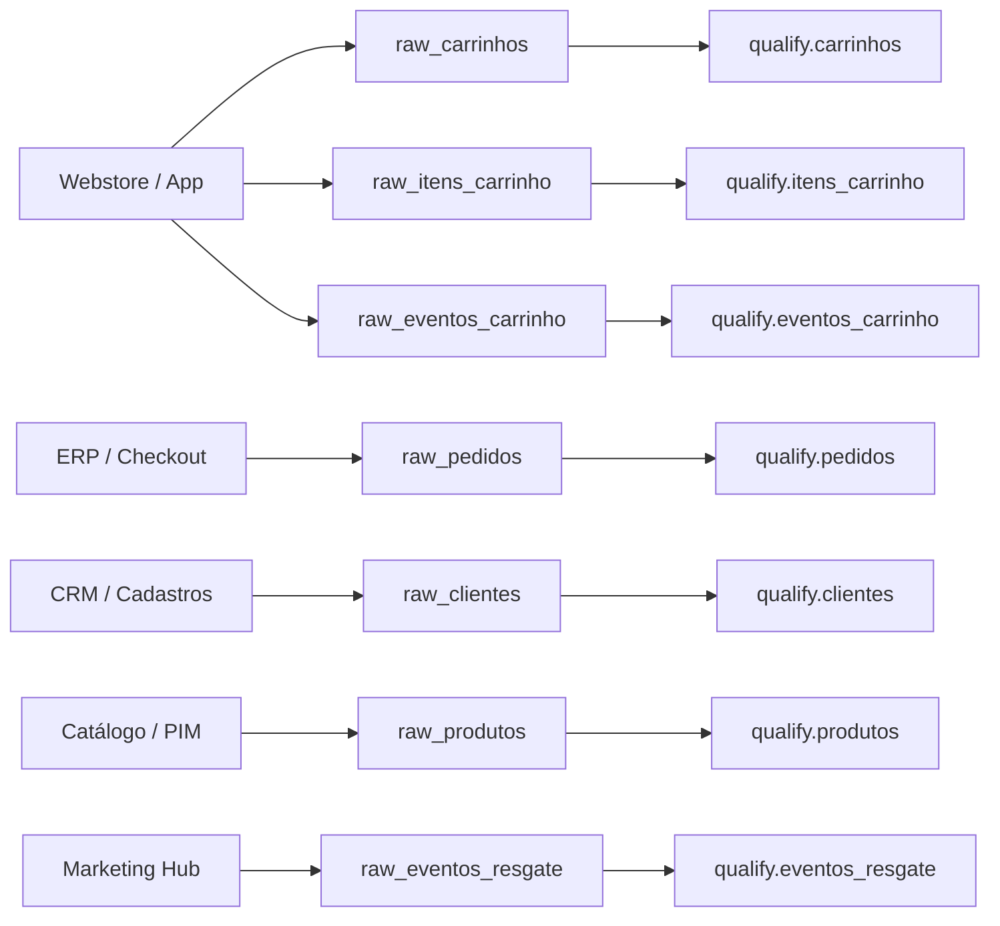

# 📥 Especificação Imutável: Camada Raw (Bronze / Ingestão Bruta)

> **Doc ID:** `spec_datalake_raw_001`  
> **Camada:** `Raw (Bronze)`  
> **Natureza:** Objeto Imutável de Especificação de Ingestão  
> **Localização Física:** S3 Explorer Dadosfera (`/raw/recuperacao_carrinho/`)  
> **Formato de Carga:** Arquivos binários `Parquet` / `CSV`  
> **Status:** ✅ Homologado & Ativo  

---

## 1. 📌 Objetivo e Princípios da Camada Raw

A camada **Raw (Bronze)** atua como a zona de aterrissagem (*landing zone*) bruta e imutável para todos os dados transacionais, cadastrais e de telemetria do case de Recuperação de Carrinho Abandonado. 

### Princípios Fundamentais:
1. **Preservação Integral ("As-Is"):** Nenhum dado de negócio é alterado, tipado agressivamente ou descartado nesta etapa. Erros, tipos textuais mistos e anomalias de origem são armazenados exatamente como emitidos pelas fontes.
2. **Imutabilidade e Replayability:** Os arquivos gravados nesta camada nunca sofrem `UPDATE` ou `DELETE`. Servem como a fonte primária de verdade histórica para reprocessamento de pipelines downstream a qualquer momento.
3. **Injeção de Metadados Técnicos:** Cada carga bruta recebe metadados de auditoria de ingestão (`_ingested_at`, `_source_file_path`, `_batch_id`) sem interferir no payload original.

---

## 2. 📋 Entidades Integradas na Camada Raw

A tabela abaixo resume todas as 7 entidades que aterrissam na camada Raw:

| Entidade Bruta | Formato Físico | Origem Operacional | Volumetria Estimada | Particionamento | Destino Downstream |
|:---|:---:|:---|:---:|:---:|:---|
| **`raw_pedidos`** | `.parquet` | Checkout Transacional / ERP | ~10.000 registros | Diário (`ano_mes_dia`) | `qualify.pedidos` |
| **`raw_carrinhos`** | `.parquet` | Sessões do E-commerce / Webstore | ~15.000 registros | Diário (`ano_mes_dia`) | `qualify.carrinhos` |
| **`raw_itens_carrinho`** | `.parquet` | Microserviço de Carrinho | ~35.000 registros | Diário (`ano_mes_dia`) | `qualify.itens_carrinho` |
| **`raw_clientes`** | `.parquet` | Banco de Contas de Usuários / CRM | ~10.000 registros | Snapshot Semanal | `qualify.clientes` |
| **`raw_produtos`** | `.parquet` | Catálogo de SKUs / PIM | ~5.000 registros | Snapshot Semanal | `qualify.produtos` |
| **`raw_eventos_carrinho`** | `.parquet` | Clickstream Telemetria Web & App | ~50.000 registros | Diário / Horário | `qualify.eventos_carrinho` |
| **`raw_eventos_resgate`** | `.parquet` | Plataforma de Disparo de CRM | ~10.000 registros | Diário (`ano_mes_dia`) | `qualify.eventos_resgate` |

---

## 3. 🔍 Validações em Texto Corrido por Entidade

Diferente das camadas analíticas, a validação na camada Raw foca exclusivamente em **sanidade de transporte, integridade de arquivo e persistência física**. Abaixo estão detalhadas as validações corridas aplicadas a cada entidade antes de torná-la disponível para processamento:

### 3.1 Entidade `raw_pedidos`
- **Validação de Ingestão e Formato:** Os dados de pedidos brutos chegam consolidados em lote diário via exportação transacional. A validação corrida verifica a integridade do cabeçalho do arquivo Parquet, certificando que o número de colunas bate com o schema esperado de faturamento (contendo `pedido_id`, `cliente_id`, `carrinho_id`, `valor_total`, `status_pedido`, `data_criacao`, `metodo_pagamento`).
- **Sanidade Física:** O arquivo é checado quanto à integridade de compressão (Snappy/Gzip) e volumetria não-zerada (tamanho > 0 bytes). Não é feita nenhuma filtragem de pedidos cancelados ou estornados aqui; o payload completo é registrado para permitir conciliação contábil histórica.

### 3.2 Entidade `raw_carrinhos`
- **Validação de Ingestão e Formato:** Representa o registro atômico de sessões de compra abertas no marketplace. A validação corrida de ingestão garante a presença das colunas fundamentais de rastreio (`carrinho_id`, `cliente_id`, `status`, `valor_subtotal`, `valor_frete`, `valor_desconto`, `valor_total`, `data_criacao`, `data_abandono`, `origem_dispositivo`).
- **Sanidade Física e Imutabilidade:** Verifica a legibilidade do arquivo parquet gerado pelos coletores. Eventuais inconsistências de cálculo (como frete negativo ou desconto abusivo) são aceitas e preservadas na camada Raw para serem devidamente segregadas pelo motor de Data Quality na camada Qualify.

### 3.3 Entidade `raw_itens_carrinho`
- **Validação de Ingestão e Formato:** Armazena o detalhe linha a linha dos produtos adicionados ou removidos de cada carrinho. A validação corrida inspeciona se todas as tuplas possuem as colunas brutas estruturais (`item_id`, `carrinho_id`, `produto_id`, `quantidade`, `preco_unitario`, `data_adicao`, `data_remocao`).
- **Sanidade Física:** Garante que a ingestão não sofreu truncamento de linhas decorrente de perda de pacote de rede durante a transferência entre o coletor e o storage S3.

### 3.4 Entidade `raw_clientes`
- **Validação de Ingestão e Formato:** Traz a base bruta cadastral de clientes do marketplace. A validação corrida confirma a presença das colunas esperadas (`cliente_id`, `nome`, `email`, `telefone`, `estado`, `cidade`, `data_cadastro`, `segmento_rfm_inicial`, `opt_in_email`, `opt_in_sms`, `opt_in_push`, `opt_in_whatsapp`).
- **Segurança & Governança na Ingestão:** Como esta entidade contém dados pessoais identificáveis (PII), a validação corrida confere se o bucket de aterrissagem possui criptografia at-rest ativa (AES-256) e permissões de acesso restritas à role de ingestão.

### 3.5 Entidade `raw_produtos`
- **Validação de Ingestão e Formato:** Exportação de catálogo de produtos contendo `produto_id`, `nome_produto`, `categoria`, `marca`, `preco_original`, `preco_atual`, `status_estoque`.
- **Sanidade Física:** A validação corrida atesta a consistência na codificação de caracteres (UTF-8) para evitar corrupção em acentuação de nomes de produtos e marcas brasileiras durante o parsing downstream.

### 3.6 Entidade `raw_eventos_carrinho`
- **Validação de Ingestão e Formato:** Tabela de alta volumetria com eventos de telemetria do usuário (`evento_id`, `carrinho_id`, `tipo_evento`, `pagina_url`, `timestamp_evento`, `dispositivo`, `tempo_permanencia_segundos`).
- **Sanidade Física:** Por se tratar de um fluxo de dados em lote semi-contínuo, a validação corrida monitora a sequência cronológica dos blocos de dados ingeridos e a ausência de corrupção nos timestamps ISO-8601 brutos.

### 3.7 Entidade `raw_eventos_resgate`
- **Validação de Ingestão e Formato:** Registro das réguas de comunicação de marketing de recuperação (`resgate_id`, `carrinho_id`, `cliente_id`, `canal_comunicacao`, `tipo_gatilho`, `cupom_oferecido`, `data_envio`, `data_abertura`, `data_clique`, `custo_envio`).
- **Sanidade Física:** Assegura que o lote recebido da ferramenta de CRM contém todas as colunas de telemetria de engajamento para posterior validação de funil na camada Qualify.

---

## 4. 🔗 Linhagem e Rastreabilidade

> **Próxima Etapa:** Os dados brutos desta camada são consumidos pelos scripts de qualificação e bifurcados de acordo com a [Especificação da Camada Qualify](file:///c:/Users/pedro/OneDrive/Desktop/wheels/pipelines/datalakes/qualify/spec.md).
