# Especificação Canônica do Pitch: Backbone Central & Guidelines de Apresentação

> **Case Técnico de Estágio — Dadosfera**  
> **Tema**: Implementação da Plataforma Dadosfera no E-commerce com Prova de Conceito em Recuperação de Carrinho Abandonado  
> **Candidato / Autor**: Pedro Sales  
> **Público-Alvo do Pitch**: Avaliadores Técnicos, Head de Dados, C-Levels e Gestores de E-commerce / Growth  
> **Formato de Apresentação**: Vídeo Gravado (10–13 minutos) ancorado em Métricas Relativas (%), Comparativo Arquitetural TCO e Prova de Conceito  
> **Documento-Fonte Primário**: [`user-case-raw-analyses.md`](file:///c:/Users/pedro/OneDrive/Desktop/wheels/agents_prompts_refs/case-internship-files/user-case-raw-analyses.md)

---

# PARTE 1: BACKBONE CENTRAL (Espinha Dorsal Cronológica)

O Backbone Central estabelece a cronologia estrita da apresentação, delimitando o tempo estimado, o objetivo de negócio, os tópicos levantados na análise do cliente e a mensagem-chave de cada bloco.

```mermaid
flowchart TD
    B1["Bloco 1: Abertura & Diagnóstico do Cliente (00:00 - 02:30)<br>• Plataforma de Dados como Meio (Agregação, Governança, Discovery)<br>• O Paradoxo do E-commerce: 70% de abandono de carrinho<br>• Gargalos da Stack Legada AWS (Kinesis Shards, Redis Cluster, S3 sem schema)<br>• Risco de R$ 50k-100k/min em picos e Lead Time de 6 semanas"]
    --> B2["Bloco 2: A Proposta de Valor da Dadosfera (02:30 - 05:00)<br>• Sistema Operacional de Dados Unificado (SaaS All-in-One)<br>• Ingestão Plug & Play (Maestro API) & Snowflake Lakehouse<br>• Governança e Democratização Segura (sem jeopardizar LGPD)<br>• Quebra da dependência de Headcount Linear para integrações"]
    --> B3["Bloco 3: PoC em Ação: 5 Regras de Recuperação (05:00 - 08:45)<br>• Regra 1: Série Temporal & Ciclo de Vida (Target 10.1% recuperação)<br>• Regra 2: Sensibilidade de Catálogo por Categoria (Eletrônicos vs Moda)<br>• Regra 3: Eficiência e ROI de Canais (Email R$0,05 vs WhatsApp R$0,30 / ROI 45x)<br>• Regra 4: Causa-Raiz vs Segmentação RFM (Preservação de Margem & Ratio 3x)<br>• Regra 5: Matriz Prescritiva de Viabilidade (Fila em Tempo Real)"]
    --> B4["Bloco 4: Governança Ativa, Data Apps & GenAI (08:45 - 11:15)<br>• Data Quality (Item 4): Dual-Artifact Silver (94.2% conformidade vs 5.8% quarentena)<br>• Data App (Item 9): Simulador de ROI Interativo em Streamlit<br>• GenAI (Bônus & Item 5): Copywriting Contextual Adaptativo com LLMs"]
    --> B5["Bloco 5: Conclusão, TCO & Call to Action (11:15 - 13:00)<br>• Comparativo TCO: -86% no Time-to-Value (dias vs semanas)<br>• Modelo Agnóstico: Métricas em % transferíveis a qualquer ticket médio<br>• Convite para POC Guiada de 2 semanas"]
```

---

## ⏱️ Matriz Cronológica do Backbone

| Bloco | Minutagem | Título do Bloco | Tópicos & Entregas Levantadas | Artefato Visual Chave |
|:---:|:---:|---|---|:---:|
| **1** | `00:00 - 02:30` | **Visão Geral do Cliente & Gargalos da Infraestrutura Legada** | • **Posicionamento**: A Plataforma de Dados como meio (governança, descoberta, aggregate) e o Carrinho Abandonado como PoC de alto valor. • **Dores da Stack AWS**: Kinesis Stream (sharding manual), Firehose (latência de buffer), S3 (sem schema enforcement) e Redis ElastiCache (complexidade standalone vs cluster, efeito dominó de reconfiguração). • **Riscos Financeiros**: Vulnerabilidade em picos (Black Friday com risco de **R$ 50k–100k/minuto** de perda por lentidão no cache) e lead time de 3–6 semanas por app. | [`chart_07_arquitetura_dadosfera_vs_aws.png`](file:///c:/Users/pedro/OneDrive/Desktop/wheels/presentation/pitch/07_arquitetura_dadosfera_vs_aws/chart_07_arquitetura_dadosfera_vs_aws.png) |
| **2** | `02:30 - 05:00` | **A Plataforma Dadosfera como Sistema Operacional de Dados** | • **Capacidades Integradas**: Ingestão Plug & Play, Transformação Centralizada, Catálogo/Linhagem Automática, Consumo Integrado (Metabase) e IAM Centralizado. • **Dilema de Headcount**: Eliminação da necessidade de contratar 1 Platform Engineer + 2 Data Engineers apenas para manter "colas" de integração manual. • **Democratização Segura**: Compartilhamento ágil de insights entre setores sem *jeopardizar* a segurança e conformidade LGPD. | Diagrama DW Medallion Kimball & Catálogo Maestro |
| **3** | `05:00 - 08:45` | **Evidências Analíticas & Regras de Negócio em Ação (PoC)** | • **Regra 1**: Série Temporal de Abandono vs Resgate (~10.1% recuperação e lift de +50%). • **Regra 2**: Sensibilidade de Catálogo e Atrito por Categoria. • **Regra 3**: Eficiência Financeira e ROI de Canais (~45x ROI multiplicador, custo < 1%). • **Regra 4**: Causa-Raiz vs Segmentação RFM (Preservação de Margem de Lucro e Ratio 3x). • **Regra 5**: Matriz Prescritiva de Viabilidade e Priorização de Atendimento. | [`chart_01`](file:///c:/Users/pedro/OneDrive/Desktop/wheels/presentation/pitch/01_abandono_vs_recuperacao_timeline/chart_01_serie_temporal_abandono_resgate.png), [`chart_02`](file:///c:/Users/pedro/OneDrive/Desktop/wheels/presentation/pitch/02_performance_categorias_produtos/chart_02_performance_categorias.png), [`chart_03`](file:///c:/Users/pedro/OneDrive/Desktop/wheels/presentation/pitch/03_roi_canais_e_comunicacao/chart_03_roi_eficiencia_canais.png), [`chart_04`](file:///c:/Users/pedro/OneDrive/Desktop/wheels/presentation/pitch/04_matriz_motivos_segmentos_rfm/chart_04_matriz_motivos_rfm_heatmap.png), [`chart_05`](file:///c:/Users/pedro/OneDrive/Desktop/wheels/presentation/pitch/05_matriz_viabilidade_recuperacao/chart_05_dispersao_viabilidade_recuperacao.png) |
| **4** | `08:45 - 11:15` | **Governança Ativa, Data App & Inteligência com GenAI** | • **Data Quality (Item 4)**: Dual-Artifact Silver (94.2% conformidade vs 5.8% quarentena - Great Expectations com 18 regras). • **Data App (Item 9)**: Simulador de Sensibilidade de ROI interativo em Streamlit. • **GenAI (Bônus & Item 5)**: Copywriting semântico com LLMs adaptado à causa-raiz do abandono. | [`chart_06_scorecard_data_quality.png`](file:///c:/Users/pedro/OneDrive/Desktop/wheels/presentation/pitch/06_data_quality_e_quarentena/chart_06_scorecard_data_quality.png), [`chart_08_simulador_roi_data_app.png`](file:///c:/Users/pedro/OneDrive/Desktop/wheels/presentation/pitch/08_data_app_simulador_prescritivo_genai/chart_08_simulador_roi_data_app.png) |
| **5** | `11:15 - 13:00` | **Conclusão, Análise de TCO & Proposta de Ação** | • **Time-to-Value**: Redução de -86% no tempo de ciclo de novos pipelines. • **Modelo Agnóstico**: Ratios e percentuais aplicáveis a qualquer ticket médio do marketplace. • **Próximo Passo**: Proposta de Prova de Conceito (PoC) guiada de 2 semanas em ambiente de produção. | Painel Executivo Consolidado |

---

# PARTE 2: PITCH GUIDELINES (Roteiro e Diretrizes de Apresentação)

---

## 🎬 Bloco 1: Abertura & Diagnóstico da Infraestrutura Atual (`00:00 - 02:30`)

### 🎯 Objetivo de Comunicação
Estabelecer o contexto estratégico: o cliente deseja construir uma **Plataforma de Dados unificada** para análises descritivas e prescritivas com agilidade e baixo custo em todas as áreas. A plataforma é o **meio de disponibilização, agregação, governança e discovery**, e o case de **Recuperação de Carrinho Abandonado** é a prova de conceito de alto impacto para demonstrar o ROI imediato.

### 🗣️ Roteiro de Fala Sugerido
> *"Olá a todos! Sejam muito bem-vindos. Hoje vamos discutir a transformação analítica do nosso cliente — uma grande operação de e-commerce e marketplace que busca construir uma Plataforma de Dados moderna para entregar agilidade e governança a todas as áreas de negócio.*  
>  
> *O objetivo central do cliente não é apenas resolver um problema isolado, mas estabelecer uma plataforma como* **meio de disponibilização, agregação, governança e discovery**. *Para validar essa capacidade com resultados tangíveis, escolhemos como caso de estudo / prova de conceito o maior gargalo de receita do e-commerce:* **o abandono de 70% dos carrinhos criados antes da conclusão da compra.**  
>  
> *Porém, ao analisarmos a arquitetura atual do cliente baseada em serviços fragmentados na AWS, identificamos gargalos operacionais críticos:*  
>  
> 1. ***Kinesis Data Streams & Lambdas manuais***: *Exigem configuração manual de shards baseada em throughput, gerando complexidade e custos imprevisíveis.*  
> 2. ***Kinesis Firehose***: *Introduz latência de buffering que atrasa ações em tempo real.*  
> 3. ***Data Lake no S3***: *Carece de imposição rígida de schema (schema enforcement), deixando os pipelines suscetíveis a quebras por dados malformados.*  
> 4. ***Redis Cluster (ElastiCache)***: *A operação entre modos standalone e cluster é complexa. Qualquer ajuste forçado por picos exige reconfigurações manuais em N serviços codependentes, e upgrades de plano geram de 5 a 15 minutos de indisponibilidade.*  
>  
> *Em eventos sazonais de pico, como a Black Friday,* **uma falha de reconfiguração de cache pode custar entre R$ 50 mil e R$ 100 mil por minuto de lentidão no checkout.** *Além disso, o lead time para subir qualquer novo data app ou painel leva de 3 a 6 semanas. Vamos ver como a Dadosfera resolve essa equação."*

### 📊 Dados de Impacto & Diagnóstico da Raw Analysis
- **Taxa Global de Abandono**: ~69.8% (Baymard Institute).
- **Risco em Picos (Black Friday)**: R$ 50k–100k por minuto de perda por instabilidade no Redis/Kinesis.
- **Lead Time Atual**: 3 a 6 semanas por nova ferramenta ou data app.
- **Custo Marginal Crescente**: Headcount técnico cresce linearmente com novos apps.

### 🖼️ Visual de Apoio
- Projetar: [`chart_07_arquitetura_dadosfera_vs_aws.png`](file:///c:/Users/pedro/OneDrive/Desktop/wheels/presentation/pitch/07_arquitetura_dadosfera_vs_aws/chart_07_arquitetura_dadosfera_vs_aws.png).

---

## 🎬 Bloco 2: A Proposta de Valor da Plataforma Dadosfera (`02:30 - 05:00`)

### 🎯 Objetivo de Comunicação
Apresentar a Dadosfera como o **Sistema Operacional de Dados unificado (SaaS All-in-One)** que substitui o emaranhado de scripts e infraestrutura dispersa por um ambiente gerenciado que garante governança nativa e quebra a dependência de headcount linear.

### 🗣️ Roteiro de Fala Sugerido
> *"Diante desse cenário, manter uma equipe técnica dedicada para configurar conexões manuais a cada novo app seria infinitamente mais caro e ineficiente do que adotar a Dadosfera. A Dadosfera unifica todo o ciclo de vida dos dados:*  
>  
> - ***Ingestão Plug & Play***: *Conectores nativos via API Maestro que eliminam o desenvolvimento de pipelines manuais para cada fonte.*  
> - ***Transformação Centralizada***: *Substitui scripts dispersos por fluxos estruturados de limpeza e modelagem dimensional Kimball Star Schema no Snowflake Lakehouse.*  
> - ***Catálogo & Governança Automáticos***: *Data lineage e metadados com Data Asset IDs oficiais, permitindo que diferentes setores descubram e compartilhem ativos de dados com autonomia.*  
> - ***Segurança e IAM Simplificado***: *Centraliza o controle de acesso e conformidade LGPD sem complexidade excessiva, possibilitando democratizar insights para marketing e CRM* **sem jeopardizar a segurança e a privacidade dos dados.**  
> - ***Consumo Integrado & IA***: *Visualização nativa via Metabase, Data Apps em Streamlit e recursos nativos de GenAI.*  
>  
> *Agora, vamos demonstrar na prática como essa arquitetura opera a nossa Prova de Conceito de Recuperação de Carrinho."*

---

## 🎬 Bloco 3: Evidências Analíticas & Regras de Negócio em Ação (PoC) (`05:00 - 08:45`)

### 🎯 Objetivo de Comunicação
Apresentar as 5 regras de negócio modeladas no Star Schema, evidenciando como a análise preditiva e prescritiva otimiza a conversão e **preserva a margem de lucro** (evitando queimar cupons desnecessários).

---

### 📈 Regra 1: Série Temporal & Ciclo de Vida do Carrinho
- **Artefato**: [`chart_01_serie_temporal_abandono_resgate.png`](file:///c:/Users/pedro/OneDrive/Desktop/wheels/presentation/pitch/01_abandono_vs_recuperacao_timeline/chart_01_serie_temporal_abandono_resgate.png)
- **Fala Sugerida**:
  > *"Acompanhando a série temporal do primeiro semestre de 2026, validamos a regra de ciclo de vida: o carrinho é classificado como abandonado após 30 minutos de inatividade. Nossa taxa média de abandono é de 69.7%. Ao ativarmos as réguas multicanal da Dadosfera, alcançamos uma taxa de recuperação consistente de* **10.1% dos carrinhos abandonados**, *gerando um lift de mais de 50% sobre a conversão basal orgânica sem intervenção."*

---

### 📊 Regra 2: Sensibilidade de Catálogo & Atrito por Categoria
- **Artefato**: [`chart_02_performance_categorias.png`](file:///c:/Users/pedro/OneDrive/Desktop/wheels/presentation/pitch/02_performance_categorias_produtos/chart_02_performance_categorias.png)
- **Fala Sugerida**:
  > *"Ao abrirmos o atrito por categoria de produto, constatamos que categorias de alto ticket, como Eletrônicos, retêm alto volume represado por indecisão e dúvidas técnicas, enquanto Moda sofre forte abandono por valor de frete. A governança da Dadosfera permite criar réguas orientadas ao contexto do catálogo em vez de disparos genéricos."*

---

### 💰 Regra 3: Topologia de Canais & Eficiência Financeira (ROI)
- **Artefato**: [`chart_03_roi_eficiencia_canais.png`](file:///c:/Users/pedro/OneDrive/Desktop/wheels/presentation/pitch/03_roi_canais_e_comunicacao/chart_03_roi_eficiencia_canais.png)
- **Fala Sugerida**:
  > *"A topologia de canais equilibra custo unitário e impacto de conversão. O canal* **Email** *(R$ 0,05 por envio) é a espinha dorsal de volume e entrega o maior retorno líquido agregado. O* **WhatsApp** *(R$ 0,30 por envio) entrega a maior conversão unitária (18% de conversão clique-venda), sendo direcionado para carrinhos de alto valor. O resultado consolidado é um* **ROI médio multiplicador de 45x** *com custo de disparo inferior a 1% do valor recuperado."*

---

### 🧩 Regra 4: Causa-Raiz de Abandono vs Segmentação RFM (Preservação de Margem)
- **Artefato**: [`chart_04_matriz_motivos_rfm_heatmap.png`](file:///c:/Users/pedro/OneDrive/Desktop/wheels/presentation/pitch/04_matriz_motivos_segmentos_rfm/chart_04_matriz_motivos_rfm_heatmap.png)
- **Fala Sugerida**:
  > *"Como diagnosticado na nossa análise estratégica, o cruzamento do valor do carrinho com o histórico RFM permite decidir a melhor ação preservando a margem de lucro. Clientes* **Premium** *abandonam por indecisão ou dúvidas — ofertar cupom para eles seria queimar margem. Para eles, usamos atendimento humanizado via WhatsApp. Já clientes* **Novos** *são sensíveis a frete e respondem a cupons de primeira compra. Além disso, o segmento Premium converte* **3 vezes mais** *que o Dormant (18% vs 6%), provando que segmentar é altamente lucrativo."*

---

### 🎯 Regra 5: Matriz Prescritiva de Viabilidade & Fila em Tempo Real
- **Artefato**: [`chart_05_dispersao_viabilidade_recuperacao.png`](file:///c:/Users/pedro/OneDrive/Desktop/wheels/presentation/pitch/05_matriz_viabilidade_recuperacao/chart_05_dispersao_viabilidade_recuperacao.png)
- **Fala Sugerida**:
  > *"Para a equipe de CRM e vendas, entregamos uma matriz prescritiva de viabilidade. No quadrante superior direito (Alta Viabilidade), isolamos os 20% de carrinhos que concentram mais de 65% da receita recuperável, gerando uma fila de acionamento em tempo real para maximizar a conversão antes da janela de 28 horas de expiração."*

---

## 🎬 Bloco 4: Governança Ativa, Data App & Inteligência com GenAI (`08:45 - 11:15`)

### 🎯 Objetivo de Comunicação
Evidenciar a robustez de engenharia com a arquitetura Dual-Artifact Silver (Item 4), a experiência de autoatendimento no Data App Streamlit (Item 9) e o ganho de conversão trazido pela camada de GenAI (Case Bônus).

### 🗣️ Roteiro de Fala Sugerido
> *"Um dos grandes diferenciais da Dadosfera é que a qualidade dos dados não é uma auditoria tardia, mas uma proteção ativa em tempo de pipeline. Implementamos a arquitetura* **Dual-Artifact Silver (DEC-006)**.  
>  
> *Com uma suíte de 18 regras no Great Expectations, alcançamos* **94.2% de conformidade rigorosa** *na camada Qualify. Os 5.8% de anomalias operacionais — fretes negativos (ANOM-01), divergências contábeis de total (ANOM-04) e e-mails malformados — são segregados em uma tabela de quarentena dead-letter com captura de payload bruto, blindando as ferramentas de marketing contra disparos incorretos.*  
>  
> *Na ponta de consumo, construímos um* **Data App interativo em Streamlit (Item 9)** *onde os gestores podem calibrar parâmetros e simular sensibilidade de ROI em tempo real. E, como diferencial de vanguarda (* **Case Bônus** *), integramos um motor de* **GenAI com LLMs** *que redige mensagens personalizadas dinamicamente de acordo com o motivo do abandono (ex: suporte para checkout vs prova social para indecisão), aumentando o CTR em mais de 18%."*

### 🖼️ Visuais de Apoio
- Projetar: [`chart_06_scorecard_data_quality.png`](file:///c:/Users/pedro/OneDrive/Desktop/wheels/presentation/pitch/06_data_quality_e_quarentena/chart_06_scorecard_data_quality.png) e [`chart_08_simulador_roi_data_app.png`](file:///c:/Users/pedro/OneDrive/Desktop/wheels/presentation/pitch/08_data_app_simulador_prescritivo_genai/chart_08_simulador_roi_data_app.png).

---

## 🎬 Bloco 5: Conclusão, Análise de TCO & Call to Action (`11:15 - 13:00`)

### 🎯 Objetivo de Comunicação
Consolidar a proposta de valor, demonstrar o impacto na redução de TCO e propor o próximo passo prático (PoC guiada).

### 🗣️ Roteiro de Fala Sugerido
> *"Para consolidar os ganhos estratégicos da Dadosfera para o cliente:*  
>  
> - **Time-to-Value (-86%)**: *Reduzimos o lead time de entrega de novos data apps e modelos de 6 semanas para menos de 3 dias.*  
> - **Eficiência de Headcount**: *Eliminamos o custo de engenharia dedicada para manutenção de infraestrutura e reconfigurações manuais.*  
> - **Retorno Financeiro**: *Taxa de recuperação de 10.1% e ROI de 45x sobre o investimento em disparos.*  
> - **Transferibilidade Total**: *Construído inteiramente sobre taxas e métricas relativas (DEC-001) — o modelo funciona com a mesma eficácia para qualquer ticket médio e vertical da empresa.*  
> - **Governança & Segurança**: *Centralização total de linhagem e conformidade LGPD sem criar barreiras para a democratização dos dados.*  
>  
> *Propomos como próximo passo a realização de uma* **Prova de Conceito (PoC) guiada de 2 semanas**, *conectando a Dadosfera aos dados reais da empresa para comprovar essa aceleração em ambiente de produção.*  
>  
> *Muito obrigado pelo tempo de vocês e estamos à disposição para dúvidas!"*

---

# PARTE 3: GUIA PARA PERGUNTAS & OBJEÇÕES TÉCNICAS (BASEADO NA RAW ANALYSIS)

| Objeção Potencial | Resposta Técnica & Estratégica (Argumentação do Candidato) |
|---|---|
| *"Não é mais barato manter nosso time interno cuidando dos scripts na AWS?"* | *"Não, porque o custo marginal da infraestrutura própria é crescente. Conectar cada novo data app ou fonte de dados exige pelo menos 1 Platform Engineer e 1 a 2 Data Engineers apenas para criar e sustentar 'colas' manuais. A Dadosfera transforma esse custo fixo de headcount em ganho de escala com conectores plug & play e governança centralizada."* |
| *"Como a Dadosfera lida com períodos de pico como a Black Friday comparado ao nosso Redis atual?"* | *"Na stack atual, o Redis ElastiCache exige gestão complexa entre modos standalone/cluster e escalonamento que gera efeito dominó de reconfiguração em N serviços, com risco de indisponibilidade de 5 a 15 min (custando R$ 50k-100k/min). A Dadosfera desacopla a camada de ingestão e processamento sobre o Snowflake Data Lakehouse elástico, absorvendo picos sem intervenção manual."* |
| *"Como garantir que a democratização de dados não exponha dados sensíveis de clientes (LGPD)?"* | *"A camada de IAM e segurança da Dadosfera é simplificada e nativa. O catálogo gerencia permissões e mascaramento granular por coluna na camada Qualify (Item 4), permitindo que marketing e CRM acessem views analíticas sem jamais visualizar dados brutos desprotegidos."* |
| *"Como o modelo de carrinho abandonado se aplica a diferentes linhas de produto?"* | *"O modelo foi concebido sob o DEC-001, utilizando taxas, ratios e percentuais relativos em 5 camadas. O multiplicador de ROI de ~45x e a taxa de recuperação de ~10.1% são agnósticos ao ticket médio — o cliente insere o seu volume e ticket para calcular o faturamento projetado."* |

---

## 🔗 Mapa de Links para Artefatos da Apresentação
- 📊 [01. Série Temporal de Abandono vs Resgate](file:///c:/Users/pedro/OneDrive/Desktop/wheels/presentation/pitch/01_abandono_vs_recuperacao_timeline/spec.md)
- 📊 [02. Performance de Categorias de Produtos](file:///c:/Users/pedro/OneDrive/Desktop/wheels/presentation/pitch/02_performance_categorias_produtos/spec.md)
- 📊 [03. Eficiência e ROI de Canais de Resgate](file:///c:/Users/pedro/OneDrive/Desktop/wheels/presentation/pitch/03_roi_canais_e_comunicacao/spec.md)
- 📊 [04. Matriz de Motivos vs Segmentos RFM](file:///c:/Users/pedro/OneDrive/Desktop/wheels/presentation/pitch/04_matriz_motivos_segmentos_rfm/spec.md)
- 📊 [05. Matriz Prescritiva de Viabilidade](file:///c:/Users/pedro/OneDrive/Desktop/wheels/presentation/pitch/05_matriz_viabilidade_recuperacao/spec.md)
- 📊 [06. Data Quality & Quarentena Silver](file:///c:/Users/pedro/OneDrive/Desktop/wheels/presentation/pitch/06_data_quality_e_quarentena/spec.md)
- 📊 [07. Arquitetura Dadosfera vs Stack AWS](file:///c:/Users/pedro/OneDrive/Desktop/wheels/presentation/pitch/07_arquitetura_dadosfera_vs_aws/spec.md)
- 📊 [08. Data App Simulador de ROI & GenAI](file:///c:/Users/pedro/OneDrive/Desktop/wheels/presentation/pitch/08_data_app_simulador_prescritivo_genai/spec.md)
